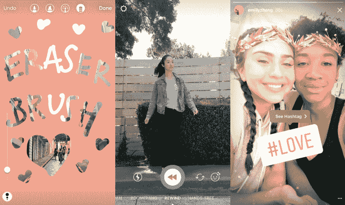

# Instagram Stories 和 WhatsApp Status 的用户达到 3 亿，接近 Snapchat  的 2 倍

> 原文：<https://web.archive.org/web/https://techcrunch.com/2017/11/01/instagram-whatsapp-vs-snapchat/>

# Instagram Stories 和 WhatsApp Status 的用户达到 3 亿，接近 Snapchat 的 2 倍

Instagram 和 WhatsApp 的 Snapchat 克隆版并没有减速。今天，脸书首席执行官马克·扎克伯格宣布 Instagram Stories 和 WhatsApp Status 现在都拥有 3 亿日活跃用户。相比之下，6 月份 Instagram 的 2.5 亿美元和 7 月份 T2 WhatsApp 的 2.5 亿美元有所增长。这使得副本几乎是原版的两倍，因为 [Snapchat 的整个应用程序只有 1.73 亿日活跃用户](https://web.archive.org/web/20230307142248/https://techcrunch.com/2017/08/10/snapchat-earnings-q2-2017/)。扎克伯格今天在脸书第三季度财报电话会议上分享了新的统计数据，尽管受到俄罗斯选举干扰的影响，但该公司仍获得了创纪录的收入和历史最高的股价。

现在，包括 Instagram Stories、脸书 Stories 和 Messenger Day 在内的大多数脸书产品都有了自己的增强现实人脸过滤器，它们已经达到了与 Snapchat 相当的功能水平。这意味着我们可能会看到更多的创新，因为没有太多的路线图可以遵循。虽然[也许我们会看到脸书复制 Snapchat 的 Bitmoji](https://web.archive.org/web/20230307142248/https://techcrunch.com/2017/10/10/facemoji/) 个性化头像和 [Snap 地图位置共享功能](https://web.archive.org/web/20230307142248/https://techcrunch.com/2017/06/21/snap-map/)。例如，Instagram 刚刚推出了 Superzoom，让你可以将视频放大，并且正在测试定格功能。

Instagram 故事

扎克伯格在电话会议上表示，他认为围绕视频培养社区是对脸书的一大推动，因为它从关注在该公司的应用程序家族上“花的时间”转向“花得值的时间”扎克伯格解释说，“研究表明，在社交媒体上与朋友和家人互动往往更有意义，对我们的福祉有好处，这是值得花的时间。但当我们只是被动地消费内容时，这可能就不那么真实了。”

WhatsApp 状态

因为 Instagram Stories 和 WhatsApp Status 是通常由密友观看的点对点视频，它们以自上而下专业制作的内容无法做到的方式增强了脸书应用的社区感。人们还会认真观看这些短片，这对脸书现在在 Instagram 故事之间插入的广告来说可能是一个福音。

现在，Instagram 的 5 亿每日活跃用户中有超过一半都在使用 Stories，这表明它正在成为该应用的未来。Instagram 现在将故事的大预览图片放在 feed 中间，鼓励你观看，这一事实支持了这一想法。虽然人们可能喜欢永久发布偶尔的魅力照片，或快速滚动它们，但故事推动着日常创作和更长时间的消费。虽然 Snapchat 可能是这个想法的先驱，但 Instagram 正在努力完善这种现代形式的社交媒体。