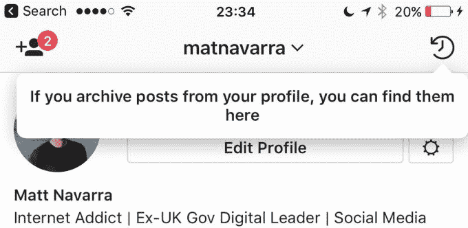
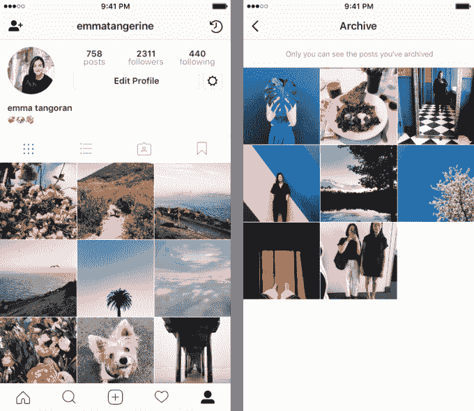

# Instagram 的存档功能上线，让你无限期隐藏照片 

> 原文：<https://web.archive.org/web/https://techcrunch.com/2017/06/13/instagrams-archive-feature-goes-live-letting-you-hide-photos-indefinitely/>

# Instagram 的存档功能上线，让你无限期隐藏照片

上个月，我们注意到 Instagram 正在测试一项名为“存档”的新功能，用户可以永久或无限期地隐藏自己的帖子。今天，[将在 Instagram](https://web.archive.org/web/20221025222840/https://instagram-press.com/blog/2017/06/13/archive/) 上向所有人展示，这意味着你今天就可以开始隐藏照片了。

你可以通过点击文章右上角的“…”三点按钮，然后选择“存档”来存档你个人资料中的任何照片或视频。

存档后，这些帖子会被移动到应用程序的一个特殊部分，位于您个人资料的右上角。

这个存档页面，以及里面的所有文章，只有你能看到。然后，你可以选择最终取消照片存档，并“显示在个人资料上”，或者干脆把它永远留在那里，作为你的个人记录。

那么，为什么有人想要存档一张照片呢？

也许你想隐藏一个没有得到很多喜欢的帖子，但你想记住这一时刻，不要在相机胶卷中成千上万的其他照片中丢失记忆。或者，你可能在和朋友吵架，或者和一个重要的人分手了，想暂时不要在你的个人资料上看到他们，也不要承诺永远删除他们。

或者，也许你只是想暂时远离社交媒体，把你所有的照片存档。

这个功能有点让人想起 [Snapchat 的回忆部分](https://web.archive.org/web/20221025222840/https://beta.techcrunch.com/2016/07/06/snapchat-memories/)，它旨在保存你为后代拍摄的照片和视频，但不一定想与朋友分享或分享你的故事。

唯一的区别是，你不能将 Instagram 直接发布到存档文件夹中——也就是说，照片必须是公开的，至少有一秒钟，这样你就可以切换页面并将其添加到你的存档中。出于这个原因，这个功能可能会更少地用作个人画廊，而更多地用作实际的档案部分，在那里你可以保存照片，老实说，你不知道你是否会在未来再次公开这些照片。

看看 Instagram 是否会从一开始就推出一个保持照片隐私的功能，这将是一件有趣的事情——几乎就像一个内置的“f Instagram”，这是一些人所说的他们的第二个“假”和秘密的 instagram 帐户，旨在纪念个人照片，也许可以与非常亲密的朋友和家人分享。

该功能今天面向所有人推出。