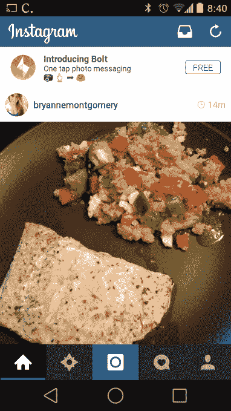

# Instagram 的“螺栓”泄漏可能是一个新的脸书应用程序或应用程序安装广告测试 

> 原文：<https://web.archive.org/web/https://techcrunch.com/2014/07/24/instagrams-bolt-leak-could-be-a-new-facebook-app-or-an-app-install-ad-test/>

一些 Instagram 用户报告说，他们在 Instagram 应用程序中短暂地看到了一个横幅广告，广告指向一个名为“Bolt”的新应用程序，该应用程序被描述为“一键照片信息”应用程序。在应用程序的名称和描述旁边，有一个下载按钮，链接到 Google Play 商店上的一个非功能性 URL。

目前网上流传的猜测是，Bolt 是 Instagram 即将发布的一款新应用。然而，Bolt 泄露似乎也有可能是一次测试，涉及脸书将应用安装广告扩展到该公司旗下的 Instagram 平台。

博尔特的存在最先引起我们的注意是由 [TechCrunch](https://web.archive.org/web/20221230233230/http://www.crunchbase.com/organization/techcrunch) 的消息灵通人士，他们在昨晚深夜向我们的消息热线发送了截图。一位消息人士甚至宣称:“他们又要来 Snapchat 了。保底。”

博尔特奇特亮相的消息也被许多网站转载，包括 [The Verge](https://web.archive.org/web/20221230233230/http://www.theverge.com/2014/7/24/5933075/instagram-bolt-app-snapchat-competitor) 、 [Business Insider](https://web.archive.org/web/20221230233230/http://www.businessinsider.com/instagram-snapchat-competitor-bolt-2014-7) 、 [Gizmodo](https://web.archive.org/web/20221230233230/http://gizmodo.com/looks-like-instagram-is-working-on-a-snapchat-rival-1610174846) 和其他网站。该公司尚未正式对此事发表评论。

Google Play 商店上已经有一个名为“Bolt”的移动应用程序，但它是一个移动通话应用程序。尽管有一个相似的粉红色闪电图标，我们已经确认*这个*闪电不是问题中的闪电。

**新的 App？**

目前认为 Bolt 是 Instagram 创造的假设是有道理的，因为接受 Snapchat 显然是 Instagram 母公司脸书的一大重点，该公司最近也推出了一款名为 [Slingshot](https://web.archive.org/web/20221230233230/http://www.crunchbase.com/product/slingshot) 的图片消息客户端。和弹弓一样，[意外地比计划的](https://web.archive.org/web/20221230233230/https://techcrunch.com/2014/06/09/facebook-has-another-go-at-snapchat-with-slingshot/)提前上线。有人可能会开玩笑说，脸书有人“手指很滑”

此外，Facebook Messenger 产品经理彼得·邓[去年转移到 Instagram】，这可能影响了该服务对](https://web.archive.org/web/20221230233230/https://techcrunch.com/2013/08/14/facebooks-star-manager-peter-deng-becomes-instagram-director-of-product-to-do-fewer-things-better/)[消息](https://web.archive.org/web/20221230233230/https://techcrunch.com/2013/12/12/instagram-messaging/)的新强调。

最后，TechCrunch 已经听说脸书下周有一些“大东西”计划，Bolt 的推出可能是其中的一部分。

**还是安装广告？**

也就是说，值得指出的是，在这次泄露中没有任何东西具体地*确认*Bolt 是即将到来的 Instagram 所有的财产。将横幅广告放在用户流的顶部也很可能是对应用安装广告的测试。

移动应用安装广告已被证明是母公司脸书极其有利可图的业务，尽管该公司在昨天的收益公告中试图淡化这一点，以使其移动广告产品看起来更加多样化。然而，该公司在本季度从移动广告中赚了 16.6 亿美元，目前占脸书广告收入的 62%。

将同样的广告引入 Instagram 平台似乎是脸书显而易见的下一步，特别是考虑到第三方移动应用的广泛网络提供了某种 Instagram 集成。这些应用业务可能会喜欢专门针对 Instagram 人群，特别是因为他们经常试图接触像那些喜欢 Instagram 的年轻人。

Instagram 可能一直在用一个虚构的应用程序尝试应用程序安装格式，看看用户是否会点击它。

或者，即使 Bolt 是脸书的下一个应用程序，看看 Instagram 如何作为一种推广工具将用户与该应用程序联系起来——或许有一天，还会与他人联系起来——也是很有趣的。

*补充报道:乔希·孔斯蒂内*

*图片致谢: [@iRBishnoi](https://web.archive.org/web/20221230233230/https://twitter.com/iRBishnoi/status/492324549745065984) 在推特上；文森特·麦克*