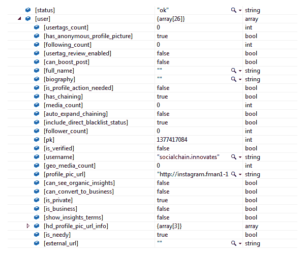
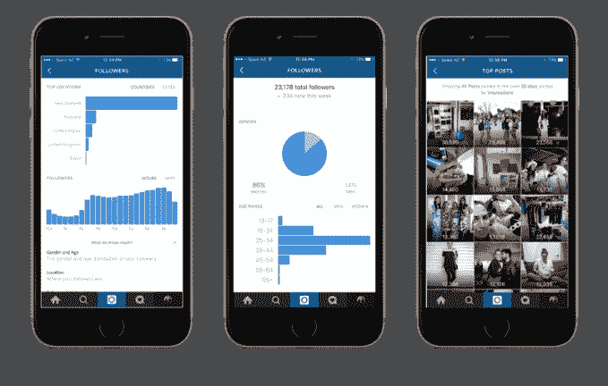

# Instagram 的代码暗示可以选择付费来增加帖子数量

> 原文：<https://web.archive.org/web/http://techcrunch.com/2016/05/23/instagrams-code-hints-at-option-to-pay-to-boost-posts/>

我们早就知道 Instagram 将很快推出[商业简介、](https://web.archive.org/web/20230318220904/https://techcrunch.com/2016/05/04/instagram-business-profiles-to-feature-contact-buttons-directions-and-more/) [分析](https://web.archive.org/web/20230318220904/https://techcrunch.com/2016/05/16/instagrams-analytics-will-offer-audience-demographics-post-impressions-reach-more/)以及旨在改善脸书旗下照片分享网络广告购买体验的功能。现在，随着[对最新的 Instagram 应用](https://web.archive.org/web/20230318220904/https://medium.com/@Elliott__/has-instagram-algorithmically-classified-you-as-needy-1d61644f2504#.hkqrf4opd)进行反编译，包括一个暗示 Instagram 计划提供一个选项来增加其网络上的帖子，许多其他未记录在案的非公开功能被曝光。

Instagram 应用程序的最新版本(版本 8.1.0)昨晚由社交媒体机构[社交链](https://web.archive.org/web/20230318220904/http://www.socialchain.com/)的创新负责人 [Elliott Murray](https://web.archive.org/web/20230318220904/https://twitter.com/Elliott__) 反编译，你可能记得这家公司的 BuzzFeed 简介，该简介审查了该服务对 Twitter 趋势的巨大影响及其可疑的策略。鉴于该机构管理着包括 Instagram 在内的多个社交网络顶级账户，它对这项服务的未来计划和功能特别感兴趣是有道理的。

默里在应用程序的代码中发现了几个可以设置为真或假的[布尔变量](https://web.archive.org/web/20230318220904/https://en.wikipedia.org/wiki/Boolean_data_type)，其中最有趣的是一个名为“can_boost_post”的变量

默里解释说，对这一变量最可能的解释是，它指的是 Instagram 的计划，即允许用户付费，以提高他们的帖子在 Instagram 网络上的覆盖范围。如今，脸书允许类似于[的东西](https://web.archive.org/web/20230318220904/https://www.facebook.com/business/help/347839548598012)，但是 Instagram 还没有为自己的广告商提供同样的功能。

目前我们不知道的是*的任何*用户是否能够增加他们的帖子，或者这个功能是否只对被批准的广告客户可用。(脸书取消了让普通用户付费更新帖子的“高亮”功能，但 Instagram 目前没有不同类别的用户。令人担忧的是，通过允许普通用户为更多的可见性付费，Instagram 可能会感觉不像一个公平的竞争环境。)

一段时间以来，在 Instagram 上增加帖子一直是广告商的请求——例如，在脸书的帮助网站上的一个帖子上，许多用户回答说“+1”、“我想要那个”、“也在找那个”等等。但就目前而言，Instagram 只是允许脸书的广告商在用户的 Instagram feeds 上做广告，在那里他们被标记为“赞助商”这些广告可以被推广，但没有直接的方法来推广一个 Instagram 帖子。

由于 Instagram 最近对其算法的改变，增加帖子的能力变得更受欢迎，该算法将不再按时间顺序显示帖子，而是首先显示“最佳帖子”，即最符合用户个人兴趣的帖子，如脸书的新闻订阅。Instagram 的专业人士和品牌[随后对这一变化](https://web.archive.org/web/20230318220904/https://techcrunch.com/2016/03/28/instagrammers-really-want-you-to-turn-on-notifications-to-avoid-death-by-algorithm/)感到震惊，并恳求用户打开通知，以免错过他们的帖子。很明显，如果“提高帖子”选项变得可用，这部分用户群将成为付费广告客户。

除了“can_boost_post”变量之外，Murray 还发现了对即将推出的分析系统和业务简介的其他引用，包括那些能够查看 organic insights (Instagram 的 analytics)、显示 insights 的条款以及将帐户转换为业务帐户的引用。后者建议，在企业简介上线后，Instagram 上的企业要么可以选择将其账户转换为企业简介，要么将被要求这样做。

Instagram 拒绝对这些发现发表评论。

*补充报道:Josh Constine*