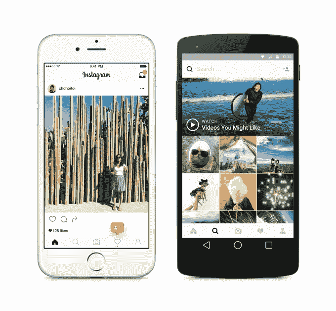

# Instagram 的新算法将最好的帖子放在第一位

> 原文：<https://web.archive.org/web/http://techcrunch.com/2016/06/03/instagrams-new-algorithm-that-puts-the-best-posts-first-goes-live-for-all/>

如果你今天在看你的 Instagram，你可能会注意到一些变化:来自朋友和你关心的其他账户的旧帖子现在出现在那些最近分享的帖子上面。是的，[新的 Instagram 算法](https://web.archive.org/web/20230322201025/https://techcrunch.com/2016/03/15/filteredgram/)重新排列帖子的顺序，首先向您显示“最佳”帖子，该算法现已上线。

我们已经知道公司计划重新订购我们的节目。

今年 3 月，Instagram [宣布](https://web.archive.org/web/20230322201025/https://techcrunch.com/2016/03/15/filteredgram/)计划不再严格按照时间倒序显示帖子，而是根据“你对内容感兴趣的可能性、你与发帖人的关系以及帖子的及时性”来增加帖子数量，当时它解释道。

如果你认为这听起来很像母公司脸书的新闻馈送算法，那你就对了。脸书很久以前就明白了，人们想看的帖子不一定是最新的。他们对你个人来说很重要。

但是由于我们大多数人并不是 24/7 都在打电话——嘿，即使是最忙的人每晚也要睡几个小时！–我们往往会错过我们最喜欢的人的帖子。如果你想和其他时区的朋友保持联系，这一点尤其正确。

正如 Instagram 在周四发布的简短的[公告](https://web.archive.org/web/20230322201025/http://blog.instagram.com/post/145322772067/160602-news)中所说，平均而言，人们会错过 70%的信息。随着 Instagram 的持续增长和扩张——该公司现在[报告](https://web.archive.org/web/20230322201025/https://www.facebook.com/business/a/advertise-instagram?campaign_id=517839611721735&creative=106037131269&keyword=instagram+ads%26placemente&extra_1=a90491ed-b421-4459-92c5-e7aee3208021&extra_2=instagramdetail)每月用户超过 4 亿——其服务上的照片和视频数量也在增加。这就是它做出这种改变的原因。

很自然，今年早些时候的最初声明[在专业 Instagrammers 和品牌中引起了很多关注](https://web.archive.org/web/20230322201025/https://techcrunch.com/2016/03/20/the-death-of-instagram-for-brands/)。他们担心这一改变意味着他们的追随者不会经常看到他们的帖子，因此[恳求用户打开通知](https://web.archive.org/web/20230322201025/https://techcrunch.com/2016/03/28/instagrammers-really-want-you-to-turn-on-notifications-to-avoid-death-by-algorithm/?ncid=rss)。

他们的担心可能是有道理的——毕竟，如果品牌没有发布用户感兴趣的内容，他们的帖子可能会被用户的订阅源进一步埋没。

当然，这种变化也会推动 Instagram 的广告努力。

然而，本周早些时候， [Instagram 开始为企业推出新工具](https://web.archive.org/web/20230322201025/https://techcrunch.com/2016/05/31/instagram-officially-announces-its-new-business-tools/)，帮助他们解决这个问题。来得正是时候。

借助名为“Insights”的新应用内分析系统，品牌可以更好地了解受众的人口统计数据，包括他们在哪里，他们何时倾向于参与，哪些帖子表现良好，等等。如果品牌看到一个帖子表现不错，他们也可以在应用程序中点击几下，将其转换为 Instagram 广告。

这些新工具将在未来几个月内到达美国、澳大利亚和新西兰的企业，并将在年底前到达世界其他地区。

根据这篇博文，面向用户的新 Instagram 算法现已上线——或者，至少，如果你还没有看到，你很快就会看到。多快？根据 Instagram 发言人的说法，该计划将在未来一个月内覆盖整个用户群。