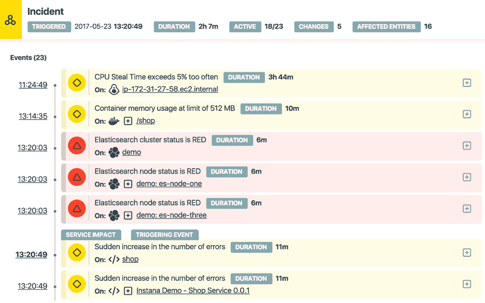

# Instana 为其微服务监控和管理服务 TechCrunch 筹集了 2000 万美元

> 原文：<https://web.archive.org/web/https://techcrunch.com/2017/12/14/instana-raises-20-million-for-its-microservice-monitoring-and-management-service/>

# Instana 为其微服务监控和管理服务筹集了 2000 万美元

[Instana](https://web.archive.org/web/20221209182940/https://www.instana.com/) 是一家在自动化和人工智能的帮助下帮助企业监控和管理其微服务部署的公司，今天宣布获得由 Accel 领投的 2000 万美元 B 轮融资，现有投资者 Target Partners 也参与其中。这使得 Instana 迄今为止的资金总额达到 2600 万美元。

Instana 于 2015 年推出，标榜自己是下一代应用性能管理(APM)解决方案，专注于监控借助容器和微服务慢慢开始在企业中出现的动态现代应用。Instana 的承诺是，一旦用户在他们的服务器上安装了它的代理，它就可以检测和映射组成这些应用程序的所有不同组件，并且可以实时映射它们之间的交互和依赖关系。然后，它使用收集的信息自动检测异常情况。

Instana 创始人兼首席执行官 Mirko Novakovic 表示:“自我们在德国成立以来，Instana 一直专注于满足监控当今现代动态应用环境的需求。“通过提供独特的人工智能解决方案，我们成功地推动了客户的快速采用，仅在 10 个月内就在全球近 100 家企业客户中进行了部署。我们现有的投资者 Target Partners 加入了 Accel ，这是另一个强有力的支持；随着 Instana 不断扩展、成熟并取得成功，他们的指导和支持将至关重要。”

该公司计划使用新的资金来扩大其产品开发团队，并“满足全球市场的需求。”