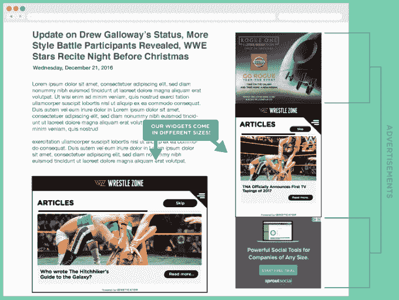

# Insticator 筹集了 520 万美元帮助出版商使他们的故事更具互动性 

> 原文：<https://web.archive.org/web/https://techcrunch.com/2017/07/13/insticator-series-a/>

# Insticator 筹集了 520 万美元来帮助出版商使他们的故事更具互动性

Insticator 宣布已经筹集了 520 万美元的首轮融资。

这家初创公司允许在线出版商将测验、投票和其他互动元素(由 Insticator 或出版商自己创建)添加到他们的故事中。然后，他们也通过在这些小工具中投放广告来赚钱。

其他尝试做类似事情的创业公司包括 [Playbuzz](https://web.archive.org/web/20221207012736/https://beta.techcrunch.com/2016/08/05/playbuzz-impact/) 和 Qzzr ( [原名 Boombox](https://web.archive.org/web/20221207012736/https://beta.techcrunch.com/2015/10/22/boombox-helps-publishers-add-an-interactive-touch-to-their-content/) )。

创始人兼首席执行官扎克·杜高(Zack Dugow)表示，Insticator widget 旨在实现一个重要的平衡——它增加了出版商的参与度，并作为一个“高度可见的广告单元”，而不会因为过于可见或咄咄逼人而惹恼读者。他还说，这个小工具是高度可定制的，所以它“看起来和感觉起来都非常像网站本身。”

使用 Insticator 的出版商包括华纳兄弟、Ancestry.com 和论坛传媒。

这些出版商也需要与网站之外的读者建立联系，这也是 Insticator widgets 在脸书的即时文章中发挥作用的原因。Dugow 表示，该公司还在努力整合由谷歌牵头的加速移动页面格式。

新的资金最初在一份监管文件中披露，由联合风险管理公司牵头，参与方包括明茨 T2 公司和贝特森公司。Insticator 现在已经筹集了超过 800 万美元的资金。