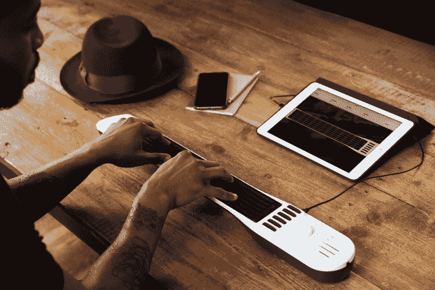

# 来自@Artiphon 的仪器 1 现已发货

> 原文：<https://web.archive.org/web/https://techcrunch.com/2016/11/11/instrument-1-shipping/>

# Artiphon 的 Kickstarter 热门乐器 1 现已上市

拿一根查普曼手杖，在它的肚子里加入许多技术，在它的插孔里塞一根 USB 线，你就会得到一个看起来有点像乐器的东西。这是由 [Artiphon](https://web.archive.org/web/20230219002117/http://artiphon.com/) 研发的一种全新的乐器。通过[一个七位数的 Kickstarter 活动](https://web.archive.org/web/20230219002117/https://www.kickstarter.com/projects/artiphon/introducing-the-artiphon-instrument-1)资助，这款乐器现在正在发货，我们迫不及待地想看看人们会用它创造什么。

这项运动经历了许多挫折和延迟，主要围绕一个熟悉的主题:从原型到大规模生产真的很难。正如该公司几天前给 Kickstarter 支持者的信所解释的那样，试图找出如何与制造伙伴合作尤其困难。然而，看起来这些问题现在已经成为过去，该公司的仪器 1 现在可以以令人惊讶的 400 美元的价格订购。

试图解释这种乐器实际上是什么，说起来容易做起来难。它可以作为吉他或键盘来演奏，但它也具有压力敏感性和内置的加速度计，这可以在顶部添加一层创意。事实上，只要看一下视频，就能感受到为什么音乐家们对这个新的创造力聚宝盆既挠头又兴奋不已。

要演奏乐器，您可以使用配套的应用程序来帮助您挑选声音、调音等。它还兼容 MIDI，这使它能够兼容大量用于创作音乐的移动和桌面应用程序，包括 GarageBand、Animoog、SampleTank、Ableton Live、ProTools、Logic、Mainstage 和许多其他应用程序。

实际上很难知道该产品是什么样的。事实上，即使是[看着专业音乐人第一次尝试](https://web.archive.org/web/20230219002117/https://www.youtube.com/watch?v=Y4CBoIAcLlk)也是相当搞笑的。他们认识到有一股新的创作潜力隐藏在那里，但他们也知道有一个非常明确的学习曲线来掌握一个全新的工具。

仪器 1 提供了一个陡峭的学习曲线，但也潜在地无限的创造力。

唯一不允许在上面演奏的歌曲是《天堂之梯》。*楼梯，被拒！*好吧，开个玩笑，[你可以](https://web.archive.org/web/20230219002117/https://www.youtube.com/watch?v=0uZceBf6ATg)，它漂亮地展示了仪器 1 的多功能性。

早期的报告表明，仪器 1 是万能的。我们迫不及待地想看看它是否也会成为新一代音乐家的大师。如果这个小美人今年出现在世界各地许多极客音乐家的愿望清单上，我们不会感到惊讶。