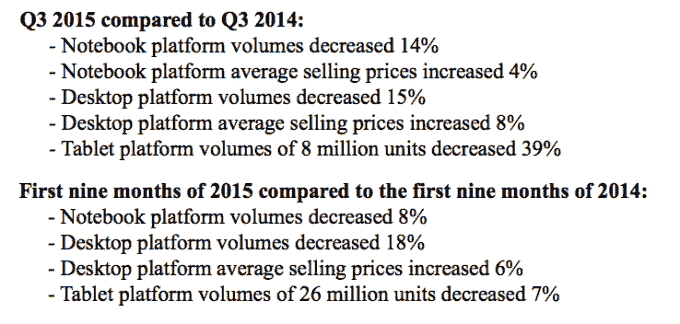

# 尽管个人电脑市场下滑，英特尔在第三季度仍以 145 亿美元的收入胜出 

> 原文：<https://web.archive.org/web/https://techcrunch.com/2015/10/13/intel-beats-in-q3-with-14-5b-in-revenue-despite-falling-pc-market/>

# 尽管个人电脑市场下滑，英特尔第三季度收入仍高达 145 亿美元

今天钟声敲响后，英特尔[报告了](https://web.archive.org/web/20221007094843/http://files.shareholder.com/downloads/INTC/855357607x0x854359/AE39D10A-21FA-43B0-9E57-727EA7C29C8D/Earnings_Release_Q3_2015_5_.pdf)其第三季度的财务表现，包括 145 亿美元的收入和每股 0.64 美元的收益。在盈利突破之后，这家芯片巨头的股价开始上涨。

分析师此前预计英特尔每股利润为 0.59 美元，营收为 142 亿美元。这些预期分别下降了 10.6%和 2.3%。

为了完善原始数据，英特尔报告第三季度净收入为 31 亿美元，毛利率为 63%。该公司在三个月内支付了 11 亿美元的股息，并斥资 10 亿美元回购了 3600 万股自己的股票。

**哗**

数字是上帝，但也是屁话。所以让我们稍微分开一下:

*   其个人电脑部门的总收入为 85 亿美元，比上一季度增长了 13%。虽然这很不错，但英特尔的客户端计算部门的收入比去年同期减少了整整 7%。个人电脑依然疲软。我们知道这个。
*   英特尔的其他每个部门都在连续增长，其中三分之二的部门同比增长。也就是说，英特尔所做的一切，除了将芯片植入笔记本电脑之外，至少做得还不错。其软件部门表现最差，而数据中心部门环比增长 8%，同比增长 12%。
*   数据中心部门的收入为 41 亿美元，是英特尔的第二大集团。

英特尔以超过 140 亿美元的现金、等价物和短期投资结束了这一时期，高于去年同期和上一季度。所以这很好。

**个人电脑市场**

请用你的脸发出以下声音:womp，Womp。以下是英特尔发布的细分数据:

那不太好。请记住，PC 市场很大，参与者很多。上述情况意味着其他原始设备制造商，以及像微软这样的参与者，很可能没有球。

**指导**

如果你愿意，可以称之为展望，但英特尔预计假日季度的收入为 148 亿美元。据推测，其中很大一部分将来自圣诞节前后传统上强劲的个人电脑销售周期。

英特尔预计其毛利率将下滑 100 个基点，至 62%的整数。这些数字意味着盈利能力与刚刚过去的一个季度没有太大的不同。

英特尔仍然是一家处于转型中的公司，它正在寻找新的收入来源来补充和替代下滑的个人电脑收入；从本质上来说，个人电脑收入的下降并不是英特尔的错，相反，这更多地反映了个人电脑市场本身的陈旧和下滑。

英特尔的股价在盘后交易中基本持平。