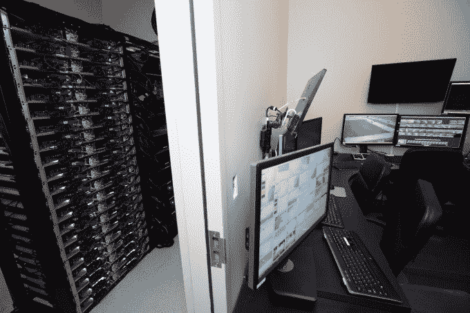

# 英特尔通过收购 Replay Technologies 获得独特的 3D 视频技术 

> 原文：<https://web.archive.org/web/https://techcrunch.com/2016/03/09/intel-gets-unique-3d-video-tech-with-replay-technologies-acquisition/>

# 英特尔通过收购 Replay Technologies 获得独特的 3D 视频技术

英特尔昨晚在公司博客文章中宣布收购以色列公司 [Replay Technologies](https://web.archive.org/web/20230111052316/http://replay-technologies.com/) 。据英特尔称，该公司提供了一种不同寻常的 3D 视频渲染功能，称之为“自由维度”或 freeD 视频。

虽然这项技术可能比体育广播有更广泛的用途，但它迄今为止一直被用来使球迷能够获得关键比赛的 360 度视角，并且在最近的 NBA 全明星周末上特别有用，在那里它被展示给[受欢迎的灌篮大赛](https://web.archive.org/web/20230111052316/https://www.youtube.com/watch?v=Q-LNA9KlHhw&list=PLlVlyGVtvuVmdvkt91nlBS9HsbLzOIDMn&index=26)。

英特尔对这家公司如此感兴趣的原因之一是，它不仅是一项很酷的技术，而且是计算密集型的。它需要一堆运行英特尔芯片的服务器才能运行。事实上，为了让 3D 广播魔术在 NBA 全明星赛上发生，Replay 使用 28 台超高清摄像机创建了一个无缝的球场 3D 视频渲染，这些摄像机位于竞技场周围，并连接到基于英特尔的服务器，许多英特尔服务器。

最近一次体育赛事中的 freeD 控制室。[英特尔](https://web.archive.org/web/20230111052316/http://www.intel.com/)供图。

随着公司和个人在更普通的商业环境中使用更少的 PC 和服务器，英特尔正在寻找使用其芯片技术的新方法，3D 渲染无论是像这样的外部观看还是虚拟现实的日益普及，都为公司带来了良好的市场机遇。

此次收购还与体育赛事转播性质的变化以及在日益分化的媒体市场中保持我们注意力的挑战有关。正如我们最近在 NBA 全明星周末、超级碗 50 和其他大型高调体育赛事中看到的那样，网络和联盟正在寻找新的方式来吸引粉丝，让我们对他们的赛事保持兴趣。Replay Technologies 代表了一种确保我们继续观看、分享和谈论我们所看到的内容的方式，无论我们使用的是什么屏幕。

虽然没有官方价格，但以色列 Globes 出版物[援引消息人士称，这笔交易价值 1.75 亿美元。在一封电子邮件中，英特尔发言人表示，该公司不会透露价格。](https://web.archive.org/web/20230111052316/http://www.globes.co.il/en/article-intel-acquires-israeli-co-replay-technologies-for-175m-1001108929)

据 CrunchBase 报道，如果这个价格接近真实价格，那么对于在收购前向该公司投入 2250 万美元的投资者来说，这似乎是一个不错的回报。