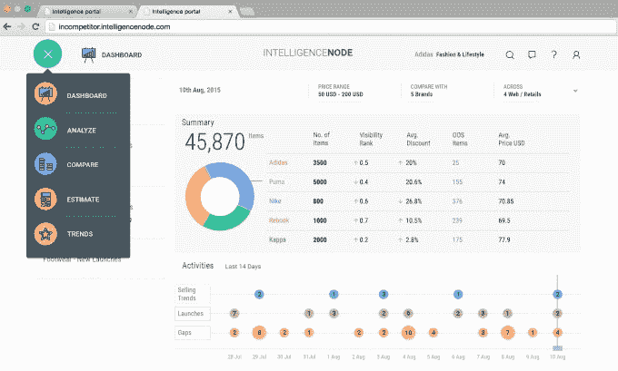
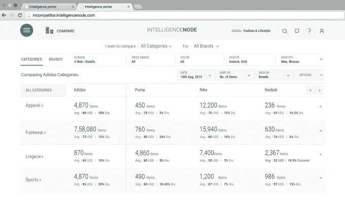

# 零售分析初创公司 IntelligenceNODE 从 NEA 和 Orios TechCrunch 融资 400 万美元

> 原文：<https://web.archive.org/web/https://techcrunch.com/2015/08/19/intelligencenode/>

总部位于孟买的 [IntelligenceNODE](https://web.archive.org/web/20230213121707/http://www.intelligencenode.com/) 是一家服务于零售商的大数据分析初创公司，在获得由 New Enterprise Associates 和 Orios Venture Partners 牵头的 400 万美元首轮融资后，它正着眼于在美国的扩张。该公司还计划雇佣更多的工程师和数据科学家来构建其平台，这有助于品牌为其产品找到最佳的营销策略。

IntelligenceNODE 声称，其技术允许零售商通过建议价格和识别表现不佳的商品，将商品生命周期从 6 个月缩短到 10 天，以便从库存中清除。它还对可以一起销售以增加利润的产品进行分类。这家初创公司的工具对时尚品牌尤其有帮助，因为它们需要尽快推出新产品。IntelligenceNODE 目前的客户包括联合利华、塔塔、Jockey 和印度的在线内衣商店 PrettySecrets。

“我们意识到，许多零售商和品牌正面临着决定其成功的艰难决定——他们是否以合适的价格销售合适的产品？是低价好还是高价好？”2012 年，他与亚森·季米特洛夫共同创立了 IntelligenceNODE。

Sularia 说，IntelligenceNODE 查看来自不同竞争对手和地区的类似产品的数据点，然后将每个客户自己的库存和销售历史、购物篮数据、促销和消费者行为的季节性和节日趋势叠加在一起。IntelligenceNODE 的分析帮助商店设计更有可能促进冲动购买的促销和零售布局。对于电子商务网站，它可以根据每个购物者的篮子里有什么来改进推荐的产品。

IntelligenceNODE 的大多数竞争对手都在美国，包括像 [Indix](https://web.archive.org/web/20230213121707/http://www.indix.com/) 、 [360pi](https://web.archive.org/web/20230213121707/http://360pi.com/) 、 [Boomerang Commerce](https://web.archive.org/web/20230213121707/http://www.boomerangcommerce.com/) 和 [Upstream Commerce](https://web.archive.org/web/20230213121707/http://upstreamcommerce.com/) 这样的公司。

Sularia 说，IntelligenceNODE 的“主要优势包括对产品的深刻理解和对跨地区软产品线特定专业的覆盖，涵盖 800 个单独类别的 100，000 个品牌的 7 亿多种独特产品，涵盖 10，000 多种产品特定属性，”以及实时定价和营销建议。

在一份准备好的声明中，NEA 董事 Tarun Sharma 表示，IntelligenceNODE 的“技术使品牌和零售商，特别是时装和配饰类别的品牌和零售商，能够充分利用分析的力量，这是早些时候的一个痛点，因为这些类别的产品具有非标准化的性质。”

加上去年的种子资金，IntelligenceNODE 现在已经筹集到 440 万美元的资金。该公司表示，从种子到 A 系列之间，其收入增长了近 450%，并计划在明年将收入增加五倍。