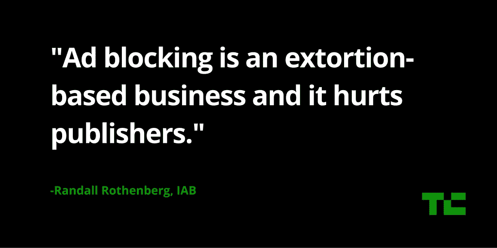

# 互动广告局首席执行官:AdBlock Plus 是一项基于勒索的业务

> 原文：<https://web.archive.org/web/https://techcrunch.com/2016/05/09/interactive-adverting-bureau-ceo-adblock-plus-is-an-extortion-based-business/>

今天在 TechCrunch Disrupt NY，我们的舞台上有 AdBlock Plus 的创始人 Till Faida 和互动广告局的首席执行官 Randall Rothenberg，但不是同时，主要是因为 Rothenberg 拒绝在公共场合与 Faida 握手。

Rothenberg 直言不讳地表达了他对 AdBlock Plus 的厌恶，如果 AdBlock Plus 认为一些广告商的广告不具侵扰性(对一些人来说，当他们付费时),它会将他们列入白名单，但他也对那些想要使用广告拦截器的人表示了些许理解。

“我不反对任何人使用广告拦截器，因为当涉及到用户体验的阻抗时，有一个正确的核心，”他说。"但正如我以前说过的，这是一个基于勒索的行业，伤害了出版商."

Rothenberg 指出，大多数出版商仍然从在线广告中获得大部分收入，他还指出，AdBlock Plus 的业务是获取这些出版商应该获得的收入，然后“将其转移到自己的口袋里”。

【T2

当然，他的立场并不令人惊讶，因为他所代表的组织认为广告屏蔽是对我们所知的免费网络的威胁。

Rothenberg 还以一种更和解的语气表示，他的组织正在与相当多的广告拦截公司合作——他的问题主要是与 AdBlock Plus 这样的公司合作。“他认为他们是从事公共服务行业的，”他这样评价法伊达。

他承认广告会导致网站下载缓慢，但他也认为 IAB 正试图通过精益原则倡议等项目来解决这个问题。

“我们正在尽一切努力与我们的出版商和广告技术供应商合作，”他说，并指出这里的主要问题是 IAB 不能准确地设定标准，互联网的开放架构确实允许任何人进入广告业务。

罗森伯格也不认为广告屏蔽会很快杀死在线出版商。

“在科技网站和游戏网站之外，它仍然没有那么大的影响力，”他说(当然，这对 TechCrunch 和类似的网站来说并不好)。

[gallery ids="1319130，1319128，1319127，1319125，1319126，1319124"]