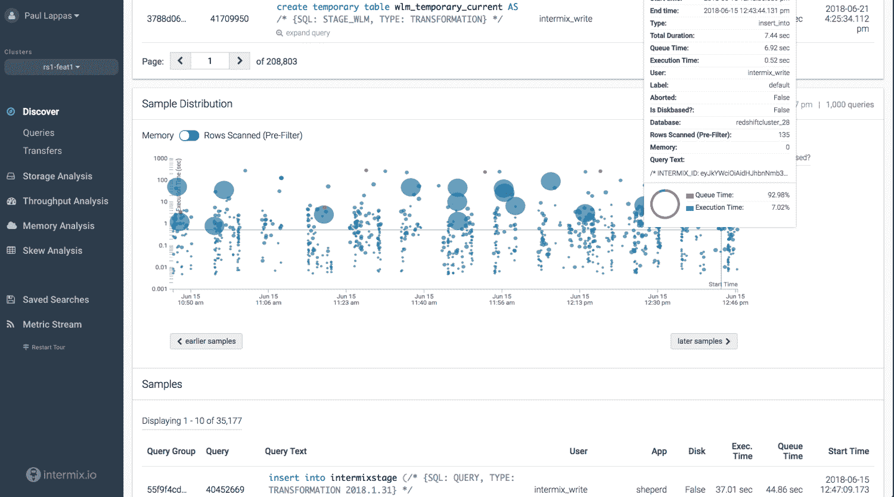

# Intermix.io 旨在帮助数据工程师找到他们最大的瓶颈 

> 原文：<https://web.archive.org/web/https://techcrunch.com/2018/06/27/intermix-io-looks-to-help-data-engineers-find-their-worst-bottlenecks/>

对于任何一家建立在机器学习业务基础上的公司来说，它拥有的数据越多，它就越好——只要它能控制住一切。但是，随着越来越多的信息从不同的来源涌入，记录在模糊的数据库中，并且通常很难(或很慢)查询，将所有这些信息放在一个整洁的地方，让数据科学家可以实际开始运行统计数据的过程很快就遇到了机器学习的最大瓶颈之一。

这是 Intermix.io 及其创始人保罗·拉帕斯和拉斯·坎普希望解决的问题。从查询一直到到达最终结果的所有路径，工程师们可以细致地了解某个特定函数背后的所有细微差别。最终产品可以帮助数据工程师监控通过其系统的信息流，而不管其来源如何，以便尽早隔离瓶颈，并了解流程在哪里出了问题。该公司还表示，它已经从 Uncork Capital，S28 Capital，PAUA Ventures 以及 Postmates 首席执行官 Bastian Lehman 和 SAP 创始人 Hasso Plattner 那里筹集了种子资金。

“公司意识到数据驱动是成功的关键，”坎普说。“云让永久存储你的数据变得便宜和容易，机器学习库让事情变得容易消化。但是一家希望成为数据驱动的公司想要雇佣一名数据科学家。这是错误的第一次雇用。要做到这一点，他们需要访问所有相关的数据，并使其完整和干净。这就落到了数据工程师的肩上，他们需要构建数据装配线，在那里他们创建有意义的类型，以获得可供数据科学家使用的数据。这就是我们服务的对象。”

Intermix.io 以几种方式工作:首先，它标记所有的数据，给服务一个元层来理解什么做什么，以及它去哪里；第二，它挖掘每一个输入，以便收集性能指标，并帮助识别那些潜在的瓶颈；最后，它能够从查询一直跟踪性能，直到结果显示在某个仪表板上。这里的想法是，如果，比方说，某个服务器在某个地方即将耗尽空间，或者表现出一些性能下降，这将很快在实际操作的性能中表现出来，并且需要得到解决。

所有这些都是效率游戏，在小范围内看起来可能没有意义。每天上线的新设备的瀑布，以及越来越多的了解人们如何在线使用工具的方式，即使是最小的公司也可以快速开始构建海量数据集。如果该公司的业务依赖于后台发生的一些机器学习，这意味着它依赖于所有尽可能快速平稳地发生的培训和跟踪，任何打嗝都会对其自身的业务产生实时影响。

Intermix.io 并不是第一家尝试开发应用性能管理软件的公司。还有像 Data Dog 和 New Relic 这样的软件，尽管 Lappas 说他们的主要竞争对手是传统的 APM 软件和一些附加的脚本。然而，数据流是一个完全不同的层，这意味着它们需要一个更独特和定制的方法来解决这个问题。