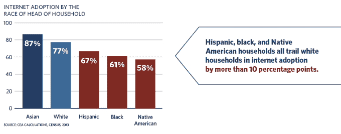
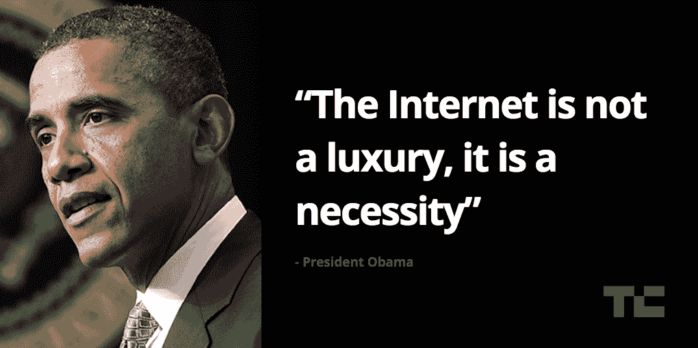

# 奥巴马总统:“互联网不是奢侈品，而是必需品”

> 原文：<https://web.archive.org/web/https://techcrunch.com/2015/07/15/internet-for-everyone/>

# 奥巴马总统:“互联网不是奢侈品，而是必需品”

许多人意识到第三世界国家仍然需要互联网接入。这就是为什么有时会有争议的 Internet.org 出现在脸书。很多人没有意识到的是，在美国，每四个人中就有一个人家里没有互联网。

四分之一。

当我听到人口普查数据时，我震惊了。几年前，当我[访问堪萨斯城](https://web.archive.org/web/20221207214343/https://beta.techcrunch.com/2012/11/13/are-you-ready-for-fast-internet-kansas-city-google-fiber-starts-wiring-homes-for-service/)时，我第一次听说这是一件趣闻，但这是真的。白宫希望通过其新的 [ConnectHome](https://web.archive.org/web/20221207214343/http://connecthome.hud.gov/) 倡议来改变这种情况。

它的使命是:

> 每个孩子都应该有同样的机会去建设一个更光明的未来，去实现他们的梦想。

家庭互联网有助于建立一个更光明的未来，它将家庭与他们在学校和职业生活中取得进步所需的信息联系起来。

为什么不是每个美国人在家里都能上网，原因有很多(请注意，98%的美国人都能上网)，但这在很大程度上与你住在哪里以及你居住的社区有多富裕有关。有些与种族有关:

谷歌[已经参与了](https://web.archive.org/web/20221207214343/http://googlefiberblog.blogspot.com/2015/07/connecthome-google-fiber.html)connect home 项目，通过其谷歌光纤项目向公共房屋管理局选定物业的居民提供每月 0 美元的家庭互联网服务。

以下是几项正在实施的举措:

> –在 Choctaw 部落民族的特定社区，Cherokee Communications、Pine Telephone、Suddenlink Communications 和 Vyve Broadband 将携手合作，确保超过 425 名 Choctaw 公共住房居民能够接入低成本的高速互联网。
> 
> –在西雅图及其覆盖范围内，CenturyLink 将通过其互联网基础计划为 HUD 家庭提供宽带服务，第一年每月 9.95 美元，接下来四年每月 14.95 美元。
> 
> –在梅肯、梅里登、巴吞鲁日和新奥尔良，Cox Communications 将向居住在公共住房管理局的合格 K-12 家庭提供每月 9.95 美元的家庭互联网服务。
> 
> –作为其现有连接承诺的一部分，Sprint 将与 HUD 和 ConnectHome 计划合作，向居住在公共住房中的合格 K-12 学生提供免费无线宽带互联网接入服务计划。这建立在美国电话电报公司和威瑞森之前承诺的免费移动宽带服务的基础上。

显然，要想在家庭互联网问题上取得进展，需要在很多地方花很多时间采取很多举措，但如果这些今天做出承诺的公司明天仍然做出承诺，我们就有机会了。

“互联网不是奢侈品，而是必需品，”奥巴马今天在俄克拉荷马州发表 ConnectHome 声明时说。

“人不是天生的编码员，”他接着说。“他们学习。”

互联网是人们学习的地方，更多的人在家里使用互联网是关键。请看下面奥巴马的声明:

[https://web.archive.org/web/20221207214343if_/https://www.youtube.com/embed/WyXyn01244U?start=2994&feature=oembed](https://web.archive.org/web/20221207214343if_/https://www.youtube.com/embed/WyXyn01244U?start=2994&feature=oembed)

视频