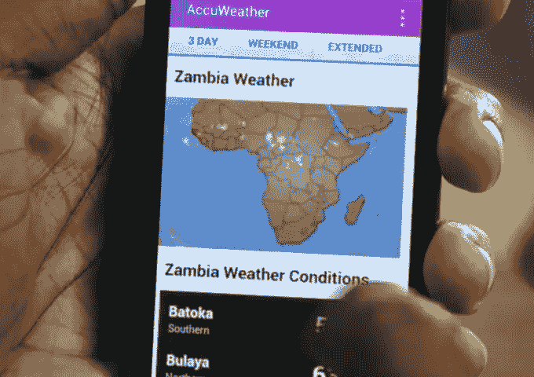

# 互联网。Org 的应用程序可免费访问脸书、谷歌、维基百科、赞比亚本地信息发布

> 原文：<https://web.archive.org/web/https://techcrunch.com/2014/07/31/internet-org-app/>

没有互联网的 50 亿人中有 85%根本负担不起数据计划。因此,[Internet.org](https://web.archive.org/web/20230404120606/https://techcrunch.com/2013/08/20/facebook-internet-org/)[脸书的无障碍倡议](https://web.archive.org/web/20230404120606/http://internet.org/)今天发布了[面向发展中国家的安卓和网络应用](https://web.archive.org/web/20230404120606/http://newsroom.fb.com/news/2014/07/introducing-the-internet-org-app/)免费数据访问有限的服务，包括脸书、Messenger、维基百科和谷歌搜索。它还提供当地的健康、就业、天气和妇女权利资源。

Internet.org 的应用首先在赞比亚推出，然后最终进入其他发展中国家，该应用与当地运营商 Airtel 合作提供免费接入，希望赞比亚人看到网络的价值，并通过该应用购买预付费数据，以探索互联网的其余部分。自 2010 年以来，Facebook Zero 一直在为发展中国家提供一个精简版的脸书。但这个新的 Internet.org 应用程序和其他服务将作为一个紧凑、独立的安卓应用程序提供，内置于脸书安卓应用程序中，或者作为一个移动网站免费提供，绝大多数赞比亚人携带的功能手机都可以访问。

Internet.org，脸书与六家电信公司的合作伙伴，也在研究无人机和卫星，为 15%的人提供互联网连接基础设施，因为他们在偏远地区，没有信号塔。让更多人上网的举措有时被批评为伪装成利他主义的脸书增长策略。在这种情况下，Internet.org 的应用程序将通过在赞比亚免费使用来促进脸书的发展。

但是 Internet.org 产品经理盖伊·罗森通过重申[马克·扎克伯格的白皮书](https://web.archive.org/web/20230404120606/https://techcrunch.com/2013/09/16/tech-to-connect-the-world/)来捍卫该项目的善意一面，他告诉我互联网接入可以对发展中国家人民的运营商机会和教育产生深远的积极影响。“我们在这里建立一个覆盖脸书以外的计划，这样我们就可以加快人们连接到互联网的速度，这个速度是每年 9%，”Rosen 说。“我们真的希望能更快实现这一目标。”

## 一部分互联网免费，其余部分收费

Internet.org 的应用程序旨在为所有赞比亚人免费提供关键服务，同时宣传为什么互联网是有用的，可能值得花钱购买。罗森说，42.5 亿人没有上互联网，但可能是因为传统的手机连接可用，这分为两类。那些想要上网但因为数据套餐太贵而买不起的人。和那些不完全了解网络的人。罗森告诉我“很多人不知道互联网是什么。他们不知道这对他们的生活和生计会有什么影响。这是一个模糊的概念。”

当然，这种观点假设互联网对人们是有益的，但这并不适用于所有文化。但是这个应用程序是为那些想要上网的人设计的，如果他们想上网并且负担得起的话。

为了在赞比亚推广 Internet.org 应用程序，将在脸书应用程序中推出宣传活动，并向 Airtel 用户发送通知。该国居民可以通过智能手机或装有浏览器的功能手机访问 Internet.org，完全免费。或者，他们可以支付一点数据来下载只有 800 千字节的 Internet.org 应用程序，或 Internet.org 应用程序被烘焙成标签的安卓脸书应用程序。

从这三个相同的入口，用户可以完全免费地使用其中一个应用程序。其中包括:

*   脸书——与朋友保持联系
*   Facebook Messenger——与爱人直接联系
*   谷歌搜索——查找信息，尽管点击搜索结果需要一个数据计划
*   维基百科——了解任何事情，所有维基百科内部链接都是免费的
*   AccuWeather 获取对农民至关重要的最新天气信息
*   airtel–了解更多关于运营商的信息并购买数据套餐
*   eZeLibrary 了解赞比亚政府信息
*   生活真相(联合国儿童基金会)-查找健康和卫生信息，包括关于怀孕、分娩、儿童疾病、儿童发展、养育、保护和儿童护理的建议
*   去赞比亚找工作——寻找工作
*   Koko liko–寻找工作
    MAMA(母亲行动移动联盟)–贫困母亲的母亲健康信息
*   WRAPP(妇女权利应用程序)-了解妇女权利以及权利受到侵犯时该如何处理
*   赞比亚 uReport(联合国儿童基金会)-查找艾滋病毒和艾滋病健康信息

如果谷歌的加入看起来有点奇怪，因为它有自己的互联网无障碍倡议项目 Loon，知道吗，脸书告诉我，应用程序中的内容提供商不需要成为 Internet.org 的官方合作伙伴。

## 付费数据计划的入口

Airtel 为所有这些免费接入付费。罗森告诉我 Internet.org 和脸书根本不付钱。相反，免费接入是 Airtel 数据计划的入口。

如果用户点击这些服务之外的链接或使用其他应用程序，Internet.org 将向用户显示一个路障屏幕，警告他们将花费他们的数据计划或需要购买一个。如果有必要，赞比亚人可以去当地商店，用 Airtel 上的预付费信用充值。这种模式之所以奏效，是因为 Airtel 认为，作为亏损大户，它可以利用免费的有限接入来推动数据套餐购买，从而赚取更多的钱。这对当地人来说很好，因为那些负担不起这些计划的人可以免费获得大量资源，因为他们得到了那些负担得起的人的有效补贴。

自 2010 年与全球 50 个国家的运营商合作推出 Facebook Zero 以来，脸书一直在提供免费的精简版服务。该项目因推动脸书在非洲的渗透而受到称赞。

不过，在过去的 6 个月里，Internet.org 自己的交易已经开花结果。在上周的收益电话会议上，扎克伯格表示，“我们在菲律宾、巴拉圭和坦桑尼亚的初步合作伙伴关系已经帮助大约 300 万人连接到互联网，这些人以前无法访问互联网。”今年 2 月，在世界移动通信大会上，他强调了这些交易是如何将客户输送给其运营商合作伙伴的。在讨论一个菲律宾网络 Globe 时，他说“我们在 Globe 用户中看到的是，使用互联网的人数——数据——翻了一番，Globe 的订户增长了 25%,所以这是一个全垒打。”

[扎克伯格今天写道](https://web.archive.org/web/20230404120606/http://www.facebook.com/zuck/posts/10101561824722531)“我们相信每个人都应该获得免费的基本互联网服务——健康、教育、工作和基本沟通的工具。”这是一种强有力的姿态，可以带来很多好处。尽管如此，Internet.org 和脸书能够决定什么是应该免费提供的基本互联网服务，什么不是，这还是有点可怕。你会注意到 Twitter 不在列表中。脸书在世界范围内的吸引力使其成为运营商的宝贵盟友，这些运营商需要旗舰服务来说明人们为什么需要互联网。所以它可以发号施令。

如果这款应用在赞比亚获得成功，你可以预计 Internet.org 将在非洲、亚洲和南美洲的其他运营商和国家推出这款应用，在这些地方，同样的数据可负担性问题仍然存在。如果脸书可以成为人们体验互联网的第一方式之一，当他们成为成熟的互联网用户时，他们不会忘记它。似乎利他主义可以成为一种商业模式。