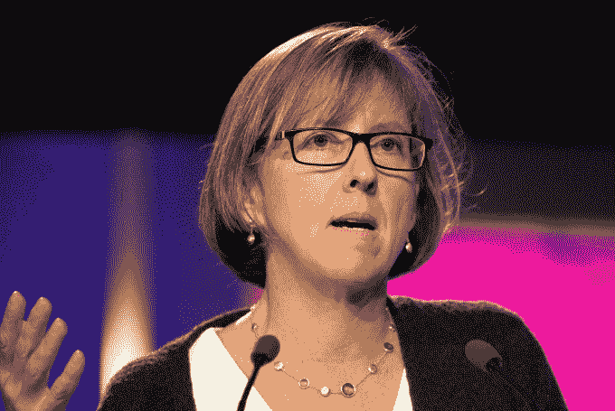

# 以下是玛丽·米克尔的 2018 年互联网趋势报告 

> 原文：<https://web.archive.org/web/https://techcrunch.com/2018/05/30/internet-trends-2018/>

# 以下是玛丽·米克尔发布的 2018 年互联网趋势报告

想要了解所有最重要的技术统计数据和趋势吗？传奇风险投资家玛丽·米克尔刚刚发布了她著名的互联网趋势报告的 2018 年版本。它涵盖了从移动到商业，再到科技巨头之间的竞争的方方面面。查看下面的完整报告，我们将很快添加一些亮点。然后回来让我们的[对这份 294 页的报告的 20 个最重要的部分进行逐张幻灯片的分析。](https://web.archive.org/web/20230110114731/https://techcrunch.com/gallery/mary-meeker-internet-trends-2018/)

*   **互联网应用**:截至 2018 年，世界人口的一半，大约 36 亿人，将会使用互联网。这在很大程度上要归功于更便宜的 Android 手机和更普及的 Wifi，尽管随着网络达到饱和，个人服务将很难增加新用户。
*   **移动使用**:尽管智能手机出货量持平，互联网用户增长放缓，但由于移动设备，美国成年人在网上花费的时间更多，2017 年为每天 5.9 小时，而 2016 年为 5.6 小时。
*   **移动广告**:人们将时间转移到移动设备的速度快于广告收入，创造了 70 亿美元的移动广告机会，尽管平台越来越多地负责提供安全的内容来托管这些广告。
*   **Crypto** :自 2017 年 1 月以来，随着比特币基地用户数量增长近四倍，人们对加密货币的兴趣正在激增
*   **语音**:语音技术正处于一个转折点，因为语音识别达到了 95%的准确率，亚马逊 Echo 的销量也出现了爆炸式增长，截至 2017 年底，其总销量从 1000 多万部增长到 3000 多万部。
*   **每日使用量**——脸书等服务的收入增长与每日用户增长紧密相关，这表明成为一种常规习惯是多么有利可图。
*   **科技投资**:我们的公共和私人科技投资正处于历史最高水平，而前六大公共研发支出和资本支出都是科技公司。

2010 年 11 月 16 日，星期二，摩根士丹利分析师玛丽·米克尔在美国加州旧金山举行的 Web 2.0 峰会上发言。今年的会议将持续到 11 月 17 日，题为“控制点:网络经济之战”摄影师:托尼·阿维拉尔/彭博

*   **电子商务 vs 砖头&砂浆**:电子商务增长加速，现在 13%的零售购物发生在网上，包裹出货量迅速上升，这预示着新购物应用的巨大机遇。
*   亚马逊(Amazon):现在在亚马逊上开始产品搜索的人比搜索引擎上的人还多，但杰夫·贝索斯仍然依靠脸书和 YouTube 等其他平台来激发人们的购买欲望。
*   **订阅服务**:2017 年，网飞增长了 25%，纽约时报增长了 43%，Spotify 同比增长了 48%。免费层加速转化率。
*   **教育**:员工从 YouTube 和在线课程中寻求再培训和教育，以跟上新的工作要求并偿还飙升的学生贷款债务。
*   自由职业者:员工渴望时间安排和在家工作的灵活性，自由职业者在互联网上的发现使其增长速度比总劳动力增长速度快 3 倍。在优步、Airbnb、Etsy、Upwork 和 Doordash 的推动下，按需劳动力在 2017 年增长了 23%。
*   **交通**:人们购买更少的汽车，保留更长的时间，并将交通支出转移到拼车上，2017 年拼车量翻了一番。
*   **企业**:通过更好的界面实现的企业消费化正在刺激 Dropbox 和 Slack 等公司的增长。
*   **中国**:阿里巴巴凭借强劲的商品总量向中国以外扩张，尽管亚马逊仍然统治着收入。
*   **隐私**:中国有一个很大的机会，因为那里的用户比美国用户更愿意用他们的个人数据换取产品利益，而且中国在人工智能领域进行大量投资的同时，在互联网公司 20 强中占据了更多的席位。
*   移民:这对一个强大的经济至关重要，因为 56%的美国顶级公司都是由第一代或第二代移民创建的。