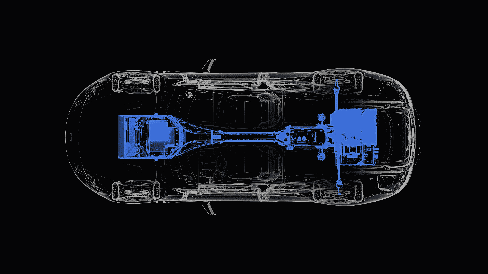

# 介绍阿斯顿马丁首款电动跑车 Rapide E 

> 原文：<https://web.archive.org/web/https://techcrunch.com/2018/09/12/introducing-rapide-e-aston-martins-first-electric-sports-car/>

# 介绍阿斯顿·马丁的首款电动跑车 Rapide E

阿斯顿·马丁终于分享了英国汽车制造商首款全电动跑车 Rapide E 的一些规格和几张预告照片。结论是:这将是快速和罕见的。

该公司将只生产 155 辆 Rapide E，该车将由容量为 65 千瓦时的 800 伏电池系统供电。(可以肯定的是，这使得阿斯顿·马丁成为第一家推出 800 伏系统的豪华车公司。)

该电池将使用 5600 多个锂离子 18650 格式圆柱形电池，预计续航里程超过 200 英里。使用 400 伏电源插座和 50 千瓦充电器，电池系统的充电速度为每小时 185 英里。这款汽车的电池系统确实能够为那些使用 800V 插座提供 100kW 的电池更快地充电，每小时可行驶 310 英里。首席执行官安迪·帕尔默(Andy Palmer)最近告诉 TechCrunch，这相当于大约 15 分钟才能将电池充电 80%。

这个项目的主要目标——一个已经进行了多年的项目——是制造一种能够提供 V12 发动机 Rapide S 感觉的电动汽车。该公司表示，工程师们特别关注威廉姆斯先进工程公司负责的电动动力系统、底盘和软件集成的开发和调整。

阿斯顿马丁 Rapide E。

Rapide E 预计最高时速为 155 英里，从 0 到 60 英里/小时的速度不到 4 秒，从 50 到 70 英里/小时的速度为 1.5 秒。电池系统为两个后置电动机提供动力，这两个电动机产生的综合目标输出刚刚超过 600 马力和 700 磅-英尺的扭矩。

阿斯顿·马丁强调，无论电池有多满，驾驶员都将能够达到这些性能目标。该公司表示，其目标是让 Rapide E 能够在著名的纽博格林赛道上跑完整圈，“完全不降低电池的性能，并能够应对日常的反复紧急加速和制动需求。”

客户交付定于 2019 年第四季度。

Rapide E 可以说是通向阿斯顿·马丁电动未来的桥梁。Rapide E 和复活的 Lagonda 品牌将在即将到来的英国 St. Athan 生产工厂建造。Lagonda 将是阿斯顿马丁的电动品牌，从 2021 年开始生产。

“Rapide E 将帮助我们了解技术和客户，”帕尔默在 8 月蒙特雷汽车周期间告诉 TechCrunch。帕尔默说，客户已经同意与该公司合作，提供数据以及他们驾驶和拥有电动汽车的经验，并补充说，这些信息将影响即将推出的 Lagonda 品牌。

阿斯顿马丁没有公布 Rapide E 的价格，称一旦客户申请，价格就可以确定。该公司此前表示，它的价格将在 25.5 万美元左右。