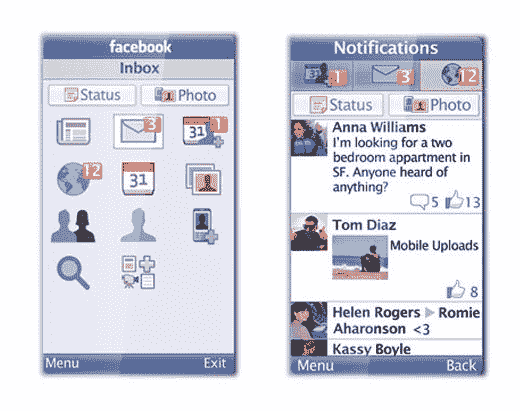
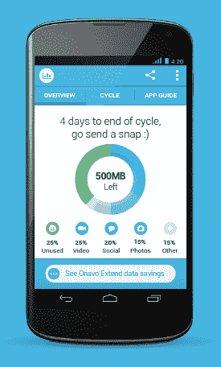
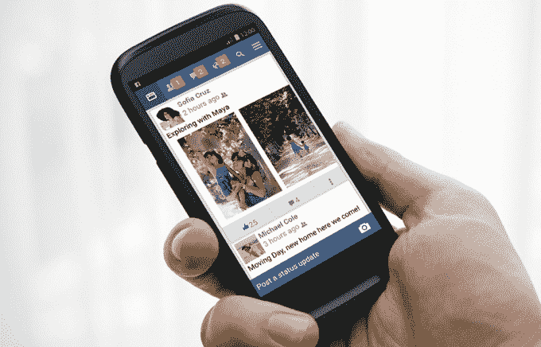
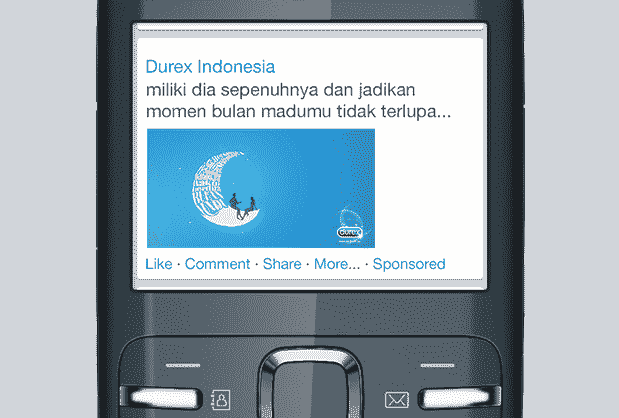
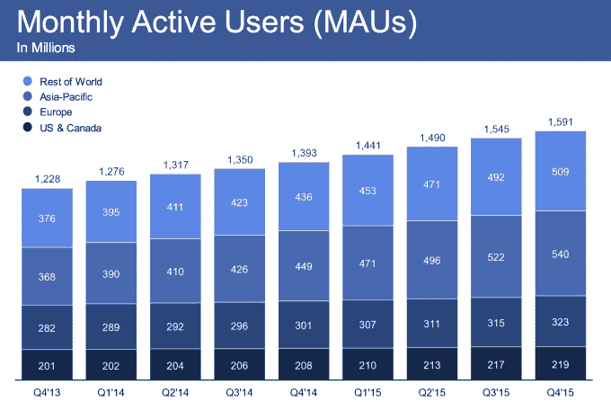

# 脸书在没有太多的地方学会赚钱

> 原文：<https://web.archive.org/web/https://techcrunch.com/2016/02/02/invasion-of-the-ads/>

0.32 美元。这是脸书在 2012 年初从发展中国家的每一个用户身上获得的微薄收入。这是可以理解的。印度、巴西和墨西哥的许多公民没有多少钱可花。

这是脸书的底线。这些人的家里没有高速移动网络，或者他们负担不起，这意味着加载充满广告的新闻提要是一种痛苦的经历。他们使用的是功能手机或带有小屏幕的老式智能手机，所以广告看起来没那么诱人。

有些人根本没有购买力去购买广告商通常在其他市场上出售的东西。

问题在于，脸书已经在许多核心市场如美国、加拿大和英国达到了用户饱和。没有那么多的人去登记了。脸书的用户增长前景肯定在“世界其他地区”，但这些签约并没有产生足够的收入。

这一点，以及即将到来的向移动的转变，吓坏了投资者，并导致脸书的首次公开募股大幅下跌。它的股价跌至 19 美元左右。

## 4X 2012

然而，在此后的几年里，脸书实施了显著的重心转移。它没有为加州总部周围的有线人群建造房屋，而是开始思考如何让脸书在地球另一边的小城镇成为一次伟大的经历。对于拥有不同手机、不同运营商和不同钱包的人来说。

这个结果在上周[脸书的轰动一时的 2015 年第四季度收益报告](https://web.archive.org/web/20230316161133/https://techcrunch.com/2016/01/27/facebook-earnings-q4-2015/#.c09dfs:62zH)中已经明确了。该社交网络现在在由发展中国家组成的“世界其他地区”的每个用户(ARPU)的平均收入为 1.22 美元。这几乎是其 2012 年收入的 4 倍。今年它取得了巨大进展，与第三季度和 2014 年强劲的假期季度相比，增长了 29.8%。

2015 年第四季度，脸书的 ARPU 在“世界其他地区”达到 1.22 美元，高于 Q1 2012 年的 0.32 美元

当然，这远不及 ARPU·脸书在美国和加拿大赚的 13.54 美元，或欧洲的 4.50 美元。但它正在迅速追赶亚太地区。随着脸书投入大量资源连接“下一个十亿”，主要是在发展中国家，Internet.org 和脸书的增长努力不再是开放知识经济的慈善工作。它们是收入的明显途径，可以为脸书在虚拟现实、人工智能等领域的大赌注提供资金。

# 为下一个十亿而建

## 一天比一天聪明

时间站在脸书一边。脸书天然的病毒式传播和效用不可避免地促使人们加入。对于一个国家的早期采用者来说，新闻提要并不那么有趣，因为他们关心的人并没有在那里分享。但是朋友们会唠叨着要朋友们加入，当他们加入时，他们的新闻会变得更容易上瘾。他们访问的次数越多，看到的广告就越多。

同样，花在脸书上的时间教会它人们想看什么。从喜欢企业页面到评论新闻报道到在个人资料中添加信息，脸书收集越来越多的数据来推动其广告定位。这意味着人们看到的每个广告更有可能发挥作用，广告商支付的费用也更高。

脸书明年就 12 岁了，从 2006 年起就对世界上所有人开放。风险资本和在核心市场赚到的钱让它可以在海外玩长线游戏。

## 移情工程

脸书的建设方式也有所不同，尽管网速很慢，但还是强调速度。脸书加载速度越快，使用起来就越不令人沮丧。这导致人们即使只有几秒钟也要打开它，花更长的时间来滚动提要、发信息和使用脸书的所有其他功能。

[脸书在 2011 年收购了 Snaptu](https://web.archive.org/web/20230316161133/https://techcrunch.com/2011/03/20/facebook-reportedly-acquires-snaptu-for-an-estimated-60-70-million/) ，并把它变成了每部手机的脸书，这是一款模拟智能手机体验的功能手机应用。无论人们在什么设备上，他们都能感受到真实的脸书。到 2013 年，脸书每部手机有 [1 亿次下载](https://web.archive.org/web/20230316161133/https://techcrunch.com/2013/07/21/facebooks-feature-phone-platform-scores-100m-users-most-in-emerging-markets/)，并提供广告服务。

每部手机都有脸书

奥纳沃

脸书还在 2013 年购买了一种减少数据和电池使用的方法。该公司从收购以色列初创公司 Onavo 获得的技术使其应用程序速度更快，消耗更少的用户数据计划，并且不会杀死他们的手机。这使得脸书变得更加实惠和方便，所以人们更多地使用它。

2014 年，随着 Internet.org 创新实验室在[的成立，该公司加大了移情工程的力度。它让脸书和其他公司模拟发展中国家恶劣的网络条件，以了解他们的应用程序如何工作，或者更多情况下，当数据变慢到涓涓细流时，他们的应用程序如何工作。](https://web.archive.org/web/20230316161133/https://techcrunch.com/2014/04/30/internet-dot-org-innovation-lab/)

为了激发员工的同情心，脸书去年在门洛帕克总部设立了[【2G 星期二】](https://web.archive.org/web/20230316161133/https://techcrunch.com/2014/04/30/internet-dot-org-innovation-lab/)。员工必须通过发展中国家常见的缓慢的 2G 连接访问脸书，因此他们知道这些用户的痛苦，并努力使应用程序运行更流畅。

## 进入是第一步

Internet.org 利用脸书的慈善意图致力于连接整个世界。脸书坚持认为，货币化不是其无障碍倡议的目的。但一个不可避免的副作用是，如果脸书为某人打开网络，他们很可能会选择这个社交网络。

最终，让更多的人获得可靠、负担得起的互联网连接可能会为脸书带来收入。无处不在也推动了网络效应。这些可能需要很长时间才能抵消脸书为让世界其他地方联网而投入的资金。

脸书的 Aquila 无人机

脸书开始制造太阳能无人机和激光器，为偏远地区提供互联网接入。这些无人机还没有在实地飞行，但是脸书已经开始测试其 Aquila 无人机，最终可以给手机信号塔范围之外的人提供连接，这样他们就可以自学、交流……并最终更多地使用脸书。

去年，脸书也发布了它的 Internet.org 应用程序，现在已经在 33 个国家可用。它提供对脸书、信使、维基百科、健康信息、公民资源和其他网站的免费数据访问。这款名为 Free Basics 的应用遭到了网络中立批评者的抵制，他们认为这是脸书控制人们访问的一种方式。但脸书认为有互联网总比没有好，并已转向创建一个更开放的平台，让其他应用程序免费使用。

免费基础应用

超过 1900 万人使用 Internet.org 的应用程序进行联系。虽然它不显示广告，但它可以让人们相信互联网是值得付费的，包括一个包含营销的脸书版本。

脸书建兴

但是，即使有人负担得起数据计划，并在连接范围内，脸书仍然希望让自己在全球各地更加方便。2015 年 6 月，脸书推出了[脸书 Lite](https://web.archive.org/web/20230316161133/https://techcrunch.com/2015/06/04/download-facebook-lite) ，这是一款精简版的安卓应用，它依赖于从 Onavo 那里学到的数据处理技术。

整个 app 不到 1mb，下载超级快。通过抛弃视频，只在必要时以全分辨率播放图像，它在弱连接上加载速度很快，不太可能垄断人们的数据计划。结果是脸书的使用是无罪恶感的，不会花费一只胳膊和一条腿。当你不担心看广告要花多少钱时，广告就不会那么烦人了。

# 每部手机的广告

所有这些努力结合起来，建立了一个海滩头，以提高发展中国家的广告收入。但是脸书也在正面解决这个问题。

在其核心市场，广告越来越花哨，数据越来越密集，但像高清视频这样的格式不会在更偏远的地区传播。用户会感到厌烦，在他们完成加载之前就开始滚动。

## 适应当地人

脸书的“未接来电”广告

从 2014 年开始，脸书开始提供带宽广告定位。这使得营销人员可以根据人们通常是通过 2G、3G、4G 还是 LTE 连接使用脸书来向他们展示广告。这样，广告商就不会浪费钱向那些因为加载速度太慢而不愿看的用户展示高清照片或视频广告。

脸书还从当地独特的行为模式中获得线索。

脸书首次涉足专门针对发展中国家的广告是“点击未接来电”。在印度，打出去的电话很贵。这就是为什么企业经常敦促人们“漏接电话”。潜在客户拨打该企业的电话号码，但在接听之前会立即挂断，这样他们就不用付费了。然后，企业可以自费给这个人回电。

脸书制作了模拟这种体验的广告，给商家提供这个人的电话号码，这样他们就可以打电话或发短信给商家，告诉他们可以刺激购买的信息。

## 视频变成幻灯片

为了促进发展中国家更多新颖广告策略的发展，脸书去年启动了[创意加速器](https://web.archive.org/web/20230316161133/https://techcrunch.com/2015/06/10/facebook-creative-accelerator/)。它让品牌有机会直接与脸书的团队合作，建立与 2G 连接、功能手机和其他旧技术兼容的活动。

与脸书创意加速器合作制作的广告

例如，脸书与安全套品牌杜蕾斯(Durex)合作，在印尼开展了一场广告活动，围绕着一张分辨率相对较低、能在功能手机上快速加载的图像。脸书还帮助编写了文本，融入了该国围绕性和节育的不同文化规范。与创意加速器合作过的品牌在广告召回和购买意向方面都有所提高。

也许最能体现脸书如何将工程和创意结合起来，从发展中国家榨取钱财的是其新的幻灯片广告形式。

首席运营官·雪莉·桑德伯格在最近的财报电话会议上表示:“幻灯片产品能够让连接速度较低的手机和具有一系列照片的功能手机获得类似视频的体验。”。“可口可乐在肯尼亚和尼日利亚使用了这种方法。他们截取了为其他市场制作的视频广告的截图。他们把它们和文本一起上传了。他们接触了 200 万人，广告认知度提高了 10 个百分点。”

脸书的幻灯片广告形式

从本质上讲，视频在这些市场需要很长时间才能加载，因此品牌可以将他们的视频切割成相当于故事板的东西。通过一些带有文本的图像，幻灯片广告可以传达与全动态视频相似的故事。脸书告诉我，它看到巴西和印度对幻灯片广告特别感兴趣。

尽管如此，脸书只是从发展中国家的表面刮去了现金。美国公民在消费能力上的不足，可以通过消费时间来弥补。在世界其他地区，脸书的用户数量增长速度几乎是美国和加拿大的 4 倍。尽管有这样的增长，那里的人们每月使用它的天数还是增加了。截至 2013 年底，世界其他地区每月有 57.4%的用户每天使用脸书，而现在这一比例为 62.6%。

在世界其他地区，脸书的增长速度几乎是美国和加拿大的 4 倍

正如桑德伯格在财报电话会议上所说，当你比较人们的注意力和美元的去向时，脸书“仍然指数化不足”。花在数字媒体上的时间，尤其是移动媒体上的时间[比花在广告上的时间](https://web.archive.org/web/20230316161133/http://digiday.com/platforms/upfrontses-tv-killing-digital-video-5-charts/)要快，但是媒体花费的雪崩正在开始。

这就是为什么脸书正在通过可访问性、工程、目标和广告形式为自己做准备。如果它能让广告商感到舒适，同时吸引网速慢的公民，脸书将越来越多地在最不可能的地方把便士变成美元。马克·扎克伯格希望脸书成为社会公用事业。水电费要花钱。但是脸书已经想出了如何让世界各地的人们用他们的眼睛支付。