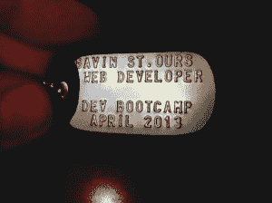

# 随着教育技术的发展，投资下降 

> 原文：<https://web.archive.org/web/https://techcrunch.com/2014/06/25/investments-decline-as-education-technology-grows-up/>

学校可能会放暑假，但美国专注于教育的科技初创公司仍在埋头苦读，招揽新业务和新投资，以利用中小学和大学对创新的巨大需求。

新的政府举措正在全国范围内展开——教育支出[预计将超过 1 万亿美元](https://web.archive.org/web/20221206221036/http://www.usgovernmentspending.com/spending_chart_2004_2019USb_20t)——国际上[也在进行](https://web.archive.org/web/20221206221036/http://www.tabletsforschools.org.uk/worldwide-research/)，更廉价的技术正在进入课堂，而[风险投资公司正在以前所未有的速度支持瞄准市场的新公司](https://web.archive.org/web/20221206221036/https://beta.techcrunch.com/2014/03/26/education-technology-startups-raised-nearly-half-a-billion-dollars-in-q1/)。

总的来说，这是一个向学习之地推销技术公司的好时机。

随着对教育技术新的兴趣和支出，初创公司和老牌供应商都在市场上采取行动。

今天，备考巨头 [Kaplan](https://web.archive.org/web/20221206221036/http://www.kaptest.com/) 表示，它已经以未披露的金额收购了 Dev Bootcamp，使其成为不断增长的软件开发培训市场中的一支强大力量。

Kaplan 表示，它将把 Dev Bootcamp 业务并入其新的经济技能培训集团，该集团已经包括 Metis——一个提供产品设计、Ruby on Rails 和数据科学培训的业务部门。

与此同时，在线销售网络编程和开发培训服务的 Treehouse 正在通过与克林顿全球倡议组织的合作扩大其覆盖范围。

该公司承诺与地区和地方政府、劳动力投资委员会和社区组织合作，为 150，000 名失业和未充分就业的工人提供软件工作培训机会。

在继续教育之外，像 [Schoology](https://web.archive.org/web/20221206221036/http://www.schoology.com/) 、 [Knewton](https://web.archive.org/web/20221206221036/http://www.knewton.com/) 、[structure](https://web.archive.org/web/20221206221036/http://www.instructure.com/)和 [Clever](https://web.archive.org/web/20221206221036/http://www.clever.com/) 这样的初创公司都推出了重大举措。

总部位于纽约的教育管理平台 Schoology 希望利用背后的风，在新一轮融资中筹集了 1500 万美元，由英特尔投资公司牵头，新投资者 Great Oaks Venture Capital 和 Great Road Holdings 参与。之前的投资者 FirstMark Capital 和 Meakem Becker Venture Capital 也参与了融资。

本月早些时候，该公司签署了一份合同，将为乌拉圭的每所学校(覆盖多达 62 万名学生)提供学习管理系统。

“我们看到很多活动来自拉丁美洲，”Schoology 首席执行官杰里米·弗里德曼说。“[在乌拉圭]他们购买了 620，000 台 XO 设备，他们真的需要一个教学和协作的平台。”国家选择了学校学。

“这绝对不是一次性的国际交易，”弗里德曼说。“拉丁美洲尤其令人感兴趣，我们看到了一个巨大的机会。”

国际扩张只是 Schoology 利用投资界筹集资金的原因之一。该公司还希望爬上教育阶梯，敲开崇高神圣的高等教育殿堂的大门。

“在美国方面，我们也开始对高等教育进行更大的投资，”弗里德曼说。该公司[与 CSU-Global](https://web.archive.org/web/20221206221036/http://www.businesswire.com/news/home/20140620005165/en/Colorado-State-University-Global-Campus-Collaborates-Schoology#.U6qajpSzfWY) 签署了合作伙伴关系，CSU-Global 是美国第一所完全在线的州立大学，由科罗拉多州立大学系统董事会于 7 年前创建。

Schoology 的新一轮投资紧随教育投资的下降季度而来，当时风险投资者似乎在今年第一季度的惊人投资速度后喘了口气。第二季度，风险投资公司仅向 66 家初创公司投资了 2.18 亿美元，低于今年第一季度的 5 亿美元。

然而，尽管一些业内人士担心电子技术投资泡沫，但首席执行官们，如资金雄厚的电子技术初创公司[的首席执行官约翰·贝克(John Baker)并不担心。“考虑到相对于其他行业而言，在教育领域的投资严重不足，我看不出这个领域存在泡沫，”贝克说。“如果以百分比来看，私人股本和风险资本对电子学习或教育技术的投资相对较少。”](https://web.archive.org/web/20221206221036/http://www.desire2learn.com/)

他的公司仍在扩大业务范围。此时，该公司正在整合来自 891 家不同初创公司、学生设计项目和 edtech 市场大型企业的应用程序，包括来自大型出版商 [McGraw-Hill](https://web.archive.org/web/20221206221036/http://www.mcgraw-hill.com/) 的内容。这些内容将出现在大约 1500 万用户面前，使其成为业内最广泛的客户群之一。

学校学和设计学并不是唯一在教育领域掀起波澜的公司。6 月初，Instructure 宣布了自己与 Unizin 的协议，Unizin 是一个由印第安纳大学、科罗拉多州立大学、佛罗里达大学和密歇根大学等大学组成的联盟。该公司的 Canvas 学习管理和协作系统运行在分布在该高校联盟中的[互联网 2](https://web.archive.org/web/20221206221036/http://www.internet2.edu/about-us/) 服务上，将在网络上的机构间共享。

Knewton 首席运营官刘中达表示:“这遵循了一个我们已经讨论了一段时间的趋势，即在线(教育)世界不仅仅是一个盈利的世界。”。"非营利机构正在上网提供真正的课程."他们还需要学习管理系统来帮助监控、管理和运营在线课程。

随着像建筑和学校学这样的学习管理系统进入高等教育，像 [Knewton](https://web.archive.org/web/20221206221036/http://www.knewton.com/) 这样的公司正在扩大他们的专业服务能力。该公司宣布[将与爱思唯尔](https://web.archive.org/web/20221206221036/http://www.elsevier.com/about/press-releases/health-sciences/elsevier-to-collaborate-with-knewton-to-build-adaptive-learning-products-for-nursing,-health-professions,-and-medical-students-globally)合作，在未来几年为护理、健康专业和医科学生生产产品。

“我们一直非常关注 K-20 世界…主要是 K-12 和大学，”刘说。“对于护理和医学专业的学生，我们正在扩展到研究生水平和职业领域。这些是全球增长最快的教育领域。”

刘说，与世界上最大的学术出版商之一爱思唯尔的合作，将是 Knewton 在规模、范围和收入方面最重要的合作之一。

Schoology 的弗里德曼表示，如今，教育投资正集中于为内容创作者提供管理和分发系统的技术，而不是内容本身。

没有一家初创公司比 Clever 更能充分体现这种平台方法，Clever 在 5 月份发布了它的[单点登录工具](https://web.archive.org/web/20221206221036/https://www.edsurge.com/n/2014-05-14-no-more-passwords-clever-shows-off-instant-login)。该公司于 2012 年推出了一项服务，将多家供应商的教育内容整合到一个平台上。现在，它为用户提供了单点登录的能力，这样年轻的学生就不必为来自不同供应商的应用程序记住几个密码。

“我们正处于一个转折点，”奥克兰联合学区的信息技术官员约翰·克鲁尔说。“这是一种通用核心和技术的融合。这两件事合在一起创造了所有这些需求。”