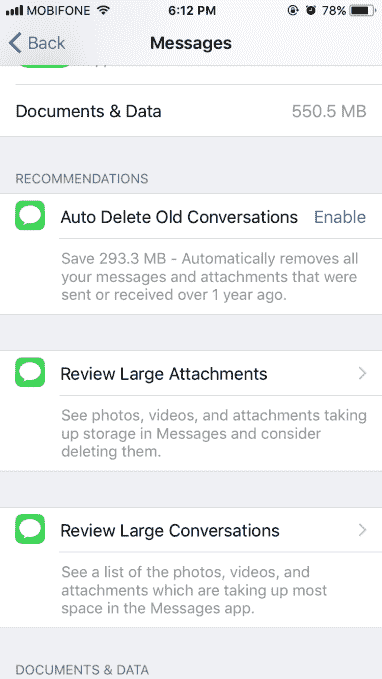

# iOS 11 将通过个性化建议帮助你释放 iPhone 上的存储空间 

> 原文：<https://web.archive.org/web/https://techcrunch.com/2017/06/06/ios-11-will-help-you-free-up-storage-on-your-iphone-through-personalized-suggestions/>

苹果在 iOS 11 中引入了一项新功能，该功能将通过提供个性化建议来帮助用户释放 iPhone 上的空间，这些建议是关于他们可以采取哪些措施来增加可用存储空间。这项功能将大大有助于所有 iPhone 用户更好地控制手机的存储空间，但对那些拥有苹果入门级机型的人来说尤其有用，比如 16 GB 的 iPhone 6 或 6S。

它甚至可以帮助那些拥有 32 GB iPhone 7 或 7S 的人，[批评者认为这仍然不够存储，](https://web.archive.org/web/20230130100805/https://www.cnet.com/news/beware-the-32gb-iphone-7-soon-wont-feel-so-roomy/)因为一些应用程序和游戏的文件大小很大，像实时照片或让你以“原始”格式拍摄的相机功能，以及对高清视频(包括 4K 视频)的支持，所有这些都占用更多空间。

没有可用的存储空间，iPhone 用户发现他们再也无法拍照和拍摄视频、下载新的应用程序和更新、安装新的 iOS 版本等等。

多年来，出现了许多第三方工具——通常以照片压缩应用的形式出现——来帮助解决这个问题，但现在苹果正在正面解决这个问题。

尽管苹果在 WWDC 的主题演讲中没有详细说明其新的“释放存储”功能将如何工作，但自那以后，许多用户已经在推特和博客上谈论了这一新功能。

从截图中(见下文)，你可以看到 iOS 11 将如何根据堵塞*你的*你的 iPhone 的东西来提出管理存储的建议，而不仅仅是提供通用的、通用的提示和技巧。

对于一些用户来说，这可能意味着推动他们打开 iCloud 来查看照片和视频，或者清空“最近删除的”相册。对于其他人来说，iOS 11 可能会建议他们查看并删除 iMessage 中的大附件和大对话——这是人们在释放存储空间时通常不会想到的地方。

你甚至可以配置你的 iPhone 自动删除旧的 iMessage 对话。

*(图片鸣谢，上图: [trainghiemso.vn](https://web.archive.org/web/20230130100805/http://trainghiemso.vn/tong-hop-13-thu-thuat-moi-nhat-va-hay-nhat-tren-ios-11/) )*

它[可能会建议](https://web.archive.org/web/20230130100805/https://twitter.com/tomi91/status/871832875959697408)清理其他苹果应用程序中的内容，如邮件、电视、照片等等。

然而，帮助用户掌握他们的应用程序如何使用存储空间并不是 iOS 11 帮助赢回免费空间的唯一方式。另一个功能是允许 iPhone 用户“卸载”他们未使用的应用程序，这可能会给那些应用程序不经常使用的开发者带来恐惧。

该功能可以在“iPhone 存储”屏幕和“iTunes & App Stores”屏幕中找到，在 iPhone 的设置中，在 iOS 11 测试版中。

打开这个开关，你就可以自动删除不用的应用，同时仍然保留它们的文档和数据。如果你选择从 App Store 重新安装应用程序(假设它仍然可用)，所有数据也会返回。

不过，这对于文件大小较大的应用程序(如一些游戏)来说可能更有用，而不是那些包含大量数据的应用程序，如脸书。这是因为应用程序本身被从手机中移除，但应用程序的数据仍然存在。

目前尚不清楚的是，iOS 11 如何确定哪些应用程序被算作“未使用”，因为对话框没有解释。卸载也可以从 iPhone 存储屏幕的已安装应用程序列表中逐个应用程序地手动完成。

存储空间问题对任何 iPhone 用户来说都是一个问题，但它们更经常困扰那些收入较低的人，以及那些买不起最好设备的人。当他们注册无线计划时，他们会选择免费、低价或老款的 iPhone。

在其他情况下，人们只是根据自己的需求选择了尺寸错误的 iPhone，因为他们不明白更新的技术和功能——无论是更好的摄像头还是对网飞等流媒体服务离线下载的支持——最终将如何影响他们手机的存储空间。

无论如何，这将是今年秋天发布的新 iOS 11 中更受欢迎的变化之一。当然，具有讽刺意味的是，最需要这个功能的用户可能没有可用的磁盘空间来下载 iOS 升级。