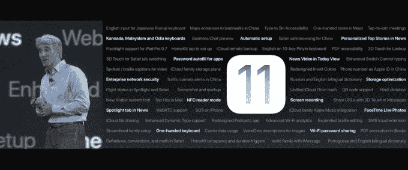
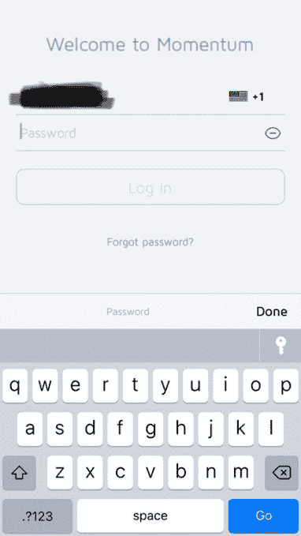

# iOS 11 的新“应用程序的密码自动填充”将无法与你最喜欢的密码管理器 TechCrunch 配合使用(或取代它)

> 原文：<https://web.archive.org/web/https://techcrunch.com/2017/06/08/ios-11s-new-password-autofill-for-apps-wont-work-with-or-replace-your-favorite-password-manager/>

苹果 iOS 操作系统的下一个版本 iOS 11 将让你更容易登录你的应用程序。新的移动操作系统的软件将引入一个名为“应用程序密码自动填充”的新功能，当你在应用程序的登录屏幕上时，可以从 iOS 键盘轻松访问你的密码。

密码自动填充实际上是本周苹果在 WWDC 2017 主题演讲中被戏谑的许多新功能之一。一张幻灯片简短地展示了 iOS 11 的许多其他功能，该公司在演示期间没有时间详细介绍这些功能。

*形象功劳，上图:*

另外，“引入应用程序的密码自动填充”是本周苹果开发者大会上一个会议的名称:

本质上，应用程序的密码自动填充很像今天 Safari 中的[密码自动填充](https://web.archive.org/web/20221025222215/https://support.apple.com/kb/PH21470?locale=en_US)。也就是说，它为您提供了一种访问存储在 iCloud 钥匙串中的密码的方法。

正如苹果指出的，登录应用程序是许多用户摩擦的来源。我们应该使用复杂的密码，经常更换密码，不要把密码存放在不安全的地方——比如 Excel 电子表格或便笺。但是，如果我们不把密码写在某个地方，也很难记住我们需要哪些密码来访问哪些资源。

1Password、LastPass 和 Dashlane 等密码管理器已经成为多年来非常有价值的工具，因为我们的密码数据库随着其复杂性需求而增长。这些工具解决了许多与使用密码相关的问题，提供了桌面软件、应用程序和扩展，允许您安全地保存，有时甚至自动登录您最喜爱的服务。

苹果公司也在几年前为第三方应用程序引入了自己的[密码自动填充功能，但开发者必须自己启用该功能——很少有人这样做。该选项允许 iOS 应用程序利用 Safari 的自动填充&密码功能，但开发人员必须首先将他们的应用程序与他们的网站相关联才能实现这一功能。](https://web.archive.org/web/20221025222215/https://9to5mac.com/2014/06/13/ios-8-lets-apps-access-safari-autofill-credentials-for-quick-easy-login/)

iOS 11 中应用程序的新密码自动填充将不再依赖于相同水平的开发者采用——尽管它可能仍需要一些调整。然而，在很大程度上，iOS 11 本身会根据用户已经保存的凭据来计算出在应用程序中显示哪些凭据。

与早期版本一样，新功能将利用 iCloud keychain 中保存的密码，这将同步你在所有苹果设备(包括 iPhone、iPad、iPod touch 和 Mac)上保存在 Safari 中的密码。

*图片来源:上图:Taj 693[Reddit](https://web.archive.org/web/20221025222215/https://www.reddit.com/r/iOSBeta/comments/6fu8so/feature_keyboard_shows_keychain_symbol_to_enter/)*

使用保存的密码的选项将出现在 iOS 键盘上方的 QuickType 栏中的应用程序中，正如你在这张发布到 Reddit 的截图中看到的(上图)[。](https://web.archive.org/web/20221025222215/https://www.reddit.com/r/iOSBeta/comments/6fu8so/feature_keyboard_shows_keychain_symbol_to_enter/)

然而，该栏似乎不会像 Reddit 上的图像所示那样只显示“密码”，还会包括您在该网站上使用的网站名称和用户名，就像存储在 iCloud Keychain 中一样。此栏的右侧还会出现一个钥匙图标。

你可以在 Twitter 上看到更好的功能示例[，](https://web.archive.org/web/20221025222215/https://twitter.com/m33x/status/872734964982460418)，其中第一个直接来自本周的 WWDC 会议。

https://twitter.com/salimahsn/status/872816522703626241

据 Reddit 上的 iOS 11 beta 测试人员称，该功能已经在脸书、Twitter 和 Snapchat 等顶级应用中运行。

然而，有一件事它没有做到——至少现在还没有——那就是与你喜欢的第三方密码管理应用程序协同工作。我们被告知，它目前只对钥匙链有效。

当我们询问时，该公司向我们证实，“iOS 11 中的密码自动填充功能不会利用存储在 1Password 中的信息”。

但 1Password 指出，他们集成到许多应用程序中的扩展将继续发挥作用。1Password 还表示，它正在试验其他 iOS 功能，如“拖放”，以便更好地使用其软件。

事实上，这是一个聪明的解决办法，因为缺乏第三方对应用程序密码自动填充的支持。正如您在该公司在 Twitter 上分享的视频中看到的[，1Password 利用 iPad 上的分屏模式和拖放功能，允许用户将其用户名和密码从其 1Password 拖到应用程序的登录屏幕上。俏皮！](https://web.archive.org/web/20221025222215/https://twitter.com/1Password/status/872163270756642816)

Dashlane 还指出，苹果新的应用程序密码填充功能并不对他们开放——这在 Android 上不是这样。

“不，不幸的是，[该功能]还不会对 Dashlane 等第三方密码应用开放；这最终限制了苹果消费者的选择和体验。“像谷歌/安卓这样的开放架构，已经允许第三方密码管理器和其他应用程序集成，从而提高用户的安全性和便利性，”他说。

Schalit 指出，在上个月的谷歌开发者大会上，Dashlane 曾表示将与谷歌合作开发应用程序自动填充 API。

“由于苹果的钥匙链在存储凭证方面具有类似的功能，我们预计他们最终会向第三方密码管理器开放他们的平台，以及随之而来的巨大的跨平台便利和安全优势，”Schalit 补充道。

Dashlane 的联合创始人兼产品副总裁亚历克西斯·福格尔(Alexis Fogel)指出，苹果在发布时限制对这种新功能的访问并不是史无前例的。

“众所周知，苹果在打开系统之前会先尝试新的东西。例如，触控 ID 就发生过这种情况——最初只能用来解锁手机或与 Siri 配合使用。这正逐步向开发者开放，”他表示。

应用程序密码自动填充功能的推出，也恰逢苹果正在削弱脸书和 Twitter 在其生态系统中的作用。 [Axios 最近证实](https://web.archive.org/web/20221025222215/https://www.axios.com/apple-removes-facebook-and-twitter-integration-from-ios-11-2433996734.html)iOS 11 正在移除与这些社交服务的集成。

这意味着应用程序——其中许多使用脸书和推特登录——[将不再能够访问](https://web.archive.org/web/20221025222215/https://www.theverge.com/2017/6/5/15743010/apple-ios-11-wwdc-2017-facebook-twitter-social-accounts-login)用户的登录账户。在某种程度上，这可能会迫使开发者采用新的应用程序自动填充功能。反过来，这将使消费者更难转向另一个平台，从而进一步将他们锁定在苹果的生态系统中，因为他们所有的凭证都将保存在苹果的云中。

*图片来源:上图:传感器塔*