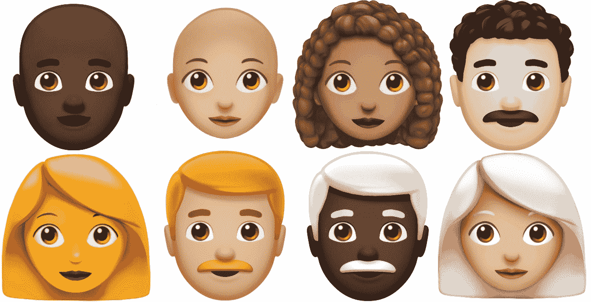
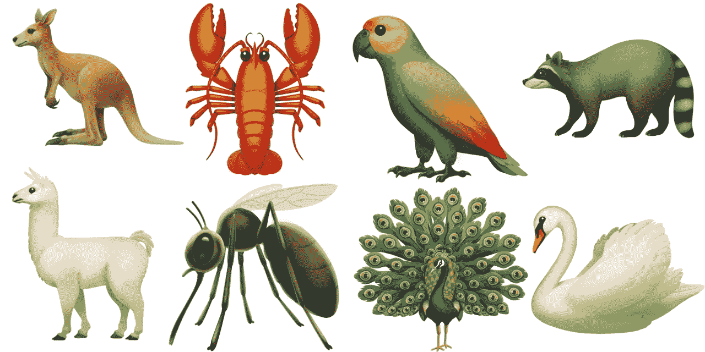
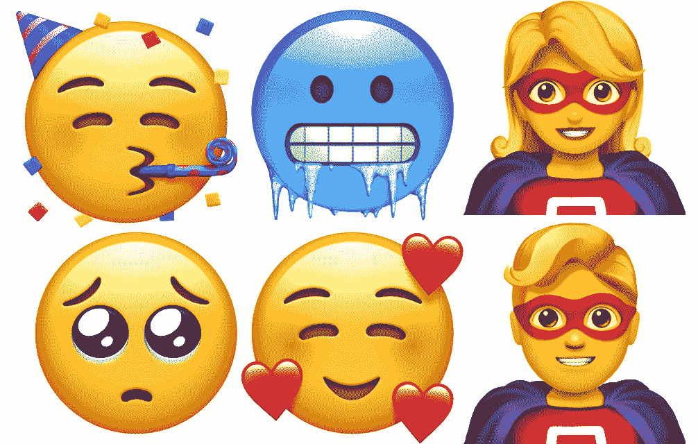
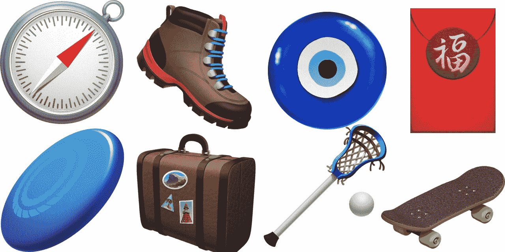

# iOS 12.1 将推出新的表情符号

> 原文：<https://web.archive.org/web/https://techcrunch.com/2018/10/02/ios-12-1-will-come-with-new-emojis/>

苹果即将发布 iOS 12.1 的公测版。在所有人抓狂之前，公司[宣布](https://web.archive.org/web/20230326092435/https://www.apple.com/newsroom/2018/10/apple-brings-more-than-70-new-emoji-to-iphone-with-ios-12-1/)这次更新将会有新的表情符号——有史以来最好的功能更新。

换句话说，苹果正在发布自己对 [Unicode 11.0 表情符号](https://web.archive.org/web/20230326092435/https://techcrunch.com/2018/02/08/get-ready-for-a-bunch-of-new-emojis/)的理解。其他设备和主要服务将很快支持相同的表情符号，但采用不同的设计。

早在 7 月份的世界表情符号日，苹果[就已经预览了](https://web.archive.org/web/20230326092435/https://techcrunch.com/2018/07/16/apple-emoji-will-soon-include-people-with-curly-hair-white-hair-and-superpowers/)一些新的表情符号设计。所以这是你应该期待的。

卷发，灰发，秃顶的人，红发…

和往常一样，除了黄色，你还能找到五种肤色，所有角色都有男性和女性的变体。Unicode 11.0 规范说，供应商应该添加“卷发”表情符号。但看起来苹果得出的结论是“好吧，让我们在那张脸上画一个‘stache’！"

至于其他东西，你会发现一个新的户外配件表情符号，如行李箱、指南针和登山鞋。在食物方面，你会发现百吉饼、盐、纸杯蛋糕、绿叶蔬菜、芒果、月饼等。

说到动物，终于有了蚊子表情符号以及新的骆驼、天鹅、浣熊、袋鼠、龙虾、鹦鹉和孔雀表情符号。

## 动物

## 表面

## 食物

## 其他一切

每次我写表情符号的时候，排名第一的评论总是关于红头发的。但是红发人花了几年时间，Unicode 财团终于听到了你的声音！