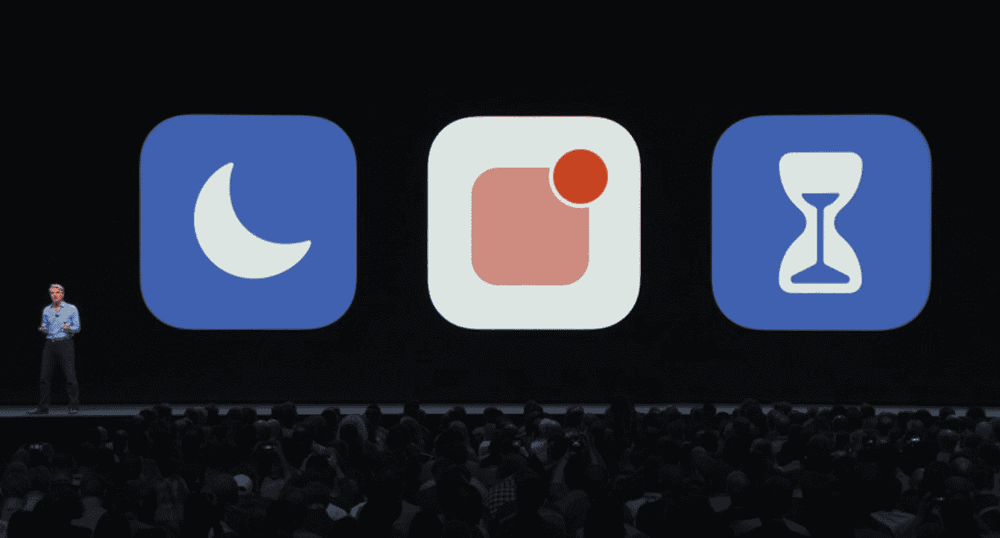
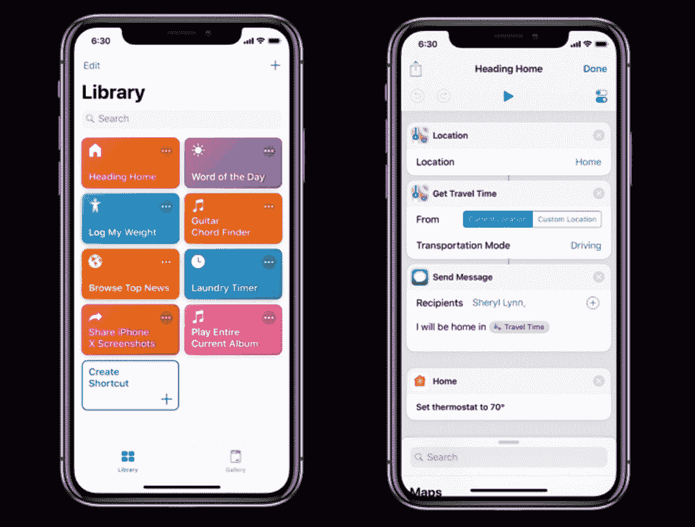

# iOS 12 旨在让你的手机更好地工作 

> 原文：<https://web.archive.org/web/https://techcrunch.com/2018/06/25/ios-12-is-all-about-making-your-phone-work-better/>

iOS 创新的步伐如此之快，以至于苹果都跟不上。在某些方面，iOS 11 的主要特点是漏洞百出，有自动更正错误，信息到达顺序混乱，计算器应用程序计算不正确。iOS 12 是一个很好的节奏变化。

“对于 iOS 12，我们在性能上加倍，”苹果软件工程 Craig Federighi 在 WWDC 上说[。](https://web.archive.org/web/20221207214511/https://techcrunch.com/2018/06/04/apple-introduces-ios-12/)

虽然有一些有趣的新功能，但 iOS 12 并不像过去几年发布的那些版本那样引人注目。它不会改变[使用 iPad](https://web.archive.org/web/20221207214511/https://techcrunch.com/2017/09/19/ios-11-review/) 的方式，也不会全面开放带有[新挂钩的应用](https://web.archive.org/web/20221207214511/https://techcrunch.com/2016/09/13/ios-10-review/)。

很明显，所有容易解决的问题都已经解决了。现在，苹果主要是为特定类别的应用添加新的框架，而不是发布影响所有第三方应用的重大平台变化。

其余的，都是关于改进，错误修复和优化。苹果今天发布了 iOS 12 的[首个公测版。我玩了一会儿 iOS 12 的早期测试版本，所以这是你应该寻找的。](https://web.archive.org/web/20221207214511/https://techcrunch.com/2018/06/25/apple-just-released-the-first-ios-12-beta-to-everyone/)

## 操作系统变更

让我们从操作系统级别的更新开始。iOS 12 应该比 iOS 11 快，包括在老设备上。

当你把你的旧 iPhone 或 iPad 更新到新版 iOS 时，你知道那种瞬间后悔的感觉。一切似乎都慢了很多。苹果希望扭转这一趋势，为 iPhone 5s 或 iPad mini 2 提供更快的 iOS 12。

应用程序应该更快地启动，键盘应该更快地出现，相机应该更灵敏。在 iOS 12 的测试版中很难感受到这一点，所以我们必须在 9 月份再次查看这一声明。

除此之外，iOS 12 还有另一个主题——让你少看手机。这一目标体现在三个新功能上——屏幕时间、更好的通知和更精细的勿扰模式。

屏幕时间是一个全新的功能，让你看到你浪费了多少时间[滚动提要](https://web.archive.org/web/20221207214511/https://techcrunch.com/2017/10/28/how-i-cured-my-tech-fatigue-by-ditching-feeds/)。你将获得每周报告，家长可以设置应用程序限制，在你所有的 iOS 设备上同步。

“请勿打扰”现在更加精确，因为您可以将其设置为一个小时，直到活动结束或您离开某个位置。许多人不想使用这个功能，因为他们忘记关闭它。

至于通知，现在默认是分组的。以我的经验来看，这需要一段时间来适应，但对于嘈杂的应用来说，这是一个很大的进步。您还可以在通知上滑动，以禁用来自特定应用程序的通知，或将它们转换为静默通知。你会觉得更能控制你的 iPhone，而不是觉得你的 iPhone 在控制你。

## 应用程序更新

苹果不能止步于这些改进，必须为自己的应用程序发布应用程序更新。让我们来看看最难忘的。

你终于可以永远抛弃 Skype 了，因为 FaceTime 现在支持群组对话——至少如果你所有的朋友都在用 iPhones 的话。单单这个功能就一定会增加 iPhone 粘性，就像你不能在 Android 上参与 iMessage 对话一样。

谈到信息，大多数 iPhone 用户不会看到今年的区别，因为苹果专注于 iPhone X。除了新的 Animojis，你现在可以使用 Memoji 创建自己的头像。不得不说我真的很喜欢 Snap 的 Bitmoji，用起来还挺兴奋的。唯一的问题是，如果你不是在给使用 iPhone X 的人发信息，这感觉像是单向对话。几年后，当每个人的 iPhone 上都有 Face ID 时，这种功能才会开始有意义。

另外四款苹果应用获得了更新。股票和苹果新闻得到了一些设计上的改进。语音备忘录现在可以将您的备忘录存储在 iCloud 中，并与您的 iPad 和 Mac 同步，而无需使用 iTunes(最终)。最后，iBooks 现在被称为 Apple Books，它现在看起来更像更新后的应用商店。

## 苹果的两个赌注

随着 iOS 12 的发布，苹果正在继续其在增强现实方面的豪赌，并通过 Siri 开始一些新的东西。这些平台变化可能会引起开发者和用户的共鸣，也可能会分散所有人的注意力。

苹果的增强现实 SDK 正在进行重大更新。通过 ARKit 2，开发者可以创建在多个用户之间共享同一个增强现实世界的应用。你可以想象多人游戏和可共享的世界。苹果还致力于提高该框架的整体性能。

但这真的重要吗？感觉很多像你一样的极客，TechCrunch 的读者，在 iOS 11 发布后测试了 ARKit 应用。但是至今还没有一个主流的热门。目前还不清楚人们是否真的想使用他们的 iOS 设备来增强现实体验。

第二件大事是 Siri 快捷键。在苹果[收购了用于 iOS 的自动化应用](https://web.archive.org/web/20221207214511/https://techcrunch.com/2017/03/22/apple-has-acquired-workflow-a-powerful-automation-tool-for-ipad-and-iphone/) Workflow 之后，许多人想知道这对自动化粉丝来说意味着什么。好消息是苹果已经完全[采用了工作流](https://web.archive.org/web/20221207214511/https://techcrunch.com/2017/03/22/apple-has-acquired-workflow-a-powerful-automation-tool-for-ipad-and-iphone/)的一系列功能。

应用开发者现在可以配置快捷方式，让用户在 Siri 中添加餐厅预订、最喜欢的外卖订单或最喜欢的运动队。理论上，它非常强大，同时也很有限。听起来像是 Siri 的书签。

大多数用户会停留在建议的快捷方式上。但高级用户将能够在新的快捷方式应用程序中配置多步工作流程。它就像工作流，但有一个新的名称和新的家庭自动化功能。

如果你是一个超级用户，这是一个好消息，但是我想知道快捷方式是否会找到主流受众。我无法测试这些功能，因为它还没有在测试版中推出。也许 iOS 12.1 或 12.2 会增加快捷方式。

iOS 12 有很多小的改进，我没有列在那里。例如，肖像模式得到了改进，照片应用程序在向您显示个性化推荐方面变得越来越好。或者，如果你有 iPhone X，你可以添加第二张脸来解锁手机。

如果你把你的 iPhone 当作基础设施，iOS 12 看起来特别有前途。许多人想要一个尽可能可靠的设备。而 iOS 12 应该会在这方面脱颖而出。