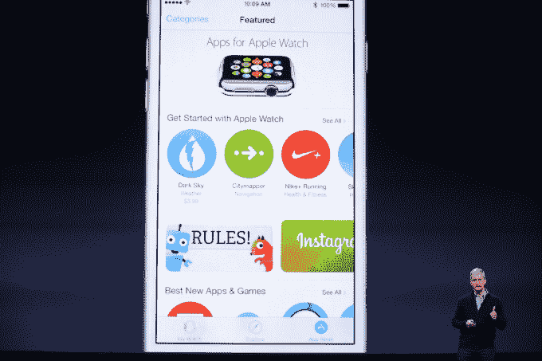
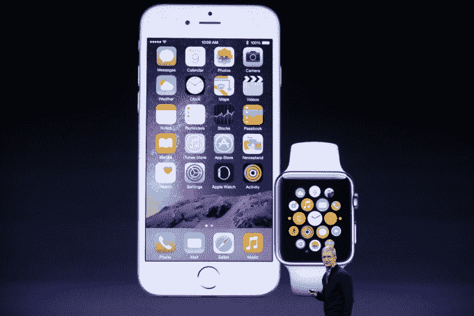

# iOS 8.2 将于今日上市，让你的手机为苹果手表 TechCrunch 做好准备

> 原文：<https://web.archive.org/web/https://techcrunch.com/2015/03/09/ios-8-2-will-be-available-today-preparing-your-phone-for-the-apple-watch/>

# iOS 8.2 将于今天上市，为你的手机准备苹果手表

苹果 iOS 8.2 更新现已正式发布，为即将发布的 Apple Watch 带来支持。8.2 版本将包括 Apple Watch companion 应用程序，除了支持与苹果的可穿戴设备通信外，还将提供许多其他新功能。

8.2 为 iPhone 带来了对 Apple Watch 应用程序的开发者支持，让 WatchKit 软件可以与其他 iOS 设备配合使用。它还改进了苹果的健康应用程序，增加了从第三方应用程序中获取锻炼信息的能力，以及针对那些不想记录步数和距离数据的人的新隐私功能。

苹果还通过此次更新改善了一般操作系统的稳定性，提高了邮件、地图(使用 3D Flyover 功能时)、音乐、画外音和助听器连接的可靠性。

虽然在 4 月 24 日之前不会对你有太大影响，但 iOS 8.2 也带来了 Apple Watch Companion 应用程序，你可以在这里为新的可穿戴设备更改设置。

iOS 8.2 更新将于今天向公众开放。与往常一样，您可以通过无线方式从您的设备进行更新，也可以将设备接入安装了 iTunes 的电脑。

