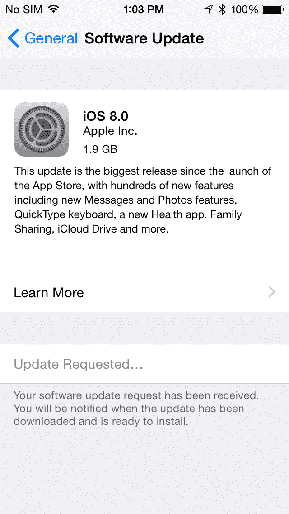

# iOS 8 现已推出，但请耐心等待 

> 原文：<https://web.archive.org/web/https://techcrunch.com/2014/09/17/ios-8-now-available-but-plan-to-be-patient/>

苹果的 iOS 8 移动操作系统正在向符合更新条件的设备推出。它既可以无线下载，也可以通过将你的设备插入 iTunes 进行有线更新，但如果你不能立即看到它，或者如果你在实际下载软件时遇到困难，也不要惊慌:苹果通常会推出像这样的大更新以缓解压力，至少在接下来的几个小时内，他们的服务器将会有巨大的需求。

为了准备你的 iOS 8 更新，你肯定应该插入并备份，使用 iCloud(如果这是你的首选方法)，或者通过同步到你的电脑。如果你非常害怕丢失数据，那么两者都做可能是个好主意。我更倾向于“从头开始”的方法，你可以从头开始，只重新安装你觉得需要的应用程序。

对于无线更新，导航到“设置”，然后“通用”，然后“软件更新”，如果你的设备可以使用，它应该会加载并提示你安装。如果你没有接近充满电的地方，在你开始充电之前插上电源。

顺利更新的其他技巧包括在更新安装后注意提示，以及您正在完成 iOS 8 新功能的设置过程。有人会问你是否要升级到 iCloud Drive，这是一个至关重要的问题:它会让你现有的跨平台 iCloud 数据同步只有在你的所有设备都在 iOS 8 或 OS X Yosemite 上才能工作。Yosemite 还不可用，所以这可能会中断共享数据的 iOS 和 Mac 应用程序之间的同步，如任务管理应用程序 Clear。

iOS 8 带来了许多新功能，所以预计你最喜欢的应用程序会全天更新，以增加与新软件的兼容性，并可能引入与其他应用程序的共享菜单和通知中心配合使用的扩展。此外，我的建议是疯狂使用各种可用的第三方键盘——这是 iOS 用户获得的新自由，所以你不妨四处看看。

这一次，苹果似乎实施了某种排队系统，当你批准你的设备上的更新时，它会在最终开始下载之前显示一条消息，称“更新请求…”。

该应用程序还需要大量的可用空间，但这主要是因为它需要在运行安装过程之前将更新存储在某个地方。如果您没有足够的空间，并且您不想删除所有的内存和应用程序，请继续并插入以进行更新，因为该文件将下载到您的计算机上。