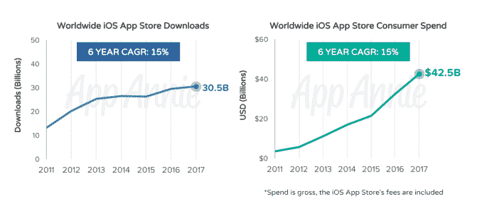
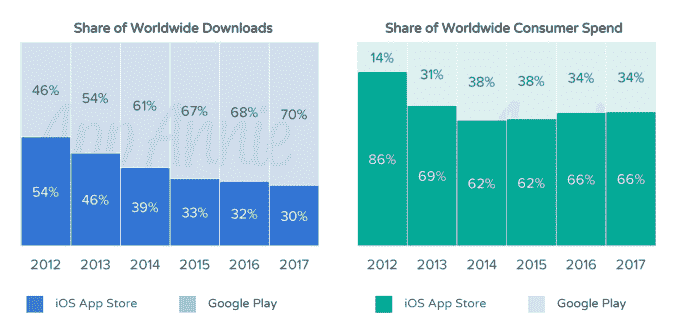
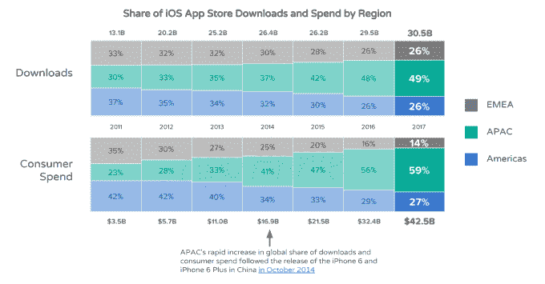
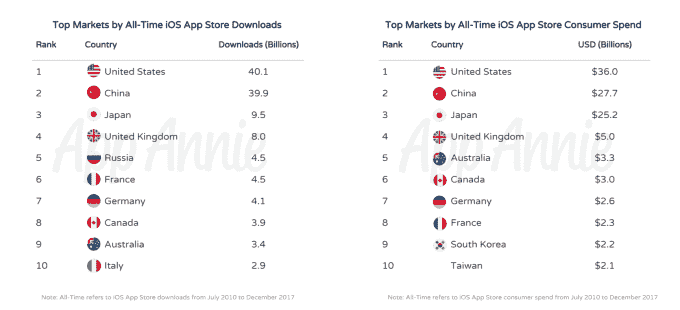
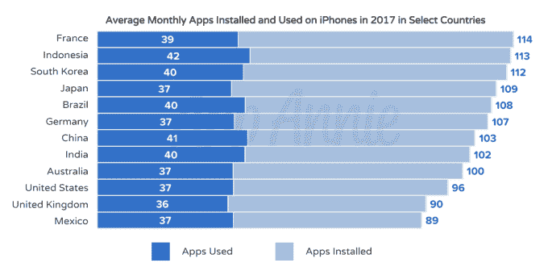
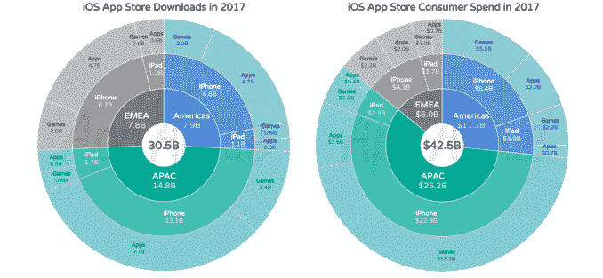
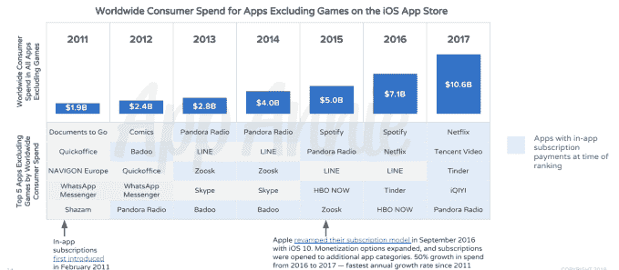
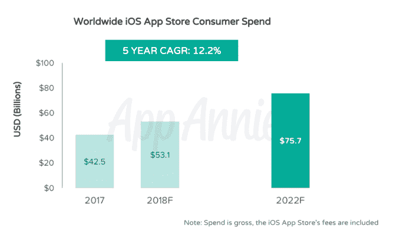
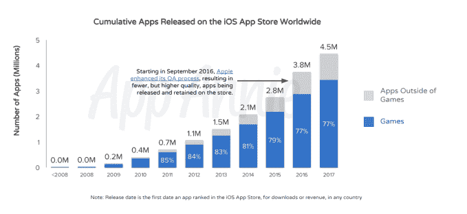

# 自 2010 年 7 月以来，iOS 应用商店的下载量已超过 1700 亿次，收入超过 1300 亿美元 

> 原文：<https://web.archive.org/web/https://techcrunch.com/2018/05/31/ios-app-store-has-seen-over-170b-downloads-over-130b-in-revenue-since-july-2010/>

在过去十年中，App Store 的下载量超过了 1700 亿次，消费者支出总额超过了 1300 亿美元。今天早上，应用情报公司 App Annie 分享了这些数据，这是为了纪念应用商店 10 周年，回顾了商店的发展和它所看到的更大趋势。然而，这些数字并不是全貌 App Store 于 2008 年 7 月 10 日推出，只有 500 个应用程序，但 App Annie 于 2010 年问世。因此，本报告的历史数据从 2010 年 7 月到 2017 年 12 月。

这意味着真实数字比 App Annie 所能证实的还要高。

该报告描绘了多年来应用商店的持续增长，指出 iOS 应用商店的收入增长超过了下载量，在 2015 年至 2017 年间几乎翻了一番。

iOS 设备用户显然也喜欢在应用上花钱。

报告称，iOS 应用商店仅占全球下载量的 30 %,但占消费者支出的 66%。

但这并不是 iOS 与 Android 之战的全貌，因为 Google Play 在中国还不可用。App Annie 在这方面的数据并不完整，因为它没有计入中国的第三方安卓应用商店。

正如 App Annie 反复报道的那样，即使没有 Google Play，中国今天在应用商店收入方面也发挥着巨大的作用。事实上，APAC 地区占消费者支出的近 60%——这一趋势始于 2014 年 10 月 iPhone 6 和 6 Plus 在中国的发布。

但当你回顾迄今为止的应用商店趋势时(或者，截至 2010 年 7 月——这是 App Annie 的数据所能追溯到的最早日期),美国以微弱优势领先。中国很快赶上来了，但美国仍然是下载量最高的国家，从 401 亿到中国的 399 亿；它创造了 360 亿美元的消费支出，而中国只有 277 亿美元。

报告指出，iPhone 用户也是大量应用程序用户。

在一些市场，用户安装了 100 个或更多的应用程序，包括澳大利亚、印度、中国、德国、巴西、日本、韩国、印度尼西亚和法国。美国、英国和墨西哥紧随其后，2017 年平均每月分别安装 96、90 和 89 个应用。

App Annie 声称，当然，每月使用的应用数量要少得多，但仍在 30%到 40%之间。

该报告还研究了游戏的影响，2017 年，游戏仅占下载量的 31%，但创造了 75%的收入。APAC 地区在这方面也发挥了重要作用，去年游戏下载量为 34 亿，消费者支出为 193 亿美元。

与此同时，订阅是一个较新的趋势，但它已经大大提高了应用商店的收入，占 2017 年消费者支出的 106 亿美元。这主要是由网飞、潘多拉和腾讯视频等流媒体应用推动的，但 Tinder 作为全球收入排名前五的应用之一，表现突出。

由于订阅和其他趋势，App Annie 预测全球 iOS 应用商店收入将从 2017 年增长 80%，到 2022 年达到 757 亿美元。

虽然 App Store 今天有超过 200 万个应用程序，但迄今为止已经有超过 450 万个应用程序在其商店上发布。其中许多已经被苹果或开发者移除，这就是为什么实时应用的数量如此之低。

包含图表的完整报告在[这里](https://web.archive.org/web/20230202161736/https://www.appannie.com/en/insights/market-data/data-behind-10-years-ios-app-store/)。