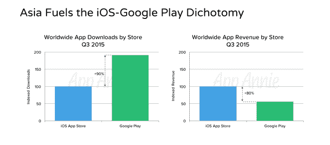
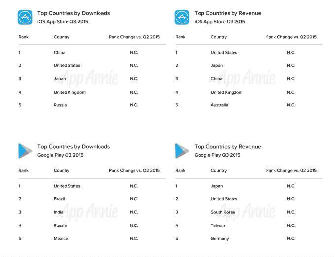

# 由于中国，iOS 应用商店的收入现在比 Google Play 高出 80%

> 原文：<https://web.archive.org/web/https://techcrunch.com/2015/10/15/ios-app-store-revenue-now-80-percent-higher-than-google-play-thanks-to-china/>

App Annie 的一份新报告分析了自去年推出 iPhone 6 和 6 Plus 以来中国对该地区应用商店收入的影响，该报告称，向更大屏幕 iPhone 的转移导致中国成为苹果最重要的市场。根据该分析公司的研究结果，就 iOS 应用下载量和收入而言，中国在今年第三季度的绝对增长领先于所有国家。

与此同时，由于印度和东南亚等新兴市场的增长，Google Play 在下载量上仍然领先，尽管 iOS 在收入方面仍然领先。

换句话说，亚洲应用经济正在冲击 iOS 应用商店和 Google Play，但它正在将两者推向不同的道路。

第三季度，Google Play 的全球下载量比 iOS 应用商店高出 90%，高于上一季度 85%的领先优势。印度、印度尼西亚和越南等新兴市场推动了这一增长，在这些国家，低于 50 美元的智能手机让更多人上网。

然而，鉴于他们的经济地位，这些新的移动用户不一定会帮助 Google Play 商店的收入增长。相反，App Annie 建议开发者将新用户定位在低端市场，迎合他们的不同需求，以便在竞争中脱颖而出。

目前，印度尤其对 Google Play 的下载量增长产生了巨大影响。例如，在第三季度，它是脸书和 WhatsApp 下载量最大的三个市场之一。中国还是 Google Play 下载量第三大的国家，也是世界第三大智能手机市场。App Annie 指出，印度的智能手机普及率只有 10-15%，仍有大幅增长的空间。

另一方面，iOS 应用商店可能没有下载量，但其收入在第三季度比 Google Play 高出 80%，高于 Q2 的 70%。当然，这主要归功于中国。今年早些时候，中国的 iOS 下载量已经超过了美国，现在这些下载量已经转化为收入。

App Annie 表示，iOS 在中国的增长受到两方面的推动:社交视频应用和游戏。前者包括类似于*的 Dubsmash* 的应用程序，类似于唇同步的应用程序 *iCastShow* 和类似藤蔓的应用程序 *MiaoPai* ，这两个应用程序在第三季度都在上升。此外，报告指出，用户为现有社交网络创建可共享内容的应用程序的流行也表明中国的应用程序生态系统正在成熟，因为这意味着第一层社交网络应用程序已经建立。

除了社交视频应用，打车应用*滴滴打车*在本季度也出现了强劲增长，因为它在该地区与优步展开了竞争。

然而，就中国的应用收入而言，增长在很大程度上受到游戏的影响。得益于新游戏*《Mir 2 传奇》*和*《拳皇 98 终极对决》*，腾讯最近的收入大幅增长。网易的游戏，*梦幻西游*，也继续表现不俗。

但中国还不是 iOS 应用商店收入最高的国家，尽管下载量排名第一。相反，这个头衔仍然被美国占据，日本紧随其后。观察这种情况是否会随着时间的推移而改变将是一件有趣的事情——特别是现在苹果已经发布了两款更大屏幕的手机，分别是 iPhone 6s 和 6s Plus。

