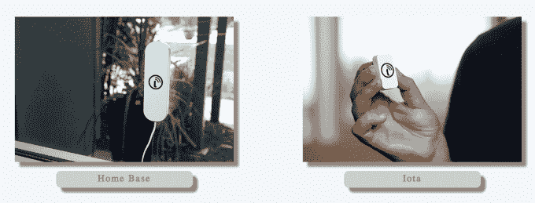
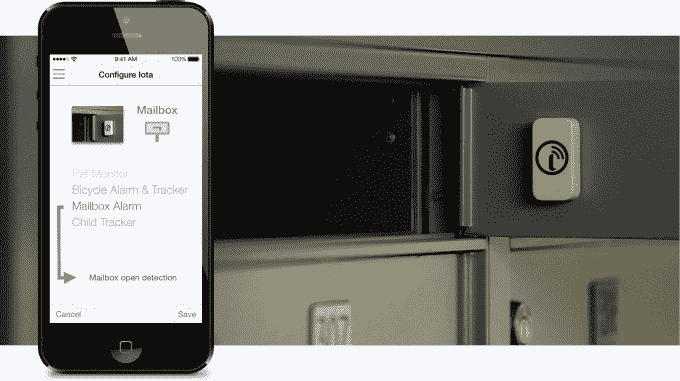
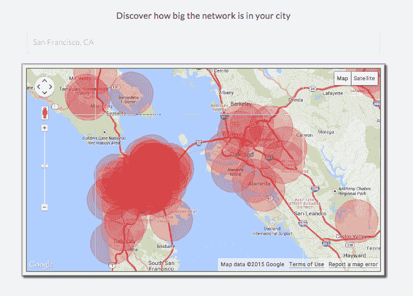

# Iotera 为其超级简单的 GPS 跟踪设备 TechCrunch 筹集了 100 万美元

> 原文：<https://web.archive.org/web/https://techcrunch.com/2015/02/25/iotera-1-million-seed/>

美国公司 Iotera 已经完成了由 ZenShin Capital Partners 牵头的一轮 100 万美元的种子融资，该公司生产电池寿命长达数月的 GPS 设备。

Crunchfund*、Startup Capital Ventures、String Ventures、EarlyMarket 和 Rubicon Venture Capital 也参与了该轮投资。2013 年 8 月，Iotera 从善信资本(ZenShin Capital)筹集了 70 万美元，还从[获得了 28 万美元，用于](https://web.archive.org/web/20230129094913/https://www.kickstarter.com/projects/1226890823/iota-never-lose-sight-of-whats-important?ref=nav_search)[的 Iota 可穿戴设备](https://web.archive.org/web/20230129094913/https://techcrunch.com/2014/07/15/iota/)的 2014 年 Kickstart 活动。

该公司仍在开发 Iota，它最初是一种帮助宠物主人跟踪他们的动物的设备。([我们去年写了很多关于它的文章](https://web.archive.org/web/20230129094913/https://techcrunch.com/2014/07/15/iota/)。)它还提供了一个跟踪 Iota 长达 4 英里的基地。

这些产品现在严格用于[预购](https://web.archive.org/web/20230129094913/http://www.iotera.com/preorder/)。该公司估计，它们将从 2015 年 5 月开始向客户发货。

“我们从 Craigslist 上得到这个想法，仅在湾区就有至少 50 只丢失宠物的帖子，”Iotera 首席执行官 Ben Wild 在接受 TechCrunch 采访时表示。

Iotera 成立于四年前，当时 GPS 追踪器的电池续航时间很短——充电间隔通常为几天——以及使用它们的服务费——Wild 说，包括设备成本在内，几年后可以达到 500 美元。

根据 Wild 的说法，它的设备不仅仅是追踪，而且不仅仅是宠物用的。Iota 可以在不充电的情况下持续“几个月”，因为它运行在团队从头设计的无线协议上(而不是使用消耗电池的智能手机设计的蜂窝连接)。

其配套的智能手机应用程序提供了一系列针对不同用途定制的通知，如跟踪宠物、检测邮箱中的新邮件、跟踪开门等。然而，当你观察 Iota 设备的基于社区的网络时，事情变得更加有趣。

这些基地相互连接。在很近的地方种上几个，就能在客户特定的家庭基地之外创造出追踪设备的覆盖区域。这意味着，举例来说，我可以跟踪我的孩子在我附近以外的地方的行踪，而不必支付每月 10/20 美元的服务费。

“我们可以用几个基地覆盖整个城市，”怀尔德解释说。"例如，对于旧金山来说，不到 20 英镑就足够了."

该公司的数据表明，一旦设备发货，旧金山已经有广泛的 Iotera 覆盖网络。

虽然网络共享覆盖范围，但每个 Iota 中的数据都是加密的，即使它通过家庭基站。怀尔德说，这很重要，因为这意味着第三方无法通过客户的大本营侵入系统。

该公司目前正在扩大规模，Wild 表示，随着资金的到位，其四人团队将增加到七人。Iotera 目前不打算在出售追踪器和家庭基站之外赚钱，但 Wild 承认未来可能有几个创收机会。

通过 Iotera 网络提供的基于位置的广告可能是一种选择。而网络也可以向选定的第三方开放。怀尔德警告说，广告应该为用户增加价值，所以希望这意味着公司将有选择地提供服务——但是目前没有立即实施这种战略的计划。

“(在物联网项目中)很容易分心，因为你可以做的事情实在太多了，”他说，并指出该公司目前正专注于开发客户体验。

T2 正在考虑的一个领域是国际扩张。Wild 希望看到这些设备在 2016 年初在欧洲销售，他说已经与中国和日本的潜在合作伙伴进行了早期讨论。然而，这些国际努力可能需要额外的一轮融资。Wild 估计，这一轮应该给 Iotera 大约 12 个月的时间，然后它需要再次筹集资金。

**Crunchfund 由迈克尔·阿灵顿创立，他也创立了 TechCrunch*