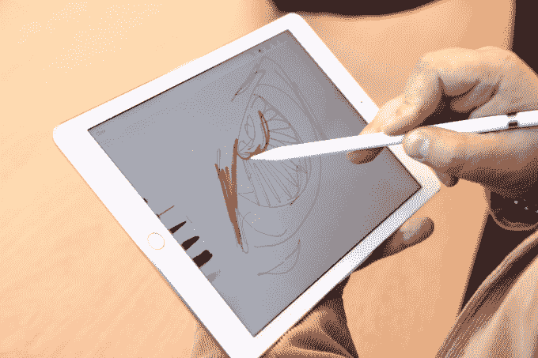
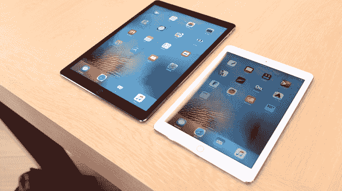

# 首先来看看新的更小的 iPad Pro 

> 原文：<https://web.archive.org/web/https://techcrunch.com/2016/03/21/ipad-pro-hands-on/>

# 首先来看新的更小的 iPad Pro

今天对于苹果来说是一个非常小的新闻日。在某种程度上，这是因为这些声明主要是对现有产品的重复。但是，也因为关于苹果硬件变小的传言确实是真的。最引人注目的小尺寸设备是 iPhone SE ( [看我们的手在这里](https://web.archive.org/web/20221210053628/https://beta.techcrunch.com/video/iphone-se-first-look/519600667/))，但对于设计师、艺术家或只是 Apple Pencil 的粉丝来说，[新的更小的 iPad Pro](https://web.archive.org/web/20221210053628/https://beta.techcrunch.com/2016/03/21/apple-unveils-a-new-smaller-ipad-pro-apples-vision-of-the-future-of-computers/) 是苹果家族的一个快乐的成员。

在今天的活动中，TechCrunch 主编 [Matthew Panzarino](https://web.archive.org/web/20221210053628/https://beta.techcrunch.com/author/matthew-panzarino/) 及时拿到了新款 iPad Pro。以下是你需要了解的内容:

*   与之前的 12.9 英寸版本相比，新款 iPad Pro 的屏幕为 9.7 英寸。
*   它的内部结构与稍加改进的大型 Pro 相当。
*   真实色调屏幕使用四个传感器来根据环境光调整屏幕的颜色。
*   新款 iPad Pro 拥有所有 iPad 中最低的反射率和最亮的显示屏。
*   它支持“嘿 Siri ”,并与新款 Apple Pencil 兼容。
*   智能连接器为其新键盘增加了电源和数据连接。
*   苹果公司预计，这种更小、更便携的选择将是计算机的未来。
*   新款 iPad Pro 有四种颜色:银色、金色、太空灰和玫瑰金。
*   价格从 599 美元起，新的 256gb 版本价格高达 899 美元。

观看上面的视频，了解 9.7 英寸 iPad Pro 新的小尺寸但功能强大的功能。