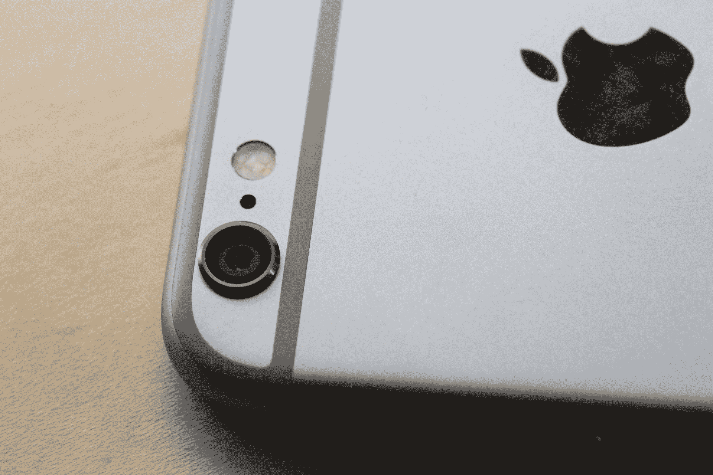

# iPhone 6 评论:认识新的最佳智能手机 

> 原文：<https://web.archive.org/web/https://techcrunch.com/2014/09/16/iphone-6-review/>

苹果今天发布了两款新的 iPhone，包括 iPhone 6。iPhone 6 显然是苹果旗舰智能手机系列的继承人，因为它与 iPhone 5s 的价格相同，但苹果今年做了一些新的事情，推出了高价 iPhone 6 Plus。然而，iPhone 6 仍然非常昂贵，它的 4.7 英寸屏幕可能更适合大多数用户，这就是为什么它被我们评为目前最好的智能手机。

## 视频评论

## 基础

*   4.7 英寸，1334 x 750 显示屏，326 ppi，1400:1 对比度
*   16、64 或 128GB 存储
*   A8 处理器(64 位)
*   800 万像素 iSight 摄像头(后置)，1.5 微米像素，120 万像素 FaceTime 摄像头(前置)
*   双频 802.11ac Wi-Fi
*   20 频段 LTE 支持
*   MSRP: 16GB，合同价 199 美元/免费合同价 649 美元；64GB，合同价 299 美元/免费合同价 749 美元；128GB，合约价 399 美元/免费合约价 849 美元
*   [产品信息页面](https://web.archive.org/web/20221006161315/http://store.apple.com/us/buy-iphone/iphone6)

**优点**

*   最好的移动相机，做得更好
*   工业设计击败了所有以前的 iPhones

**缺点**

*   圆形边缘可能意味着手机不太容易握持

## 设计

苹果凭借 iPhone 6 的设计超越了自己——尽管获得了大量的屏幕空间，但与前代产品相比，它并不显得巨大，而且它仍然是一款非常容易单手使用的设备。新的更薄的外壳意味着它比 iPhone 5s 重半盎司多一点，在更大的表面积上均匀的重量分布意味着它不会明显比旧款手机重。事实上，它设法让 5 和 5 感觉非常厚实，这令人难以置信。

[gallery ids="1058426，1058425，1058424，1058423，1058422，1058421，1058420，1058419，1058418，1058417，1058416，1058415，1058414，1058413，1058412，105

这一代的新品还有全金属后壳，它用薄连接缝代替了玻璃顶部和底部面板。当你把手机转过来时，这有助于更统一的外观，更接近 iPad mini 和 iPad Air 后壳的完整单一平面。我测试的太空灰版本非常受益于这种完整的外观，设备的正面也同样令人印象深刻。它真的让屏幕成为明星，这一点至关重要，因为苹果创造了这一代独一无二的显示器，击败了潜在的安卓篡夺者——但我将在下面的专用显示器部分详细介绍这一点。

与 iPhone 4、4S、5 和 5s 相比，iPhone 6 握起来更舒适，这些手机都更喜欢直边和与 iPhone 6 的倾斜曲线成直角。它的圆形边缘让人想起 iPhone 3GS 和更早的产品，事实上，它最接近的设计类似物可能是金属背的原始 iPhone，它的边缘也变成了扁平的后壳。不管它的灵感是什么，它会更自然地握在你的手中，并且会在那里更舒适地停留更长时间。

沿着显示屏的圆形边缘有助于苹果追求的近乎无缝的外观，但它们也符合人体工程学的目的。使用苹果的向后滑动和向前滑动手势，它开始用来取代 iOS 7 中的向后和向前按钮导航，这在 iPhone 的新前玻璃设计中变得更加容易和自然，当设备的屏幕变暗时，这些手势捕捉和弯曲光线的方式肯定会吸引设计爱好者的目光。

如果说苹果在设计上有任何闪失，那可能是背面突出的 iSight 相机镜头，它比其余部分厚一英寸。在日常使用中，这还没有给我带来任何问题，但它似乎是一个潜在的砂砾堆积区域，这也意味着当手机面朝上放在平坦的表面上时，它将靠在它的镜头上——尽管这在一定程度上通过在镜头盖中使用蓝宝石来缓解。

## 表演

苹果新的 A8 芯片是 iPhone 6 背后的强大动力，它提供了尖端处理器技术带来的性能。A8 突破了你认为的设备整体速度和响应能力的极限，整体用户体验明显加快。这是其中一种情况，你没有意识到你正在使用的设备(我的情况是 iPhone 5s)在一般速度方面可以变得更好，直到你拿起新设备。

因此，iPhone 6 可以更好地处理 iOS 8 的各种动画、透明度和其他视觉效果，可以毫不费力地为更大、更高分辨率的显示器供电。它可以处理更强大的游戏，最重要的是，即使在处理视觉密集型任务时，电池续航时间也更长。此外，它实现了新的成像功能，真正使苹果的移动相机成为业内最好的，我们将在下面详细讨论。

苹果还改进了去年推出的运动协处理器，这是一种专用的活动跟踪芯片。iPhone 6 中的 M8 不仅提供了对加速度计、指南针和陀螺仪数据的持续监控，还引入了对新气压计提供的信息的监控，以确定海拔的变化。M8 还可以检测行走、跑步和驾驶活动。在实践中，用它来监控和显示我每天行进的距离、爬过的台阶和飞行高度效果非常好，似乎没有对我的电池产生明显的负面影响。

## 特征

iPhone 6 和 6 Plus 的一大新功能是能够使用触控 ID(存储支付信息的新安全元素)和 NFC 来执行简单的非接触式支付。它们目前在我附近的任何地方都无法使用，而且苹果公司要到 10 月份才会推出 Apple Pay 功能。然而，我有机会在活动中以演示身份看到它的运行，它的工作方式正如你所期望的那样，通过拇指扫描授权支付，就像他们通过触控 ID 授权从 iTunes 购买数字产品的当前方法一样。你甚至不需要解锁你的设备就可以工作，这可能是我见过的最方便的移动支付解决方案。

说到触控 ID，它似乎比 iPhone 5s 中的版本有所改进。我的意思是，它的识别和解锁速度似乎要快得多(这可能与处理能力的提高有关)，而且它的故障率似乎也低于上一代产品。如果苹果已经加强了触控 ID 背后的技术，它不会这么说，但更流畅的体验肯定会有所帮助，因为它现在既用于 Apple Pay，也向第三方开发者集成开放。

健康是 iOS 8 的新功能，在 iPhone 6 中，它已经成为我日常应用检查的主要内容。它似乎在准确跟踪我一天的活动(或缺乏活动)方面做得不错，至少与你从 Fitbit line 或 Nike+ Fuelband 等可穿戴设备上获得的信息相当。到目前为止，在填写完整的个人资料方面，没有太多的来源可供选择，我认为苹果可以在让用户更容易从他们的活动历史记录中深入了解每天的总数方面做一些工作，但这是一个很好的被动功能，苹果已经通过新的 M8 成功地提高了能效和准确性。

苹果的新 iPhone 系列能够改进慢动作视频，这从技术上说意味着它可以以 240fps 而不是 120fps 拍摄。当以我们习惯观看的速度回放时，这会减慢时间，并使捕捉快速动作的难以置信的细节成为可能。下面的短片向您展示了这一点，尽管分辨率有所降低，因为它是通过 Apple Mail 格式化和共享的，Apple Mail 会自动优化文件大小以降低文件大小。

可达性是 iPhone 6 和 6 Plus 独有的功能，旨在帮助补偿它们的大屏幕尺寸，并使单手使用大手机成为可能，无论你的手套有多大。在 iPhone 6 上，它只是让事情变得更方便，因为我发现即使屏幕在正常位置，单手使用这款设备也没有任何困难。可达性对于屏幕尺寸问题来说是一个非常实用的解决方案，但幸运的是，在 iPhone 6 的情况下，它通常只是一个你应该需要的工具，而不是你会发现自己经常使用的东西。

## 显示

iPhone 6 配备了比 iPhone 5s 分辨率更高的显示屏，分辨率为 1334 x 750。它还允许更深的黑色，并使用一种称为“双域”像素的东西来实现这一点，以便无论你从哪个角度观看手机，颜色都仍然显示真实。它的可视区域比 iPhone 5s 多 38%，但总体上只增加了 13%，而且它与 iPhone 5s 的 326 像素密度相匹配，这意味着你仍然无法识别任何单个像素。

显示缩放将允许您使用这些额外的空间来简单地扩展单个界面元素和文本的大小，这对于有视力问题或只是发现自己经常眯着眼睛看手机的用户来说非常好。如果你不使用显示缩放，你可以为屏幕上的元素提供更多的喘息空间，并且你可以在每个主屏幕上获得一行额外的图标，这在你难以决定第一页的剪裁时非常有用。

这确实是苹果最令人惊叹的技术成就之一——它看起来像一个占位符高分辨率打印图像，巧妙地放在玻璃后面，直到它焕发生机。让其他制造商去讨论这种或那种显示技术的相对优点吧；苹果的就是最好看、最好用的，iPhone 6 用我在手机上见过的最好的色彩渲染再次证明了这一点。

## 照相机

苹果一直在智能手机中提供最佳的移动相机体验——这并不是说它提供了最多的百万像素或最多的特技功能。相反，该公司着眼于对大多数用户来说什么是移动相机中最重要的，并一次又一次地准确传达这一点。iPhone 6 秉承了这一传统。

它仍然可以拍摄 800 万像素分辨率的图像，与目前手机内置的其他相机相比微不足道。但这些都是大像素图像，这有很大的不同，6 还拥有聚焦像素的能力，这是苹果给其新的相位检测自动对焦的名字。不管名字叫什么，最终效果是更快的自动对焦，苹果通过隐藏对焦框使其更加隐形，除非你自己调用它。

该相机还具有更好、更准确的面部检测功能，可以拍摄较小的面部，并且在使用连拍模式并试图从大型系列中找出最佳拍摄效果时，也能更好地拍摄闭着的眼睛和微笑。该相机现在还可以拍摄高分辨率全景照片，根据光线变化自动调整曝光，产生总分辨率高达 4300 万像素的惊人效果。

苹果 iPhone 6 上的视频捕捉也很棒，他们使用的稳定技术使视频拍摄在最抖动的场景下看起来更稳定，这真的令人印象深刻，正如你在下面的视频样本中看到的那样，这是我遛狗时拍摄的(没有努力实现平稳的步态)。

## 电池

iPhone 6 使用了改进的电池技术，它显示出——实际上，我可以正常使用大约一天半。不过总的来说，与 5s 相比，苹果对它的大多数评分都非常接近，在媒体播放、浏览和待机方面提供了类似的小时评分，但声称通话时间增加了四个小时。在实际使用中，就一次充电的运行时间而言，它比我的 iPhone 5s 要好，但我测试的 iPhone 5s 此时也已经一年了。

尽管如此，当你使用 iPhone 6 时，感觉你不需要在电力方面吝啬，即使你使用所有的后台活动跟踪铃声和哨声，它也应该比你正常度过一天要多。

## 结果

iPhone 6 是目前最好的智能手机。它几乎在每一个重要的方面都有所改进，而且它以一种引人注目的新设计来实现这些改进，这种设计平衡了消费者对更大屏幕的需求和轻薄耐用的外壳。从视觉上看，这是苹果最有吸引力的手机，4.7 英寸的尺寸将比 iPhone 6 Plus 更大的比例更具吸引力。

最重要的是，这里的卖点是苹果已经成功地用新的 iPhone 6 夺回了最初的 iPhone 带来的活力和兴奋。这感觉像是以所有正确的方式回归了形式，此外还打包了大量像 Apple Pay 这样的新功能，为苹果公司的未来指明了道路。然而，对于用户来说，这一切都是为了提供你可以放在口袋里的最好的电脑，这正是 iPhone 6 的特点。