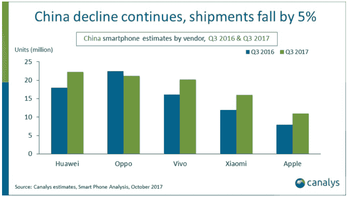

# iPhone 8 的发布推动苹果在经历了 18 个月的销量下滑后在中国实现增长 

> 原文：<https://web.archive.org/web/https://techcrunch.com/2017/10/30/iphone-8-launch-propels-apple-to-growth-in-china/>

苹果公司终于在中国恢复了增长。

根据来自科纳仕公司的一份新报告，由于新发布的 iPhone 8 的早期迹象，该公司已经打破了连续六个季度的销售下降。该分析师公司在 2017 年第三季度记录了苹果 40%的年增长率，三个月内出货量为 1100 万。它还指出，去年 iPhone 8 在 iPhone 销售中所占的比例高于 iPhone 7。

苹果公司在中国的收入比两年前下降了 50%以上，[根据其最近在 Q2 的收益](https://web.archive.org/web/20221025222653/https://beta.techcrunch.com/2017/08/01/apple-continues-to-struggle-in-china-as-revenue-drops-10/)，所以增长是非常必要的。然而，尽管取得了进步，该公司在科纳仕公司报告中仅排名第五。

华为以 2200 万的出货量领先该领域，略微领先于 Oppo(2100 万——唯一的年度下降)和 Vivo(2000 万)。2017 年复兴的[小米排名第四。](https://web.archive.org/web/20221025222653/https://beta.techcrunch.com/2017/07/26/report-xiaomi-sales-climb-but-huawei-remains-chinas-top-smartphone-brand/)

除了原始数据，还有一些值得挖掘的值得注意的东西。

首先是苹果，科纳仕公司认为苹果在中国并没有摆脱困境。

备受期待的 iPhone X 将于 11 月 1 日上市，它的影响没有在这份报告中得到反映，但这款手机的供应已经有限，其昂贵的价格——最基本型号的起价为 1000 美元——可能意味着这款手机不会像这家美国公司在中国发布其第一款更大尺寸的设备 iPhone 6 时那样取得显著增长。

“苹果不太可能在第四季度保持这种增长，”科纳仕公司的莫佳在一份声明中表示。

“尽管 iPhone X 将于本周发布，但它的定价结构和供应仍在抑制。iPhone X 将享有健康的灰色市场地位，但其受欢迎程度在短期内不太可能帮助苹果，”贾预测。

除了苹果——考虑到苹果对中国智能手机市场的重要性，苹果经常成为研究中国智能手机销售的焦点——很明显，一些品牌现在主导着中国智能手机市场。

根据科纳仕公司的数据，2017 年第三季度前五大卖家占中国出货量的 75%。这家分析公司预测，由于小米在中国主要网购日——11/11——和线下零售的[通常令人印象深刻的表现，小米可能会进入前三名，但是，从这一方面来看，很难看到任何其他公司在这一点上在顶级玩家上取得进展。](https://web.archive.org/web/20221025222653/https://www.strategyanalytics.com/strategy-analytics/blogs/smart-phones/2016/11/14/xiaomi-huawei-and-meizu-winning-in-alibaba-2016.11.11-shopping-festival#.Wfbz9BOCzOQ)

这一点尤为重要，因为数据显示，中国智能手机市场的增长已经见顶。

科纳仕公司报告估计，该市场的出货量同比下降了 5%，至 1.19 亿部。[这是连续第二个季度下降。](https://web.archive.org/web/20221025222653/https://beta.techcrunch.com/2017/07/26/report-xiaomi-sales-climb-but-huawei-remains-chinas-top-smartphone-brand/)

中国仍然是这个星球上智能手机公司最大的单一市场，但这种下滑解释了为什么许多公司将注意力扩展到快速增长的市场，如印度和东南亚。

这些地区尚不足以与中国匹敌，但当竞争激烈、市场萎缩时，它们代表着更容易获得的收入机会。