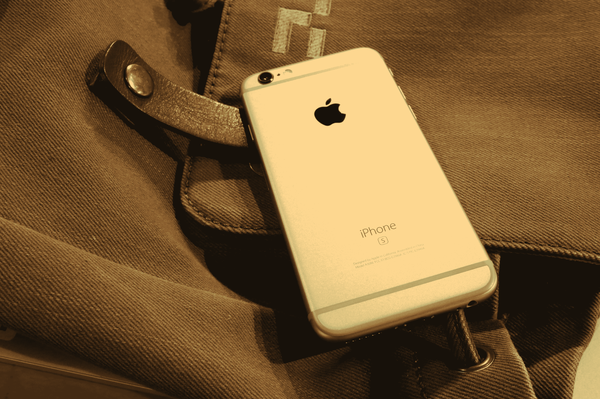

# iPhone 和 iPad 应用程序将能够使用 iOS 10  拍摄原始照片

> 原文：<https://web.archive.org/web/https://techcrunch.com/2016/06/14/iphone-and-ipad-apps-will-be-able-to-shoot-raw-photos-with-ios-10/>

# iPhone 和 iPad 应用程序将能够使用 iOS 10 拍摄原始照片

好消息，携带 iPhone 的照片爱好者:原始照片拍摄支持即将在 iOS 10 中推出。

*(想知道“原始”照片到底是什么吗？它是以原始形式存储图像的任何文件类型，没有压缩和预处理。好处:你有更多的数据可以处理，允许后期处理中更大程度的编辑灵活性——这就是为什么专业摄影师倾向于拍摄 RAW。缺点:文件往往非常大。)*

眼尖的观察者发现，在昨天的主题演讲中，一张幻灯片上顺便提到了原始照片编辑，但在舞台上对此只字未提。

今天下午，该功能在 WWDC 的一个研讨会上得到了确认，会上公布了一些细节:

*   第三方开发者将能够拍摄和存储原始照片，但这是他们必须添加到他们的应用程序中的东西——当你更新到 iOS 10 时，它不会突然开始在你的所有应用程序中工作。
*   它只适用于后置摄像头
*   与许多数码单反一样，iOS 可以同时处理 RAW 和 JPEG 格式的拍摄
*   它将适用于运行在 iPhone 6s、6s Plus、SE 和 9.7 英寸 iPad 上的应用程序
*   原始照片将以 Adobe 的数字负片(DNG)文件格式存储

唉，还没有消息表明苹果是否/如何计划在他们自己的相机应用程序中支持原始照片。