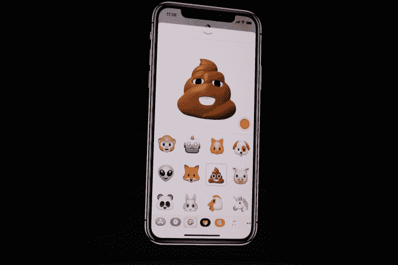

# iPhone X 将包含 animoji，基于你面部表情的表情动画

> 原文：<https://web.archive.org/web/https://techcrunch.com/2017/09/12/iphone-x-animoji/>

# iPhone X 将包含基于你面部表情的动画表情符号

苹果公司今天在发布新款 iPhone 8 和 iPhone X 的新闻发布会上展示了一种新型表情符号。

iPhone X 包括一个新的面部相机系统，可以进行实际应用，比如用你的面部进行[解锁手机](https://web.archive.org/web/20230315095319/https://techcrunch.com/2017/09/12/face-id-is-replacing-touch-id-on-the-new-iphone-x/) ( [和支付](https://web.archive.org/web/20230315095319/https://techcrunch.com/2017/09/12/faceid-will-work-with-apple-pay-third-party-apps/))。它还被用于一些看起来有趣但可能有点令人毛骨悚然的东西——它可以跟踪你的面部表情，并用它们来制作你最喜欢的表情符号。

animoji 的存在于上周[被泄露](https://web.archive.org/web/20230315095319/https://techcrunch.com/2017/09/09/animated-3d-emoji-coming-to-iphone-8-per-ios-11-firmware-leak/)，但这些故事无法捕捉到观看苹果公司的克雷格·费德里吉(Craig Federighi)在舞台上扭曲他的脸以制作狐狸和便便表情符号的体验——或者看到外星人版本的首席执行官蒂姆·库克(Tim Cook)命令他，“带我去见你的领导人。”

您还可以录制音频信息来搭配 animoji，animo Ji 的动作将与声音同步。出于某种原因，这项技术的第一个演示涉及一个表情符号低语，“*你在哪里？？*

费德里吉解释说，animoji 的目标是将“我们自己的个性”融入我们最喜欢的表情符号中。虽然演示有点奇怪，但这似乎是给你的信息添加个人风格的好方法，特别是如果有一些你经常使用的表情符号，你的朋友已经厌倦了它们。(对我来说，是💃。)