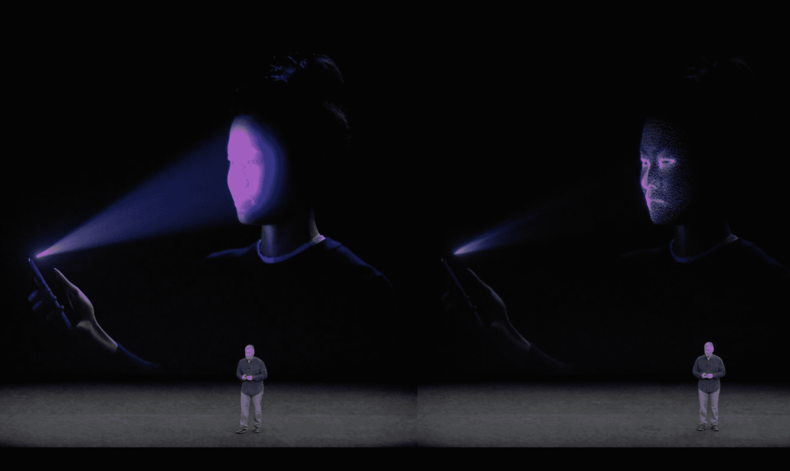
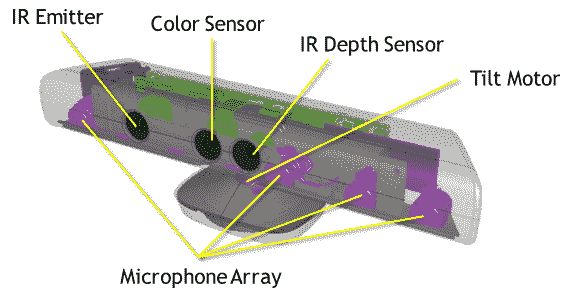

# iPhone X 基本上在正面有一个 Kinect 来启用 Face ID 

> 原文：<https://web.archive.org/web/https://techcrunch.com/2017/09/12/iphone-x-basically-has-a-kinect-on-the-front-to-enable-faceid/>

# iPhone X 基本上在正面有一个 Kinect 来启用 Face ID

苹果的 [Face ID](https://web.archive.org/web/20230315095319/https://techcrunch.com/2017/09/12/face-id-is-replacing-touch-id-on-the-new-iphone-x/) 是否会像触控 ID 一样方便还有待观察(它已经在舞台上失败了)，但最起码我们不能指责苹果没有为这项任务投入足够的硬件。[新款 iPhone X](https://web.archive.org/web/20230315095319/https://techcrunch.com/2017/09/12/iphone-x/) 的正面有一个完全开启的深度感应系统，很像最初的 Kinect。

顶部突出的切口不仅仅隐藏了一个自拍相机——它有一对红外发射器，即使在黑暗中也能找到你的脸，并在上面投影一个点网络。一个红外敏感相机观察这些点如何被扭曲并反射到你的脸上，产生一个详细的 3D 网格。

每当你想解锁你的手机，同样的事情再次发生，它只是比较已知的网格和一个它正在检测现场。苹果表示，两张脸非常相似，以至于系统将一张脸误认为另一张脸的几率是百万分之一。

这个红外网格系统非常类似于 PrimeSense 为微软的 Kinect 设备开发的系统，尽管不得不说，它可能是一个比房间尺度跟踪更好的用例。不得不说，Kinect 从来没有特别灵敏的反应。

2010 年发布的 Kinect 也有类似的设置。

微软将这些点留在了飞行时间系统的后面，该系统更加精确，但也更大更复杂。苹果实现的点网格系统是紧凑的，并且是为单一目的而设计的，这应该会使它更加可靠。

也许这并不奇怪，系统应该是相似的；PrimeSense 曾与微软合作生产最初的 Kinect，最终在 2013 年被苹果收购。正如我们当时所写的:

> 我们从我们的消息来源获悉，苹果可能对 PrimeSense 正在开发的新移动芯片组感兴趣，该芯片组最终将适用于 iPhones 和 iPads 等设备。这些芯片以及附带的传感器和软件技术可以用于各种目的，如身份识别和室内空间测绘。

搞定了。

当然，如果你需要的话，你可以输入一个密码，以防你的鼻子被打破或者你戴了一个面具。或者，如果你在 100 万人面前直播，但这不起作用，就像几分钟前发生在克雷格·费德里基身上的事。