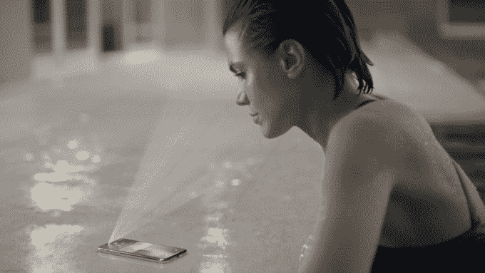
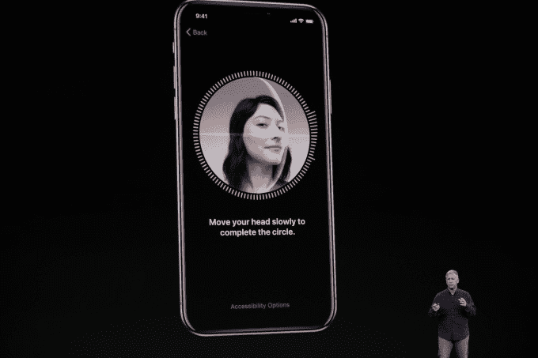

# iPhone X 的 Face ID 引发安全和隐私问题

> 原文：<https://web.archive.org/web/https://techcrunch.com/2017/09/13/iphone-xs-face-id-raises-security-and-privacy-questions/>

新的顶级 iPhone 取消了 home 键和内置的指纹识别器，支持一种新的生物识别技术——称为[Face ID](https://web.archive.org/web/20230407150336/https://techcrunch.com/2017/09/12/face-id-is-replacing-touch-id-on-the-new-iphone-x/)——使用用户面部的 3D 扫描来验证和解锁他们的设备。它也取代了触控 ID 的 Apple Pay。

苹果表示，这是对指纹识别器的一个进步，因为对用户来说，这是一个更容易、更自然的操作——你只需看着手机，它就会解锁；如果手指湿了之类的就不用担心了。苹果正在努力从便利的角度出发。

【T2

然而，通过人脸生物特征来控制智能手机上的个人内容，不可避免地会带来许多安全问题。

当然，已经有很多关于这个话题的高调的推特聊天[了，包括猜测某人的脸是否已经死了或者正在睡觉，或者不愿意在你面前解锁他们的设备，可能会被用来违背他们的意愿这样做。](https://web.archive.org/web/20230407150336/https://twitter.com/MichaelFNunez/status/907704834723282946)

智能手机上现有的面部解锁系统名声不佳，加剧了这种情况。

例如，三星使用的另一种面部识别解锁功能被证明可以被一张有问题的面部照片所欺骗——这使得它在一个自拍被公开交易为标准社交通讯货币的数字时代变得非常不安全…

不要在这里挑出三星。早在 2011 年[的时候，Android 就有一个面部解锁功能，这个功能可能很容易被欺骗。即使是随后版本的 Android Face Unlock，需要用户眨眼才能解锁并放弃其秘密，也被证明可以通过](https://web.archive.org/web/20230407150336/http://www.androidauthority.com/galaxy-nexus-face-unlock-works-with-real-face-and-photo-32210/)[巧妙的 photoshopping】来克服。](https://web.archive.org/web/20230407150336/http://www.androidauthority.com/android-jelly-bean-face-unlock-blink-hacking-105556/)

然而，很明显，苹果公司已经加入了更多的核心技术和更多的想法，试图将其面部生物识别技术的实施置于更坚实的基础上。

iPhone X 的摄像头不仅仅是寻找一张脸的 2D 图像；该设备顶部的传感器包装凹槽包括一个点投影仪，泛光照明器和红外相机，以及一个传统的相机镜头，因此它能够感知深度和读取脸型(包括在黑暗中)。

正如我们昨天所写的，它实际上是一个小型化的 Xbox Kinect T5，可以放在你的手机前面。因此，Face ID 会把一张脸的照片解释为一个平面——因此实际上不是一张脸。

尽管正如人们所说，布丁的好坏要在吃的过程中检验。

当 iPhone X 显然无法识别克雷格·费德里吉的脸，因此无法解锁时，有一个短暂的舞台演示失败了，这显示了另一个潜在的问题，考虑到在向主人开放方面过于强硬的技术可能是高度安全的，但它一点也不方便。

这位苹果高管在意外被锁在门外时的第一反应似乎是擦擦眼睛下面的汗水——这表明传感器可能被光线搞混了。我们必须等等看。

## Face ID 需要你的关注

昨天，苹果展示了 iPhone X 用户如何从多个角度记录他们面部的 3D 扫描，界面要求他们倾斜并转动头部以注册生物识别。

当然，生物特征存储在本地的安全区域中，因此它不会离开设备。

苹果还透露，它已经创建了神经网络来对人脸进行数学建模，以便该技术能够足够智能地适应不断变化的景观和人脸的各个方面——例如，如果他们开始戴眼镜，或者换了新发型，戴上围巾或留胡子(不太清楚:如果用户戴着覆盖的[厚脸是否有效)——显然，他们用来自世界各地的超过 10 亿张人脸图像来训练他们的模型。](https://web.archive.org/web/20230407150336/https://twitter.com/riptari/status/907706343225741312)

训练数据中的偏差风险是显而易见的。但苹果至少听起来很有信心，它已经掌握了这项技术，声称另一个人能够解锁他人设备的总体风险是百万分之一。

它还表示，Face ID 不会被面部照片所欺骗，并指出将该系统与面具进行测试——似乎有信心即使是逼真的面具也不会欺骗它，可能是因为红外传感器的缘故。(尽管有人想知道加热的硅胶面罩是否能解决问题……)

正如你所料，它证实了 Face ID 确实会被同卵双胞胎弄糊涂。

更有趣的是，苹果公司表示，Face ID 需要“你的注意”——这意味着用户必须睁开眼睛，盯着设备，Face ID 才能工作。因此，它似乎需要某种用户交互才能成功解锁，而不仅仅是面部在传感器的视线范围内。

这是这里最有趣的未知数之一。

Face ID 昨天在库比蒂诺的演示对苹果员工锁定，所以我们还没有机会自由地玩和测试它的参数。但在库比蒂诺的技术专家认为，触发 Face ID 并不那么容易，一个人只需眯起眼睛就能让它不起作用。

不过，目前还不清楚用户的视觉注意力需要有多活跃，才能让设备的虚拟挂锁弹出。

有人能撬开一个熟睡的或死去的人的眼球来符合 Face ID 的要求吗？还是说，在手机解锁之前，必须看到眼睛移动——而且是心甘情愿地移动——向手机移动？

如果你故意把眼睛扫向别处，试图避免看这个设备，会怎么样？当你的注意力被有意转移时，手机会读出吗？

我们还不知道。测试这款手机肯定会很有趣。

但是强迫某人把手指放在手机屏幕上似乎至少在理论上比强迫一个人睁开眼睛并以一种特定的方式看起来更容易，如果他们不想的话。因此，你可以说 Face ID 比苹果的触控 ID 指纹识别技术略胜一筹。

不过，这也可能取决于你有多少时间来试图欺骗 iPhone X 用户看他们的手机。或者你愿意花费多少力量…

可以肯定地说，这很大程度上取决于苹果如何解读用户的目光。

但是，即使 Cupertino 的工程师以一种非常周到和高度专注的方式设计了这方面的技术，也无法回避这样一个事实，即生物识别安全往往会让安全专家感到不安。

## 生物识别与密码

有很多好的理由。尤其是一个突出的事实，如果你的面部高度详细的 3D 扫描发生泄露，你不能改变生物特征。

生物识别也不如使用(强)密码安全。当然，选择不当的密码是一场安全噩梦。(苹果为 iOS 密码提供了多种选项——默认要求六位数密码，但如果用户选择，也支持更长的字母和数字字符串。不过，如果用户真的想的话，它也允许用户恢复到四位数密码。)

安全一如既往地是一个光谱。消费级生物识别技术处于相当低的位置，最好在多因素身份认证场景中与其他更强大的措施结合使用。如果你要部署它们的话。

密码和口令相对于生物识别技术还有另一个优势——它们似乎提供了更多的法律保障，防止国家机构违背用户意愿强行解锁设备。

2016 年初，[《福布斯》](https://web.archive.org/web/20230407150336/https://www.forbes.com/sites/thomasbrewster/2016/03/31/warrant-apple-iphone-fingerprints-hack-los-angeles/#3cd962743074)发现了它所描述的第一个已知的使用授权令强迫 iPhone 用户用他们的生物特征信息解锁他们的设备的案例——在那个案例中，使用了被警方扣押的 iPhone 上的触控 ID 指纹生物特征。

然而，在 2014 年具有里程碑意义的[裁决](https://web.archive.org/web/20230407150336/https://www.scribd.com/doc/245628784/Fingerprint-Unlocking-Ruling)中，一名美国法官表示，虽然不能强迫被告交出密码，但可以要求他们提供生物特征信息来解锁他们的设备。

在现任美国政府的领导下，边境的设备安全也成为了一个越来越令人担忧的问题——美国政府已经表现出了[扩大国土安全部的权力，使其能够要求访客提供密码的意愿。](https://web.archive.org/web/20230407150336/https://techcrunch.com/2017/02/08/passwords-for-social-media-accounts-could-be-required-for-some-to-enter-country/)

虽然正在提议[立法](https://web.archive.org/web/20230407150336/https://techcrunch.com/2017/02/20/wyden-letter-dhs-passwords-warrantless-border-searches/)取缔这种法外入侵，但尚不清楚基于要求一个人应用他们的生物特征信息的强制解锁设备是否会给边境代理提供一个持续的漏洞，让他们在没有授权的情况下继续访问设备的内容。

因此，如果越权的国家机构能够利用这项技术作为规避个人权利的途径，苹果鼓励人们采用面部生物识别技术可能会带来更大的风险。

尽管如此，该公司显然一直在想办法降低这种风险——在 iOS 11 中添加一个功能，让用户[通过 SOS 模式快速禁用触控 ID](https://web.archive.org/web/20230407150336/https://techcrunch.com/2017/08/17/an-ios-11-feature-could-let-you-quickly-disable-touchid-and-keep-cops-out/) ，该模式可以被触发以要求完整的密码。

据证实，也将有一个类似的快捷方式来快速禁用 Face ID。

在 iOS 11 中，还将特别要求输入密码，然后才能从设备上获取任何数据——限制在边境搜索未锁定的设备，以便代理能够在那里手动筛选内容，而不是给他们自由访问和轻松下载所有数据的能力。

观察苹果如何在更广泛的安全系统中部署面部生物识别是关键。

如果它推动 Face ID 作为密码的完全替代品，那确实是不负责任的。

但是，归根结底，它为希望增加易用性的用户提供了一种技术选择，同时也提供了一种更强的安全保护措施，可以在关键时刻调用或介入内容。

对于像苹果这样的主流消费者来说，在 Face ID 功能尚未测试的阶段，这看起来是一个相当深思熟虑的解决古老的安全性与便利性问题的方法。

不过，这里还有另一个更广泛的担忧。

## 总是看着我

人脸固有地包含了丰富的个人信息——从物理身份和特征，到性别和种族，情绪/情感状态，甚至是年龄的近似值。如果最近的研究可信的话，一张脸甚至可以表明性别。

因此，使面部特征的大规模扫描正常化的技术确实无情地朝着反隐私的方向推进——带来令人不安的滥用风险。

很明显，为了让 Face ID 发挥作用，至少 iPhone X 的一些传感器需要一直开启，扫描潜在的人脸。

这意味着它可能在用户不知情的情况下收集非常敏感的数据。

因此，Face ID 为用户打开了一个被秘密监视的潜在渠道，比如通过扫描他们的面部，试图确定他们在凝视屏幕上的特定内容时有多开心；或者甚至收集关于设备所有者的家庭背景的见解，例如通过识别和计数同一位置的多个不同的脸来估计家庭规模。

即使 iPhone X 上为 Face ID 供电的传感器中只有一些一直开着，一些硬件和软件也必须持续监视，不管你在哪里，和谁在一起，你在做什么…

请记住，无论去哪里，人们都会随身携带智能手机，甚至在自己家里的房间之间也是如此。因此，虽然[亚马逊 Echo Look](https://web.archive.org/web/20230407150336/https://techcrunch.com/2017/04/29/how-echo-look-could-feed-amazons-big-data-fueled-fashion-ambitions/) 提议在你的卧室里观看你，但 iPhone X 对它可以观看你的地方没有这样的限制。

在 iOS 平台上运行应用程序的第三方将如何被允许访问 iPhone X 的摄像头和传感器硬件是一个关键的考虑因素。不难想象，像脸书这样的数据收集巨头会喜欢用这种技术做什么——即使它只能在自己的应用程序打开并在设备上运行时使用它。

目前还不清楚苹果是否会采取什么样的控制措施来限制应用程序开发者使用 X 的面部扫描功能(是的，我们正在询问)。但硬件已经被创造出来并将很快推出的事实——无疑是在苹果公司数百万美元营销资金的帮助下推广的——已经代表了下一波由技术推动的隐私侵蚀。

因此，尽管智能手机技术已经教会我们习惯于在白天或晚上的任何时候不断受到数字刺激和脉冲的干扰——以至于移动操作系统包括“请勿打扰”设置来手动关闭我们现在预期的入侵——但苹果对面部识别技术的支持使面部扫描和面部阅读成为新的常态。

从用于身份和认证的面部识别，这只是引入更多个人侵入性技术系统的一小步，比如对你浏览的内容进行情绪跟踪时间戳。举一个我没想到的例子。

也许未来的智能手机会有一种新的未被充分利用的控制方式——在设置菜单中切换——简单地说:“不要看我。”