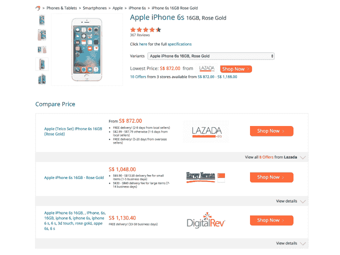

# iPrice 在东南亚的一站式电子商务网站 TechCrunch 上增加了比价功能

> 原文：<https://web.archive.org/web/https://techcrunch.com/2016/09/12/iprice-price-comparison/>

# iPrice 在东南亚的一站式电子商务网站上增加了价格比较功能

总部位于东南亚的购物网站 iPrice 推出了一项重大更新，为其电子商务聚合服务带来了直接价格比较。

[iPrice 去年筹集了 120 万美元](https://web.archive.org/web/20221207203601/https://beta.techcrunch.com/2015/12/14/iprice-raises-1-2m-more-for-its-e-commerce-service-in-southeast-asia/)，它的目标是成为东南亚[网上购物的一站式目的地，该地区以其潜力](https://web.archive.org/web/20221207203601/https://beta.techcrunch.com/2016/05/24/report-southeast-asias-internet-economy-to-grow-to-200b-by-2025/)而闻名，因为[其 6 亿累积人口中的互联网接入继续增长](https://web.archive.org/web/20221207203601/https://beta.techcrunch.com/2016/09/01/smartphone-sales-jump-6-5-in-southeast-asia-but-sub-150-devices-rule/)。它声称每月有超过 500 个商业合作伙伴和 160 万访客，并增加了新的价格比较功能，以便让访客更容易找到合适的交易。

该功能以两种方式工作。如果你看一个产品，iPrice 会弹出一个相关变体的列表，帮助你轻松找到你选择的那个。因此，如果这是一部智能手机，那么你会看到基于颜色、存储空间和型号等细节的相关信息。

第二，也许也是最重要的，它将额外的信息，如交付时间、交付成本和支付方式整合到一个视图中。这一点很重要，因为电子商务在东南亚仍处于萌芽状态，许多货物运输需要几天时间，这可能是因为它们是跨境的，而支付类型是必不可少的，因为该地区的信用卡普及率低于 10%。在你点击进入零售商的网站之前，把这些都放在一个地方要方便得多。

最初，比价功能在智能手机等科技产品上很活跃。其他产品，包括衣服、鞋子、包包和珠宝，被显示为外向链接，当点击时，会将访问者直接带到商家网站。此后，如果客户购买了产品，iPrice 会从产生的业务中提成。

iPrice 首席执行官 David Chmelar 在接受 TechCrunch 采访时表示:“竞争对手提供的东西和消费者的价值之间存在差距。”。“我们希望把消费者放在第一位，我们对人们如何网上购物做了大量研究。”

Chmelar 表示，总部位于马来西亚并提供优惠券和交易聚合的 iPrice 正在寻找其他方式来打包数据，以使购物体验更加直观。

“围绕如何处理相同的数据，还有其他的可能性，但通过以更好的方式显示数据来提供额外的附加值。我们真的想掌握价格比较，我们可以做的事情太多了，”他补充道。