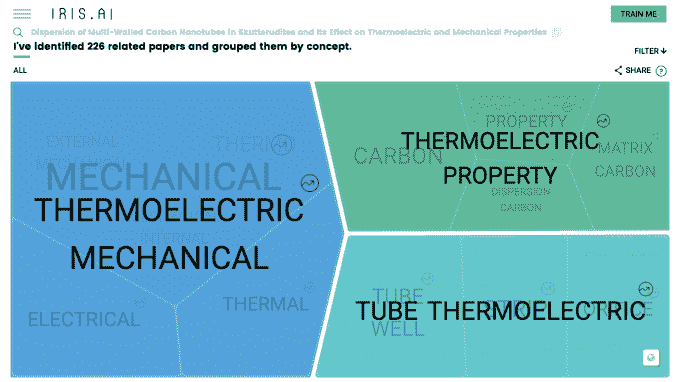
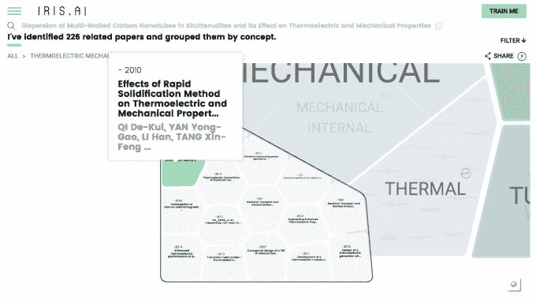

# Iris 是一个人工智能，帮助科学 R&D 

> 原文：<https://web.archive.org/web/https://techcrunch.com/2016/12/05/iris-is-an-ai-to-help-science-rd/>

大多数创业公司都有一个音高；Iris AI 的团队有两个人。他们创造了一个由人工智能驱动的科学助手，功能类似于搜索工具，帮助研究人员跟踪相关的期刊论文，而不必知道他们搜索的正确关键词。但在未来，它的大愿景是，一个人工智能婴儿长大后成为一名科学家，能够形成甚至测试假设，这是基于它将在科学研究助理的“第一份工作”角色中学习的一切。

这就是人工智能的多阶段、宏观前景。然而，在这项技术的发展仍处于相当初级的阶段，说服客户接受人工智能的潜力仍是一个挑战。需要有优越疗效的证据。

因此，在 Disrupt London，Iris 背后的初创公司正在重新启动其商业模式，通过专注于展示人工智能助手效用的活动，专注于扩大该工具的用户社区。着眼于通过一些量身定制的问题解决方案来指导 Iris 的持续发展和未来发展。一石二鸟。

他们的想法是:“科学马拉松”，或科学黑客马拉松。其目的是汇集一个问题解决者社区，以帮助公司解决具体的 R&D 挑战，同时也让 Iris 在解决问题的过程中提供帮助，并从具体的问题和活动期间拼凑的解决方案中学习。这个团队最初的想法是向有大量 R&D 需求的公司出售 Iris 的定制试点，尽管他们最终的目标是将他们的人工智能作为软件即服务出售。首先，他们需要 Iris 来赢得粉丝并影响有影响力的人。学习——很多。

“人工智能对人们来说有点陌生，”联合创始人兼首席执行官 Anita Schjø ll Brede 说。“公司对此很感兴趣，但他们不太明白这是如何运作的，有时他们会有点犹豫。他们很好奇，但他们想看看它是如何工作的——他们想真正感受一下。因此，我们不是试图出售该工具的定制安装，而是推出这些“scithons 即服务”，或作为一个事件概念。

“我们现在销售的是主持 scithon 的能力——我们从我们的社区中找到 20、30、40 名来自各种不同背景的非常聪明、非常有动力的人才，我们将他们与这个有科学挑战要解决的公司合作伙伴召集在一起。并让这些团队坐下来竞争公司设定的一个奖项。他们为了解决这个难题竞争了几个小时。因此，该公司获得了应对挑战的解决方案，并接触到了一些真正聪明、有干劲的年轻人。”

scithons 和 Iris 产品的目标客户是谁？需要解决科学难题的研究咨询公司和公司。Schjø ll Brede 表示，既有“严格的 R&D 要求”又有多学科 R&D 需求的公司，建议将电信公司作为一个潜在目标。

“这不仅仅是你开发的一个东西，而是有许多不同的领域需要你关注，”她在谈到目标客户时表示。“还有研究咨询公司，它们与各种不同的客户打交道，这些客户都从不同的角度看待问题。”

另一个目标是:那些在人工智能等新技术上投入了高风险赌注的小型新贵，可能会对公司造成冲击。换句话说，企业害怕被创业公司颠覆。

“我们确实需要那些愿意冒险的人，”她补充道。“人们看到了世界的颠覆性趋势，因为，让我们面对现实吧，这些大玩家中的大多数——如果他们在未来几年内不采取任何行动，他们将被超越。因此，我们正在寻找那些理解‘人工智能这件事’的玩家，尽管我们可能理解也可能不理解，但它正在成为现实，我们需要立即拥抱这些新趋势和技术。”

## 人工智能婴儿步和训练轮

Iris 的第一个版本在二月份发布，已经在大约 2000 个 Ted 演讲上训练了三个月。在这一点上，它能够提供一个特定 Ted 演讲的核心科学概念的摘要。但是，经过五个月的众包科学培训后，9 月份发布的第二版将 Iris 的能力扩展到了当前的科学助手功能。该团队现在有大约 2800 人注册帮助学校 Iris。

为什么人们会把宝贵的时间用来免费训练一个人工智能？Schjø ll Brede 认为部分原因是因为这些人自己也想要这个工具。她说，在一定程度上，这是对核心使命的共同信念，即让科学知识更好地为人类服务。她强调 Iris 的基础版本将永远是免费的，并指出该团队打算在获得种子资金后开放他们的部分源代码。在这一点上，他们得到了€38 万英镑(41.5 万美元)的资金支持。

去年 11 月，几位联合创始人在奇点大学(Singularity University)为期 10 周的项目中相遇，随后这家公司成立了。在那里，他们决定将科学作为他们的重点，认为企业家和企业在获取“核心知识时存在严重的痛点，因为你不知道自己在寻找什么，而且你也不是领域专家”Iris 的想法由此诞生。

最终，Iris AI 试图解决的核心问题是正在出版的科学文献的绝对数量——这使得解析和将它置于上下文中更加耗时。Schjø ll Brede 认为，人类需要越来越智能的机器辅助方式来导航不断增长的科学知识，并帮助研究人员跟上步伐，提出新的更好的理论和想法。

虽然现有的数字服务使科学文献可以通过关键词进行搜索，如谷歌学术，但在导航数字内容的方式上，自动突出相关和相关研究以省去一些跑腿工作的选择较少。这就是他们想让艾瑞斯进来的地方。

Schjø ll Brede 说:“我们正在使用一种带有启发式功能的非语义神经主题建模方法来构建层次结构。“我们从科学论文中提取摘要，这就是我们的工作。我们从频率分析开始，从那篇论文中提取出最重要的单词和表达。然后我们把这些单词转化成一个向量，在多维向量空间中。

“Iris 从整个其他内容中找到相关的单词——所以她使用同义词和上位词……然后我们将所有这些单词聚集在一起。所以我们得到了这些与文本中的每个关键词相关的词群或词袋。然后我们计算一下这个单词包最合适的标签是什么。

“这样，我们就建立了您刚才输入的文档的指纹。我们用它出去拿相关的文件。我们还创建了您可以在工具中看到的这些层次结构，我们有两个、三个或五个主要类别。每个主要类别都有子类别。结果中最多有几层类别。然后，对于每一个底层类别，我们都会从开放存取论文数据库中获取相关的研究论文。”

这里有一个例子，当我输入一篇关于碳纳米管的研究论文的 URL 时，Iris 提供了顶级结果。

每个部分都是可点击的，允许用户向下钻取，以拉出落入由人工智能识别和突出的各种类别的额外研究论文。这个想法是在集群分组中呈现信息，而不是分层列表，以添加一个可视化元素来帮助导航一个复杂的知识库。

再向下钻两层，图形现在可以看起来像这样(如下)——可以将鼠标移到单个研究论文上进行仔细查看，例如下面标记的β-Zn [4] Sb [3] 材料的属性。

Iris 呈现搜索结果的视觉结构让人想起早期的搜索项目，包括一些预测性的搜索工作，如研究项目 [SciNet](https://web.archive.org/web/20230316211126/https://techcrunch.com/2015/02/01/scinet/) (商业化名称为 [Etsimo](https://web.archive.org/web/20230316211126/http://www.etsimo.com/) )和 [Random](https://web.archive.org/web/20230316211126/https://techcrunch.com/2014/04/04/futureful-becomes-random/) 。

“从第一天起，我们就认为 UX 将会非常重要，”Schjø ll Brede 说。“对我们来说，数据的可视化是我们整个团队非常热衷的事情……我相信核心技术在帮助我们的用户获得概览和找到相关论文方面非常重要，并且远离关键词，但我认为可视化概览也给了我们的用户很多。”

“你可以获得这种视觉导航动态，我认为我们的大脑可以处理得比这好得多，比如十页的列表，”她补充说，将人工智能搜索加上视觉导航结果称为“真正强大的组合”。

根据 Schjø ll Brede 的说法，目前 Iris 已经阅读了大约 1800 万篇研究论文的训练数据集。虽然不是论文全文；目前它只是在看摘要。其目的是及时解析完整的研究论文，在这一点上，该工具可以扩展搜索粒度，以便能够只搜索完整论文中的部分研究——可能会进一步分割和切割科学知识库，包括跨学科，以及提高 Iris 搜索结果的整体质量。不过，还是那句话，还没到那一步。

“我们发现，仅仅使用抽象概念就能获得非常非常好的结果。但这也仅仅是一个开始。就像 Ted 演讲是一种有趣且非常简单的开始方式一样，摘要是下一个层次。她说:“我们现在处理的是 5000 万份文件，而不是 2000 份报告，所以这是一个很大的进步，但也只是一个开始。”。

“就我们的发展而言，下一步不仅仅是使用摘要，而是阅读全文。我们还在构建相似度图，我们将机器读取输入的论文和所有输出的论文，并对文档进行完全矢量化……因此，与我们现在对单词进行矢量化的方式相同，我们可以对文档的完整指纹进行矢量化。这意味着结果会比现在好得多。

“它们足够好，足以在今天产生影响，但在接下来的七八个月内，当我们发布那个版本时，它们会变得更好。同样，一旦我们阅读了全文版本，我们可以开始将论文分成更小的部分，这样我们就可以看到，比方说，我正在研究一种用于某些医学应用的蛋白质，我真的只是在寻找方法来做我需要对这种蛋白质做的任何事情，我们可以开始只在方法中过滤或搜索。或者在主题内。或在特定结果内等

## 发育期痛

Iris 的一个相当大的障碍是，并非所有的研究论文都是开放获取的研究论文。因此，那些被锁在付费墙后面的人提出了一个问题——尽管该团队希望说服付费期刊及时与之合作，以帮助打开更多科学的大门。目前，Iris 的产出达到了大约 3750 万篇开放存取研究论文，但希望随着时间的推移能够增加更多的内容。他们使用[核心](https://web.archive.org/web/20230316211126/https://core.ac.uk/)库作为他们输出研究论文的来源，但表示用户可以输入更广泛的研究论文作为搜索的起点(大约 5000 万)。

Iris 社区本身的规模也是相当有限的。Schjø ll Brede 表示，访客数量约为 43，000 人，其中约 13%转化为活跃用户(她说，这是指有人使用该工具进行搜索，导航到一篇论文，并“正确地”查看它)。因此，如果它想让运行 scithons 的平台的想法超出它打算密切监督自己的最初几个规模，它就需要认真地加强这一点。

另一个严重的限制是 Iris 可以智能解析的科学类型。Schjø ll Brede 说，她更擅长硬科学，而不是软科学——列举了 Iris 擅长的领域，如航空航天、汽车、物理和化学。其他研究领域给她的人工智能带来了问题。

“我们现在正在做一份特定科学领域的清单——我们试图衡量我们或多或少擅长的领域，”她说。“但在一般的硬科学领域，如航空航天、汽车、材料科学、物理、化学等更难的领域。不太擅长市场研究或经济学之类的东西。”

[gallery ids="1424108，1424107，1424106，1424105"]

在这些精选的强性能学科之外，我发现 Iris 很快就会动摇，并开始提出一些非常随机/超现实的结果。例如，我在一项皮肤状况的流行病学研究的摘要上测试了它，得到了一个非常混杂的结果包——包括关于椭圆星系的研究论文，合作的文化演变，以及一篇关于建筑物中低冲水马桶的影响及其对排水系统的影响的论文……现在可能有一个出色的机器人医学皮肤病学假设正在由一个萌芽中的机器智能伪造，它将设计糟糕的厕所与富有同情心的文化倾向和一点点银河 wonkiness 联系起来，但我对此表示怀疑。呃……艾瑞斯，你吸了什么？

与此同时，Iris 转变成一名实验表演科学家的宏伟愿景的时间框架——嗯，团队在发布时预算为十年——所以现在是九年，而且还在继续……Iris 最好开始苦读。

值得注意的是，也有其他人应用人工智能来减轻科学搜索的痛苦。例如，语义学者是我们之前报道过的一个非盈利项目。尽管 Schjø ll Brede 表示，区别在于它采用语义方法从文本中提取上下文，她说这需要一个完整的语言模型才能发挥作用，而 Iris 的非语义方法不需要语言模型。尽管她承认还不清楚哪种方法更好。

“我们不是试图理解句子，而是理解上下文，”她说。“一些语言学家不喜欢这种方法，但我们已经在其他应用程序中看到，如翻译引擎……统计深度学习，非语义方法似乎效果更好。尽管这违背了长期以来流行的理论。

“目前还不能确定哪种方法会更好。我们认为会有一种混合的方式，但我们从一种非语义的方法开始。”

其他创业公司也面临类似的问题，包括总部位于加拿大的[Meta](https://web.archive.org/web/20230316211126/http://meta.com/)；[旧金山的 Yewno](https://web.archive.org/web/20230316211126/http://yewno.com/about/)；据 Schjø ll Brede 称，还有一家丹麦公司叫做 [Unsilo](https://web.archive.org/web/20230316211126/https://site.unsilo.com/site/) 。

就计划的进展而言，Iris 的父母希望明年能看到几个新版本的发布——因此该工具不仅能生成上下文概述，还能创建完整的相似性图表，提高结果质量。他们还打算推出自己的数字平台来组织 scithons，并希望开始看到公司解决挑战的切实成果。

另一个希望是已经开始超越开放获取期刊——并且“可能与一两种付费期刊整合”。他们还希望在 2017 年全年创收。

在那之后，在 2018 年的某个时候，商业计划的下一步是建立一个 API，向那些在自己的 R&D 数据库中锁定了大量专有研究的较大公司推销它 Iris 被设想为释放 R&D 内部部门洞察力的 SaaS——因此与机器人科学家仍然相去甚远，但从商业模式的角度来看，更成熟了一点。为了达到这个目标，他们仍然需要证明核心效用。所以让 scithons 开始吧！

**评委问&答**

**问:**这方面的市场可能是法律、专利搜索、版权、医疗保健、研究论文……这是对一小部分人来说非常有价值，而对大多数人来说毫无价值的东西之一。那么，你如何瞄准那些真正真正看重它的公司，如何定价才能获得最大价值呢？
**答:**我们预计大约有 1100 万人在研发部门工作，这是 SaaS 车型的目标市场。当谈到 scithon 走向市场战略时，我们已经或多或少地按成本定价的前几个战略能够打入市场并获得牵引力。当我们在数字平台上扩大规模时，我们会获得更大的规模——但我认为真正的价值将出现在这个过程的第三步，当我们开始连接内部研发数据库时，这些大公司有 500，000 份内部研发文档，他们对此一无所知。这才是真正的价值所在。

问:你会先去哪些地区？科学确定吗？或者你认为法律或专利可能对你更有价值？答:专利可能会发挥作用。但它是工程、硬科学、航空航天、汽车、材料科学，那些沉重的硬科学。

**问:**我鼓励你去看看其他市场，比如法律、医疗或版权市场，因为有大量的数据需要你去消费，而且发现非常非常困难，而且没有任何真正好的工具。他们愿意花很多钱来解决这个问题。
**答:**我们正在应用的核心技术可以解决所有这些问题——对我们来说，我们希望在十年内达到的目标是专注于科学领域，这是我们需要达到的目标，但我认为利用核心技术在其他领域进行衍生绝对是一个有趣的模式，展望未来几年。

问:你的愿景是什么？人类、世界如何从 Iris 中受益？
**答:**假设我们给 Iris 1,000 篇关于气候变化挑战的论文。她能读出来，她说‘好吧，我要读这些东西，还有这些东西’。她会提出一个假设…然后她会被连接到一个模拟环境，在那里她可以进行实验，跑到那里实际测试它。并公布结果——无论结果是积极的还是消极的。

**问:**还有预测选举？
**答:**否。

问:这个你打算怎么收费？你打算怎么卖？答:这就是 scithons 的由来。scithons 将按事件定价。然后主办 scithon 的公司将获得一个 SaaS 模式，我们每年为每个用户提供一个席位。

对于后来的 API 模型，它将…真的取决于项目的大小。

问:我鼓励你把这个价格定得非常非常高。定价等于地位。价格等于地位。如果你定价太低，人们会说没有价值。如果你给它定价高，他们会认为它很值钱。确实如此——你正在取代人们多年来试图挖掘所有这些东西的努力。所以如果我是你，我会把它的价格定得非常非常高。如果需要的话可以下来。但是起点高。
**答:**没错。

**问:**竞技动态？还有其他人这样做吗？
**答:**有一些玩家在类似的领域做类似的技术……有 Meta 和其他一些人，还有语义学者在科学论文领域工作。其他公司也在研究类似的技术，这是一种更普遍的“嘿，许可我们的技术”游戏。就 scithon 的商业模式而言，还有 Kaggle 和其他一些平台——可能不是直接的竞争对手，但……如果他们看到其中的价值，可能会进入相同的领域。

问:你打算如何让 scithons 继续下去？你有一个你想锁定的 100 个人的名单吗？
**答:**我们已经卖出了前五个……因为有一个真正的研发挑战需要解决……他们要与 20、30、40 名外部人才互动，所以有雇主品牌与之混合，第三，这是一种非常酷的方式来接触这种新的人工智能技术，人们不太确定如何应对……事实证明这对一家公司来说真的很容易。他们做那种活动的风险真的很低。

问:他们在联系你吗？还是你在联系他们？
**答:**两者皆有。我们确实与 60、70、80 家公司进行了对话，其中五家直接转化为销售。接下来还有一个更长的联系人名单……在我们开始开发工具之前，我们就已经与研发部门和公司进行了密切的对话。所以我们确实有很多公司在和我们对话。