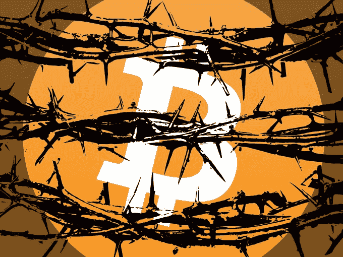

# 比特币的承诺会化为乌有吗？

> 原文：<https://web.archive.org/web/http://techcrunch.com/2016/01/19/is-bitcoins-promise-going-up-in-smoke/>

[Vivek Wadhwa](https://web.archive.org/web/20230326071501/http://wadhwa.com/)

是一名学者、企业家和作家，在斯坦福大学、杜克大学和奇点大学任职。

More posts by this contributor

不久前，风险投资家还在谈论比特币将如何改变全球货币体系，让政府无力监管货币交易。现在加密货币似乎在为生存而战。

1 月 14 日，一个有影响力的比特币开发者迈克·赫恩[宣布](https://web.archive.org/web/20230326071501/https://medium.com/@octskyward/the-resolution-of-the-bitcoin-experiment-dabb30201f7#.t9va2o3gd)加密货币失败，并透露他已经卖掉了所有的比特币，新的现实浮出水面。消息传出后，比特币的价格在一天之内下跌了 10%——对于那些在比特币上赔钱的人来说，这是一个令人悲伤的结果。

比特币确实有巨大的潜力，但现在它已经损坏到无法修复，急需替代品。

今天的大多数货币和交易系统仍然是不透明、低效和昂贵的。

以北美证券交易所纳斯达克为例。它是世界上技术最先进的国家之一。然而，如果我在纳斯达克(NASDAQ)买卖脸书的股票，我必须等待几天才能完成交易和清算。这是不可接受的；应该需要几毫秒。

在委内瑞拉，希望在超市货架上购买任何有价值物品的公民都要排一整天的队，因为恶性通货膨胀导致他们口袋里的纸币每天都在大幅贬值。

当那里的移民工人向他们在墨西哥、印度和非洲等地的家人寄钱时，他们会被汇款公司敲诈——支付高达 5%-12%的费用。甚至在美国，支付处理商和信用卡公司收取每笔交易额的 1%—2 . 5%的商户费用。这是经济的负担。

比特币旨在改变这一点，但它天生就有严重的缺陷。它不受监管，并提供匿名，所以它迅速成为毒贩和无政府主义者的天堂。它的价格大幅波动，允许疯狂投机。而且，由于比特币的大部分被开始推广它的小团体所拥有，它被[比作](https://web.archive.org/web/20230326071501/http://www.ft.com/intl/cms/s/0/1877c388-8797-11e5-90de-f44762bf9896.html#axzz3xZEkZnaq)庞氏骗局。

在此基础上建立的交易所也有严重的安全漏洞。此外，还有一些被冲昏头脑的风险资本家。

他们中的一些人购买了大量的硬币，然后开始大肆宣传它是一种强大的颠覆，可以支撑所有形式的金融创新，从移动银行到无国界的即时汇款。他们还向比特币初创公司投入了数百万美元，希望获得更大的财富。

但是比特币还没有准备好迎接黄金时代。赫恩的批评揭露了噩梦般的现实——一张长长的、令人恐惧的负面清单。

中国比特币矿工控制着超过 50%的货币创造能力，并通过中国的防火长城与比特币生态系统的其余部分相连。这降低了整个系统的速度，因为正如赫恩解释的那样，这相当于一个糟糕的酒店 WiFi 连接。这也让人民军队在全球货币问题上占据了战略优势。

比特币分布式网络每秒只能处理少量交易。这导致不可预测的交易解决时间和其他行为，人们真的不希望它们成为货币系统的一部分。例如，在高峰时期，比特币的费用可能会超过信用卡费用。

似乎这一切还不够糟糕，比特币社区似乎正在进行公开的内战。其成员一直在审查辩论和攻击对方的服务器。一个由五名核心开发者组成的小型委员会控制着比特币的代码库，已经成为引导比特币未来的星室。

这对风投的声誉和钱包是一个沉重的打击。然而，他们中的一些人仍然坚定地捍卫比特币。

是时候承认当前的比特币需要废弃，并利用支撑比特币的技术背后的创新:区块链。

区块链是一个透明的交易分类账——同时托管在世界各地的许多计算机上——允许创建数字货币和虚拟银行。

我相信，如果实施得当，它将成为一个更好的交易和验证模型，我们目前将其用于全球金融系统和许多其他类型的活动，如投票、公共注册、艺术品来源和房地产转让。

> 一开始，比特币是一项高尚的实验。现在，这是一个分心。

从比特币的失败中，我们学到了数字社区不应该如何运作。我们已经看到了总账系统是如何被劫持的。我们已经看到了采矿系统的浪费，它消耗了数十亿瓦时的电力，并在中国催生了巨大的服务器农场，仅仅是为了处理数据以“开采”比特币。

我们需要向成功的开源技术项目学习，比如 Linux 基金会，它之所以蓬勃发展，很大程度上是因为它已经证明了自己作为一个中立机构的价值，可以管理各种各样的开源项目，这些项目规模太大，小团队无法随意管理。我们还需要按照赫恩和比特币忠实者的建议，重新思考区块链的方方面面。

让我们也记住是什么让一些风险投资家成为比特币狂热者:纯粹的贪婪。这是我最清楚的比特币失败的原因。比特币系统本应是一个公平的竞争环境和一个更高效的交易系统，但它已经恶化为利益相关方之间围绕一笔资金池的争斗。

一开始，比特币是一项高尚的实验。现在，这是一个分心。是时候建立更加合理、透明、稳健、负责的治理体系，为所有人的更加繁荣的未来铺平道路了。