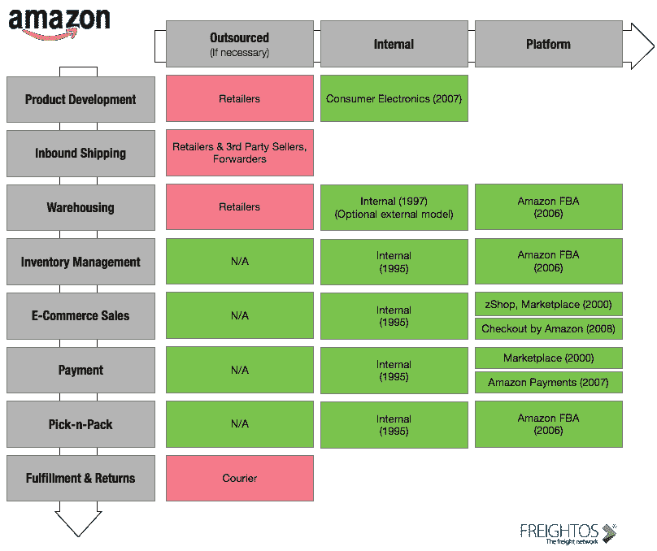
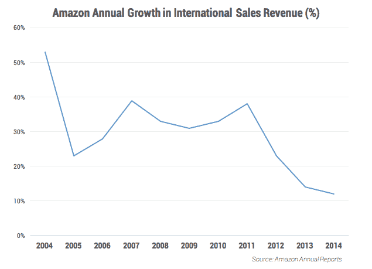

# 物流即将被亚马逊收购吗？

> 原文：<https://web.archive.org/web/https://techcrunch.com/2016/01/29/is-logistics-about-to-get-amazoned/>

Zvi Schreiber撰稿人

兹维·施赖伯是

[Freightos](https://web.archive.org/web/20230305215853/http://www.freightos.com/)

，一家为货代、托运人和大型电子商务提供国际货运在线服务的物流初创公司。

2015 年 11 月，北京世纪绮优快递服务有限公司[在美国政府注册为远洋运输供应商](https://web.archive.org/web/20230305215853/http://www2.fmc.gov/oti/NVOCC.aspx)。那又怎样？嗯，北京世纪绮优快递服务公司是亚马逊的子公司。今年早些时候，亚马逊已经通过空运和卡车运输扩大了其物流业务。

亚马逊进入数万亿美元的货运行业会对亚马逊的国际卖家、进口商和最终消费者产生巨大影响。但是在亚马逊的运作方式的背景下，这可能意味着世界上最大的行业之一发生更广泛的变化。

## 亚马逊即服务的崛起

在过去的 20 年里，亚马逊的运营战略已经从在线零售商转变为 B2B 服务提供商，向其他企业提供一系列关键基础设施即服务。

> 这是正在发生的亚马逊网络服务、亚马逊的履行和 Kindle Direct Publishing 的很大一部分……我们正在创建强大的自助服务平台，让成千上万的人能够大胆尝试并完成否则不可能或不切实际的事情。
> 
> — [杰夫·贝索斯 2011 年度股东信](https://web.archive.org/web/20230305215853/http://phx.corporate-ir.net/External.File?item=UGFyZW50SUQ9MTM0NDcxfENoaWxkSUQ9LTF8VHlwZT0z&t=1)

在取悦顾客或增加市场份额的驱动下，亚马逊的发展过程遵循一个清晰的结构:

*   找出效率低下的地方。

*   开发技术解决方案。

*   将解决方案扩展到一个平台中。

*   提供平台作为第三方企业的新颖解决方案。

例如，亚马逊首先为他们自己的 IT 创建了一个[高效的内部计算云](https://web.archive.org/web/20230305215853/https://www.quora.com/How-and-why-did-Amazon-get-into-the-cloud-computing-business)，在以亚马逊 Web 服务的形式提供给其他人之前，先在内部对其进行扩展。同样的模式在其他领域也出现了，包括支付、电子商务结账和零售，我们将在下面看到。

关键是，竞争对手通常看不到变化的到来。当“云计算”这个词在 1996 年第一次被使用[的时候，IBM 和微软当然没有预料到他们最大的竞争对手会是一家书店！](https://web.archive.org/web/20230305215853/http://www.technologyreview.com/news/425970/who-coined-cloud-computing/)

## 进入零售业的 X 即服务领域

亚马逊在过去 20 年里稳步发展其零售服务。在最初业务外包的情况下，亚马逊开发了内部的、技术驱动的解决方案。一旦成功，这些解决方案将作为外部服务提供给第三方企业。

在在线零售领域，这一过程始于亚马逊提供核心电子商务和包装服务，而批发商负责采购图书并将其入库。亚马逊团队成员会从批发商那里订购书籍，熬夜到凌晨 3 点 [在贝佐斯车库的地板上包装书籍](https://web.archive.org/web/20230305215853/http://www.wsj.com/articles/SB10001424052970203914304576627102996831200)。书籍的交付将外包给像 UPS 这样的公司，就像今天一样。

随着电子商务平台的改进，亚马逊于 2000 年开始向第三方供应商提供电子商务服务，从而产生了极其成功的亚马逊市场。今天，超过 200 万第三方卖家[占据了亚马逊销售额的 40%。](https://web.archive.org/web/20230305215853/https://techcrunch.com/2015/01/05/amazon-third-party-sellers-2014/)

规模和改进的技术以更高效的仓储重复了这一模式，导致了 2006 年亚马逊(Amazon)推出的 Fulfillment。与此同时，亚马逊支付也在 2007 年作为一项服务推出，尽管它并不特别成功。另一项服务，一个叫做亚马逊的电子商务购物车解决方案，是下一个推出的服务(2008 年)，尽管它也从未起飞。

## 在供应链中垂直扩张

在扩展到服务领域后，亚马逊从消费电子产品开始，开始扩大其在供应链中的地位。

这是亚马逊遭遇失败的一个领域，包括 Fire 手机和 Kindle Fire。虽然像 Kindle 这样的设备作为内容分发策略是有效的，但产品开发从未达到平台阶段。

## 首次涉足物流

2014 年，亚马逊通过专注于以前外包的物流组件，继续其在供应链上的扩张——首先是入境物流，然后在 2015 年是送货上门。

每年超过 1 万亿美元用于国际货运，为全球船队、飞机和卡车提供动力，每年跨境运输价值超过 19 万亿美元的货物。装载多达 18，000 个集装箱的巨大船只运送了消费者吃的、用的和穿的所有东西的 90%(只需检查你衣服或设备上的标签)。

但是全球货运业是手工操作的，效率低下。这正是亚马逊利用技术和规模来降低成本的最佳时机。亚马逊在 2014 年开始为国际卖家提供[外包整合](https://web.archive.org/web/20230305215853/http://phx.corporate-ir.net/External.File?item=UGFyZW50SUQ9MjgxMzI2fENoaWxkSUQ9LTF8VHlwZT0z&t=1)，利用批量折扣获得更便宜的美国进口价格。

## 扩展到交付领域

交货是一个更重要的难题。2014 年，让亚马逊顾客高兴的免费送货(和快速 Prime 送货)花费了超过 42 亿美元——接近净销售额的 5%。此外，缺乏对外包流程的控制也会影响客户满意度，比如 2014 年假日季节的[快递运输延误](https://web.archive.org/web/20230305215853/http://www.fool.com/investing/general/2014/01/08/amazon-considering-options-after-ups-delays.aspx)。

为了降低运营成本和对外部供应商的依赖，亚马逊在 2015 年开始扩大其在交付中的作用。2015 年 12 月,《西雅图时报》报道,亚马逊正在谈判租赁一支航空舰队，而[亚马逊卡车](https://web.archive.org/web/20230305215853/http://recode.net/2015/12/04/amazon-buys-thousands-of-its-own-trucks-as-its-transportation-ambitions-grow/)开始上路。标志性的亚马逊套餐首次由亚马逊 员工[配送，而亚马逊也推出了](https://web.archive.org/web/20230305215853/http://www.geekwire.com/2015/delivered-by-amazon-what-its-like-to-get-a-package-straight-from-the-online-retailer/)[众包配送](https://web.archive.org/web/20230305215853/http://www.cnet.com/news/amazon-reveals-delivery-service-powered-by-regular-folks/)服务。

虽然这对亚马逊来说是一项全新的业务，但没有哪家公司能在技术驱动的效率方面做得更好。亚马逊仓库中超过 30，000 个机器人证明了自动化在供应链中有多么强大。同样的驱动力也解释了亚马逊的包裹无人机递送努力。

## NVOCC 戏剧

在这种背景下，亚马逊(Amazon)申请成为货运代理公司既合乎逻辑，也十分大胆。亚马逊(Amazon)进入了一个众所周知的非自动化行业。货运报价从到平均需要 90 多个小时，而的定价也以不透明著称。

但亚马逊的国际收入增长停滞不前，2014 年下滑至 12%——按亚马逊的标准算，增幅并不算大。更轻松、更便宜地将产品销往全球各地的亚马逊卖家，可以重振增长，降低亚马逊自身的全球运输成本，并加强对流程的控制。

## 对 l 物流行业的启示

亚马逊已经养成了将内部服务扩展到第三方服务的习惯。如果亚马逊成功降低了内部履行和物流成本，这些服务不太可能继续局限于亚马逊内部使用。

作为一个行业，物流技术驱动颠覆的时机已经成熟。没有一家公司比亚马逊更擅长利用技术来扩大利润。物流和送货公司应该跟踪亚马逊的物流像老鹰一样玩耍的早期。除非物流公司能够跟上亚马逊可能部署的技术创新，否则亚马逊物流服务可能会在未来十年成为一个新的平台，取代现有的货运领导者。