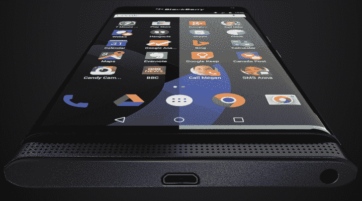

# 这是黑莓首款安卓手机吗？

> 原文：<https://web.archive.org/web/https://techcrunch.com/2015/07/03/is-this-blackberrys-first-android-phone/>

# 这是黑莓首款安卓手机吗？

在过去的一个月左右的时间里，围绕谣言工厂的普遍想法是黑莓正在开发一款 Android 手机。如果你打不过他们，就加入他们，好吗？

现在，我们已经对他们的第一款 Android 手机可能会是什么样子有了一个粗略的想法。

由足智多谋的埃文·布拉斯(又名 [evleaks](https://web.archive.org/web/20230128091352/https://twitter.com/evleaks) )发布的这张照片显示了一个设备，它的显示屏的两半都有曲线——与三星的 Galaxy S6 Edge 没有什么不同。据说它被称为黑莓“威尼斯”，虽然这可能是一个代号。

如果你格外关注 T4，你可能会注意到这款设备的总体轮廓与黑莓自己在 3 月份的世界移动通信大会上悄悄展示的东西非常相似。然而，这款设备似乎运行的是黑莓自己的 BB10 操作系统:

看到第二张照片中的滑出式键盘了吗？目前还不清楚传闻中的 Android build 是否会在其曲面显示屏下塞进类似的东西；虽然这似乎是一个紧张的挤压，上面泄露的渲染当然没有消除这种可能性。

对黑莓来说，在首次接触 Android 时加入滑出式键盘将是一个不错的举措。Android 市场竞争激烈，但是缺少许多具有坚固物理键盘的手机，尤其是如果你想寻找一些最新规格的手机。

像这样的设备将吸引服务不足的利基市场*和*有助于哄一些人抓住他们的旧黑莓设备进入勇敢的，新的 Android 驱动的黑莓世界。它不会让黑莓一夜之间占领安卓市场，但会帮助他们迈出第一步。