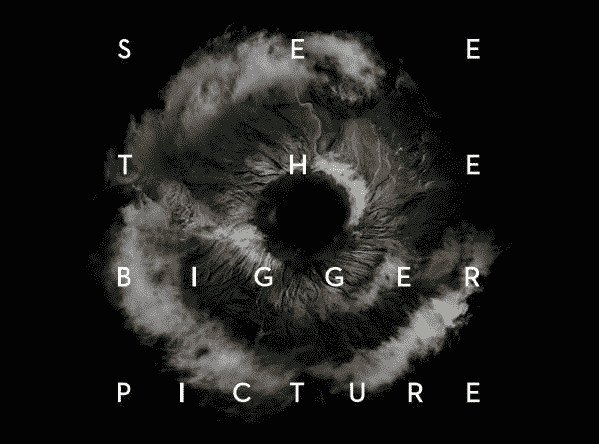

# 这是 DJI 的下一个 Mavic 无人机吗？

> 原文：<https://web.archive.org/web/https://techcrunch.com/2018/07/07/is-this-djis-next-mavic-drone/>

# 这是 DJI 的下一个 Mavic 无人机吗？

我们可以确定的是:DJI 即将举办一场大型活动。它原定于 7 月 18 日，但最终被推迟，以便该公司“能够根据(其)创新标准交付产品。”对于 2016 年[Mavic Pro](https://web.archive.org/web/20230327082237/https://techcrunch.com/video/dji-launches-the-mavic-pro/)的后续活动来说，时机似乎是正确的，并且“更大的图片”活动艺术品似乎证实了对成像的关注。

然而，接下来的部分变得更加投机了。 [DroneDJ 发布了](https://web.archive.org/web/20230327082237/https://dronedj.com/2018/07/06/breaking-news-dji-mavic-2-photo-leaked-online/)一张名为“Mavic 2”的(相对)大型折叠式无人机的图片。该设备还配备了一个可更换的摄像头万向节，这意味着用户可以用不同的版本切换板载型号。

对于寻找便携式解决方案的专业摄影师来说，这将是一个受欢迎的变化，他们可以将它与其他设备一起塞进相机包中。增加广角选项也符合整个“更大画面”的观点。

[CNET 在一篇文章中指出](https://web.archive.org/web/20230327082237/https://www.cnet.com/g00/news/say-hello-to-the-dji-mavic-pro-2-drone-if-this-photo-is-real/?i10c.encReferrer=aHR0cHM6Ly93d3cuZ29vZ2xlLmNvbS8%3D&i10c.ua=1&i10c.dv=14)360 度避障在这里也是可能的。这将有助于新的 Mavic 与 Playground Global 支持的初创公司 Skydio 的 R1 竞争，后者俘获了无人机社区的心。

当然，DJI 仍然是消费级无人机的市场领导者，它的 Mavic 系列在帮助消费者主流化该产品方面走了很长的路。但竞争加剧无疑让该公司最近保持警觉。

泄密对 DJI 来说肯定不是什么新鲜事，因为最后几款设备在发布前已经以某种形式在网上出现了。然而，该公司不出所料地拒绝了我们的置评请求。