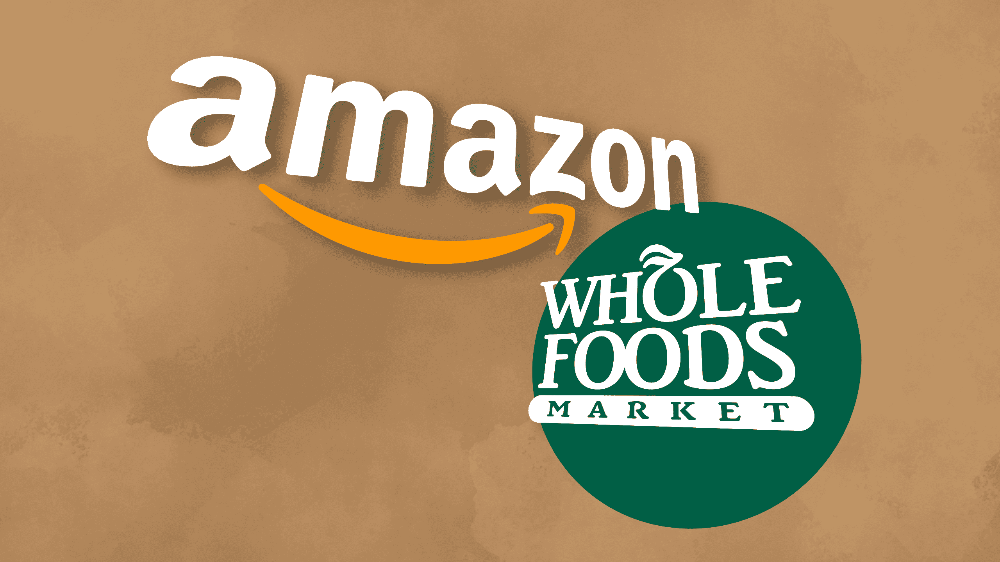
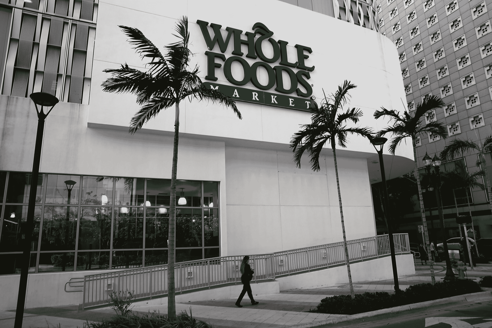
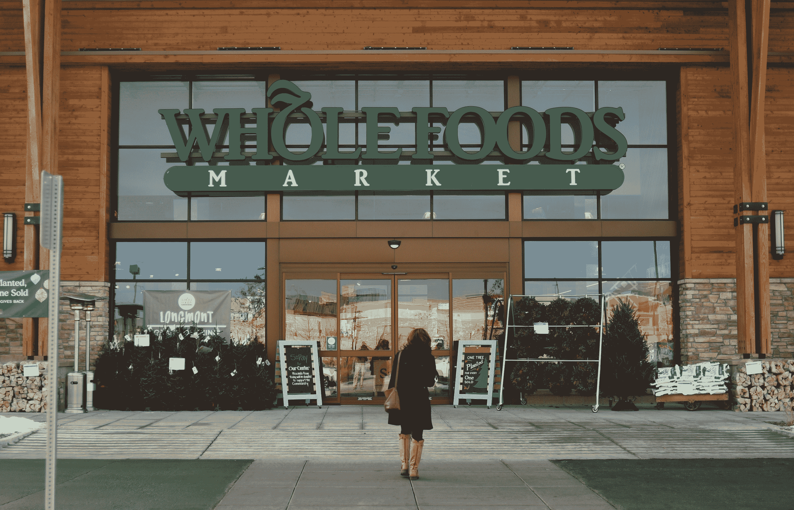

# 全食超市是亚马逊的健康选择吗？

> 原文：<https://web.archive.org/web/https://techcrunch.com/2017/06/19/is-whole-foods-a-healthy-option-for-amazon/>

More posts by this contributor

如果你在过去的几天里一直躲在石头下或盯着一个坐立不安的旋转器，你可能会错过亚马逊正在以近 140 亿美元收购全食超市的消息。市场青睐新的合作伙伴关系，因为他们[击败了他们的竞争对手](https://web.archive.org/web/20221025223043/https://beta.techcrunch.com/2017/06/16/foodpocalypse/)。

两家公司都通过这次收购获得了几个短期和长期的机会。

**数百个新的履行地点** <
随着习语商业的发展——地点、地点、地点。Whole Foods 有数百家门店，精心布置在富裕的地段，可以被视为亚马逊难以置信的房地产收购。

从仓库到家的距离决定了我们现在能多快得到我们需要的电池。

目前，[亚马逊在九个市场提供当天送达服务](https://web.archive.org/web/20221025223043/http://go.redirectingat.com/?id=35871X943606&site=businessinsider.com&xs=1&isjs=1&url=http%3A%2F%2Fwww.amazon.com%2Fb%3Fnode%3D8729023011%26tag%3Dbisafetynet-20&xguid=f66b5bb5a2e3eeaae2779976b8e5eff5&xuuid=81c720b68989ee12ade93d802ac81b13&xsessid=dba1c3ea788477ed31d6345309377bdf&xcreo=0&xed=0&sref=http%3A%2F%2Fwww.businessinsider.com%2Fhow-many-fulfillment-centers-does-amazon-have-in-the-us-2015-3&pref=https%3A%2F%2Fwww.google.com%2F&xtz=420)。2015 年， [Piper Jeffray 分析师预测](https://web.archive.org/web/20221025223043/http://www.businessinsider.com/how-many-fulfillment-centers-does-amazon-have-in-the-us-2015-3)年收入超过 50，000 美元的家庭是当天送达的核心市场。他们还估计，亚马逊的履行地点大约在 50-65%的目标市场的 20 英里范围内。这次收购让亚马逊从郊区搬到了社区。

每家全食超市都兼做退货点、微型仓库、提货点，以及着陆区，我们将在后面讨论。

**高价遇上超高效**

亚马逊和全食超市给自己树立了截然不同的形象。当我们想到全食时，我们不会想到低价产品。全食超市，我的一些朋友称之为“全钱包”，专注于他们的高质量，高价格，精心策划的选择。另一方面，亚马逊以其超高效率、价值和选择而闻名。

对亚马逊来说，分销他们已经以更高利润采购的产品的能力对他们的业务来说是一个福音。换句话说，全食超市的加价为亚马逊的商品建立了一个高利润的渠道。

全食超市意识到，他们需要提供更低价位的选择来进入更大的市场。因此，他们推出了全食超市 365“品质与节约相结合”来满足更多对价格敏感的消费者。凭借亚马逊更低成本的供应链，全食 365 可能已经找到了将价格降至某个水平所需的东西，这样他们不仅可以与沃尔玛和好市多竞争，还可以为喜欢纽扣的消费者提供更方便的体验。

(照片由乔·雷德尔/盖蒂图片社拍摄)

**启用最后一英里**

自成立以来，亚马逊一直专注于将产品高效地送达客户手中。 [Amazon Prime](https://web.archive.org/web/20221025223043/https://beta.techcrunch.com/topic/product/amazon-prime/) 、 [Amazon Fresh](https://web.archive.org/web/20221025223043/https://beta.techcrunch.com/tag/amazonfresh/) 、 [Amazon Flex](https://web.archive.org/web/20221025223043/https://flex.amazon.com/) (送货)、 [Amazon Fresh Pickup](https://web.archive.org/web/20221025223043/https://beta.techcrunch.com/2017/03/28/amazon-debuts-amazonfresh-pickup-drive-up-groceries-delivered-to-your-trunk/) 和 [Amazon Go](https://web.archive.org/web/20221025223043/https://beta.techcrunch.com/2016/12/05/amazon-go/) 都是该公司最近以更快的送货速度颠覆零售业的尝试。

退一步讲，让我们回忆一下每家公司都提供了什么。亚马逊拥有更复杂的技术基础设施、创新的在线消费者体验、更好的履行流程和库存管理。亚马逊缺乏的是人的面孔和与我们社区的联系。许多人对亚马逊的唯一了解是他们在瓦楞纸箱上的商标。

全食超市在令人难以置信的地点拥有物业，拥有强大的品牌，以及成千上万的员工在他们的所在地为他们的社区服务。这些都是亚马逊扩大“最后一公里”交付规模所需要的缺失部分。建立一种以服务为导向的文化并不容易，全食超市有一群不可思议的员工可以支持他们新的以机器为导向的母公司。

全食超市目前有像 Instacart 和 Postmates 这样的分销合作伙伴，他们可能会失去很多生意。它们只是未来可能被切断的两项服务，因为亚马逊在我们的社区中有了一个新的履行地点。

11 月 [亚马逊宣布](https://web.archive.org/web/20221025223043/https://beta.techcrunch.com/2016/11/30/amazon-launches-amazon-ai-to-bring-its-machine-learning-smarts-to-developers/) 它正在测试一家新的不需要结账的人工智能商店。最近， [有报道称](https://web.archive.org/web/20221025223043/http://fortune.com/2017/03/28/amazon-go-cashier-free-store/) 他们的系统在任何给定时间都很难跟踪商店中超过 20 人的情况。虽然这一概念将在不久的将来上市，但一旦亚马逊准备好大规模部署他们的解决方案，全食超市将提供一个令人难以置信的试验场。这将允许我们像对待冰箱的延伸一样对待所有的食物。

现在知道还为时过早，但我们可能会回过头来说，亚马逊刚刚收购了一整队司机，如果他们愿意，可以为他们的新母公司完成几项活动。

(图片由 RJ·桑戈斯蒂/丹佛邮报通过盖蒂图片提供)

**机器来了**

在每一次未来技术讨论的背景下，都潜伏着两个话题:无人机和自动驾驶汽车。亚马逊对后者保持沉默，但很明显，如果他们能够提供自己的商品，他们可能会成为巨大的赢家。然而，对于这两种努力来说，仍然有一个主要的后勤问题——我们要把我们的车辆和无人机带到哪里去充电和储存。

随着这一大规模房地产收购，亚马逊继承了数百个当地屋顶和停车场，现在可以为他们的车队充电和补给。随着开车的人越来越少，这些停车场将允许商店扩张，并为其他活动提供更多空间。

**为便利的未来干杯**

零售业的未来对我们所有人来说都很有趣。很难否认，市场继续创造一个世界，我们都将有更多的时间观看指定幸存者和 Housemaiden，而不需要花时间去跑腿。

我们将按照这个顺序，选择最方便的、符合他们的钱包和价值观的选项。

在过去的几年里，我们已经看到亚马逊测试了在消费者冰箱中获取食品杂货的新方法，包括 Amazon Fresh、Amazon Fresh Pickup、无人机送货和 Amazon Go。当我回顾这次收购时，我不禁想到，“他们是一直在为此做准备，还是意识到他们无法独自完成？”