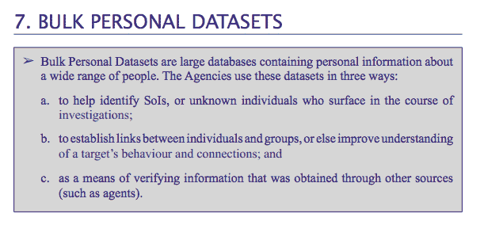

# 英国议会调查呼吁建立新的法律框架来管理间谍机构

> 原文：<https://web.archive.org/web/https://techcrunch.com/2015/03/12/isc-report-privacy-and-security-report/>

在今天发布的一份报告中，英国议会的情报和安全委员会呼吁议会制定一项新的单一法案来管理国内间谍机构的运作，以提高透明度和公众信任。它将其报告称为“迈向更大透明度的重要的第一步”。

这份 149 页的报告是该委员会长达一年的调查的累积，其背景是美国国家安全局举报者爱德华·斯诺登(Edward Snowden)泄露的文件不断被披露(其中一些文件具体涉及英国 GCHQ 间谍机构)，目的是审查英国情报和安全机构的运作，具体着眼于(用委员会自己的话说):

*   各机构目前可利用的侵入能力的范围；
*   如何使用这些能力，以及使用的规模；
*   这些功能侵犯隐私的程度；和
*   最重要的是，规范其使用的法律权威和保障措施

该委员会声称没有发现英国政府机构试图规避法律的证据，但确实指出了它所说的“现有立法缺乏清晰度”——指出这“加剧了对机构活动的怀疑”。

“从长远来看，围绕现有立法边缘的小规模改革和改进是不够的。因此，我们认为，与其像一些人建议的那样，简单地改革 RIPA[调查权力监管法案]，不如替换适用于情报机构的整个法律框架，”该委员会写道。

“这些机构的目的、职能、能力和义务应当在新的议会单一法案中明确规定
。这还应包括隐私限制、透明度要求、目标选择标准、共享安排和适用于其能力使用的其他保障措施。”

“这些变化早就应该发生了，”它补充道。“在当今社会，公众对公开和透明有着合理的期望。因此，虽然这些机构必须秘密运作才能保护我们——我们也不能指望它们不这样做——但必须尽一切努力确保在安全的情况下将信息公开。”

因此，底线是，斯诺登揭发情报机构在西方民主国家活动过度的动机再次被证明是正确的。就连当权派也承认，在斯诺登曝光之前，间谍机构的运作太不透明了。

尽管委员会呼吁增加透明度，但报告中的各种细节仍被编辑(情报机构相关报告的典型做法)——包括，正如 [The Intercept](https://web.archive.org/web/20230224073651/https://firstlook.org/theintercept/2015/03/12/uk-parliament-finally-offers-evidence-mass-surveillance-stops-terror-attacks/) 所指出的，GCHQ 向委员会提供的具体案例研究，显然是为了“证明”大规模监控在防止恐怖袭击方面的功效。因此，在这一点上，公众没有办法自己判断。

委员会还声称对这些机构使用大规模监视(它称之为“批量拦截”)作为发现和/或情报收集工具的做法进行了质疑，并再次声称对这些方法的合法性感到满意，因为这些捕鱼考察的范围有限；通过搜索词对收集的数据进行分类和过滤；并且只有很小比例的最终通信被人类分析师阅读。

“鉴于所涉及的过滤范围，很明显，GCHQ 的批量拦截能力并不构成地毯式监视或无差别监视，”该委员会断言。

“我们审查了一些案例，这些案例表明，批量拦截暴露了以前未知的威胁或阴谋，这些威胁或阴谋威胁到我们的安全，否则不会被发现。因此，原则上，我们认为批量拦截是一种适当的情报收集能力，有助于英国的国家安全——只要它有适当的目标和控制，”它补充说。

[今年早些时候](https://web.archive.org/web/20230224073651/https://techcrunch.com/2015/02/06/ipt-nsa-gchq-ruling/)英国情报机构的司法监督机构裁定，在去年 12 月之前，NSA 和 GCHQ 之间的数据共享活动是非法的，理由是它们违反了欧洲人权法。然而，该法院也认为这些机构目前的活动是合法的——鉴于这一判断是基于非公开的法庭呈件，公众必须再次相信这一判断。

议会委员会的调查还触及了通信元数据的话题——鉴于相关的隐私风险，它建议将通信元数据作为一个单独的类别——称为“通信数据增强版”——并给予“比狭义的通信数据类别更大的保护”。

它还呼吁加强与获取英国公民数据(包括英国人在国外的位置)具体相关的保障措施，并改善其所谓的“敏感职业”的保障措施，如律师、医生或记者。在这一点上，去年 11 月，通过法庭听证会，英国情报机构允许工作人员窥探律师与其客户之间享有法律特权的通信。

该委员会表示，其建议的监管情报机构活动的新法律框架应遵循的原则可概括为:“基于明确承认的能力，以及授权程序、隐私限制、透明度要求、目标选择标准、共享安排、监督以及适用于这些能力使用的其他保障措施”。

# 批量个人数据集

该委员会声称，其报告载有关于英国情报机构部署的侵入能力的“前所未有”的详细程度，包括首次确定使用所谓的“批量个人数据集”(BPDs):又名“包含广泛人群个人信息的大型数据库”，情报机构使用这些数据库“在调查过程中识别个人，在感兴趣的主题之间建立联系，并验证他们通过其他方式收集的信息”。

[《卫报》](https://web.archive.org/web/20230224073651/http://www.theguardian.com/us-news/2015/mar/12/uk-surveillance-laws-need-total-overhaul-says-landmark-report-edward-snowden)援引一名委员会成员的话，将 BPDs 比作“电话簿”，尽管它只关注情报机构“感兴趣的某个类别”的人。

BPDs 中包含的信息显然是固有的个人信息，但在报告的后面部分会更清楚地说明个人信息的具体程度，其中会指出数据可能包括个人的宗教信仰、种族或民族血统、政治观点、医疗状况、性取向以及法律特权、新闻或“其他机密”信息等细节。

报告的这一部分被大量编辑，包括删除了不同机构持有多少 bpd 的细节。该报告明确指出，这些数据集“大小从数百到数百万条记录不等”，可以通过“公开和秘密渠道”获得。

该报告还指出，管理这些数据集使用的规则“在立法中没有定义”。因此，换句话说，它们像 RIPA 一样，不在现有监管的范围之内。

委员会注意到与 BPDs 相关的几个具体问题——包括该功能以前没有被公开承认(在其报告之前),这意味着隐私问题和其他保护措施没有在公众或议会中得到考虑；对数据的存储、持有、共享等方式没有限制，对滥用也没有法律处罚；并且对数据集的访问是内部授权的，无需部长批准。

(在今天的报告发表后，卫报报道说，英国首相匆忙发表了一份声明，指定情报服务专员马克·沃勒爵士将被赋予“监督大量个人数据集使用的法定权力”。)

该委员会的报告直接引用了军情五处总干事的话，声称 BPDs 不是用于捕鱼探险，而是用于跟踪特定的情报。

用他自己的话说:

> …我们只在有情报理由的情况下接触这些东西。因此，我们从一个威胁、一个问题、一个线索开始，然后需要对其进行检查和追踪，要么不予考虑，要么采取行动予以应对。这就是我们使用数据的时候。军情五处绝对没有人坐在那里，只是浏览这些东西，看一些有趣的东西；绝对不行。

机构用来控制和管理数据集访问的现存“政策和程序保障”需要法律培训、审计程序和纪律程序。

> 所有有权访问大量个人数据集的工作人员都接受了法律责任培训；所有搜查都必须基于必要性和相称性；并且可以审计所有搜索以确保识别任何误用。

然而，报告也指出*所有*情报机构已经处理了不当访问这些 bpd 的案例:

> 每个机构都报告说，他们已经对近年来不当访问这些数据集中的个人信息的工作人员进行了纪律处分，或者在某些情况下解雇了他们。