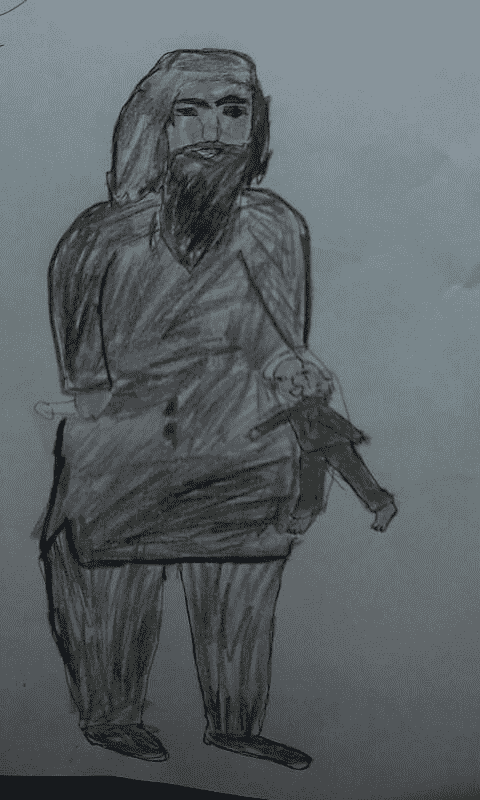

# ISIS 的战术说明了社交媒体在现代战争中的新地位 

> 原文：<https://web.archive.org/web/https://techcrunch.com/2014/10/15/isis-tactics-illustrate-social-medias-new-place-in-modern-war/>

9 月下旬，33 岁的 Bahjat Majid 焦急地坐在他家位于伊拉克 Ainkawa 的难民营里。他说，几天后，他将离开他们，以库尔德自由战士的身份回到前线，与自封的伊斯兰国作战。

在 Qaraqosh 附近的 Aiyrash 村的最后一场战斗中，Majid 忍受了狙击手和迫击炮的猛烈射击，战斗日夜不停，几乎持续了一个星期。那段记忆萦绕在他心头。

战斗让马吉德夜不能寐。他说，他的睡眠问题持续存在，因为他无法忘记伊拉克和叙利亚伊斯兰国(ISIS)在网上发布和宣传的图形宣传图像。伊拉克的男人、女人甚至儿童——几乎每个人都看过被钉在十字架上的敌人的照片，一个穿着派对礼服的小女孩的无头尸体的快照，受害者在被刀割断脖子之前的视频。

“也许佩什梅加很强大，但他们也很害怕，”马吉德告诉我。“( ISIS)使用的强大媒体影响着人们。”

欢迎来到现代战争，在线宣传在其中扮演着核心角色。

过去一年，ISIS 利用社交媒体和网络控制了对伊拉克和叙利亚冲突的叙述。尽管 ISIS 借用了弗拉基米尔·普京等宣传者的一些策略，但它也证明了自己是一个可怕的开拓者。

尽管这个恐怖组织雄心勃勃，要建立一个在地理上超越他人的哈里发国，但它并不被认为是一个民族国家，它占领了伊拉克和叙利亚的大片领土，并通过武力征服了这些领土。事实证明，它的权力下放对其宣传工作大有裨益，让ISIS 能够以一种新颖的方式推出自己的故事。因为 ISIS 的宣传来源于数以千计的个人来源，所以很难反驳。

2011 年，阿拉伯之春，我们看到了网络和社交媒体是如何被用来反击暴君和组织抗议和革命的。2014 年，我们了解到，这个强大的工具，像所有其他工具一样，可以被用来传播谎言和错误信息，就像它可以传播真相一样容易，它可以被用来压制和阻止自由言论，就像它可以被用来促进自由言论一样。

长期以来，宣传一直是战争的工具，而且越来越精明。比如，当俄国的爪牙维克多·亚努科维奇(Viktor Yanukovych)向和平抗议者出动武装力量时，以及今年克里姆林宫入侵克里米亚和乌克兰东部时，弗拉基米尔·普京巧妙利用了国有媒体。

> 曾经双方都依赖记者来报道战争，为他们提供相对的安全，但宣传却越来越多地排挤独立记者，他们对扭曲的报道构成了威胁。

他声称独立广场的抗议者是极端分子、民族主义者、新纳粹分子和反犹分子——这是一场成功的诽谤运动。西方领导人和媒体不愿全力支持独立广场，许多人甚至以平衡的名义进一步传播俄罗斯的虚假主张。于是普京插了进来，用同样的策略错误地宣称克里米亚需要被吞并，因为说俄语的人受到压迫。他还声称，俄罗斯人没有参与乌克兰东部所谓的有机分离主义运动——这一“事实”已被证明是虚假的，但在去年春天经常被重复，导致国际混乱。

这种全面的宣传策略对记者产生了不幸的影响，尤其是那些质疑这种宣传的记者。曾经双方都依赖记者来报道战争，为他们提供相对的安全，但宣传却越来越多地排挤独立记者，他们对扭曲的报道构成了威胁。因此，报道冲突变得更加危险。

土耳其一名 12 岁的科巴尼难民画的画。

俄国已经有杀害冒犯克里姆林宫的记者的历史。安娜·波利特科夫斯卡娅在发表批评俄罗斯政府的报道后被处决，这一案件引起了西方的关注，但据保护记者委员会称，自 1992 年以来，俄罗斯还有 35 名记者被谋杀。当乌克兰东部的局势升温时，所谓的“分裂分子”——他们实际上得到了克里姆林宫的全力支持——开始在那里绑架数名记者，这足以让许多记者对此次旅行三思而行。

像普京一样，ISIS 认识到独立记者可以如何破坏宣传。但普京作为一个民族国家的首脑，至少需要一些合法性的主张，所以他的宣传重点是掩盖他的非法行为。

相比之下，ISIS 认为自己的合法性来自真主建立哈里发国的命令。西方的认可对它没有任何好处，反而让它的宣传者变得更原始、更暴力、更精神错乱。普京领导的俄罗斯等传统国家含蓄地威胁记者，而伊斯兰国则更加咄咄逼人。詹姆斯·弗雷和史蒂文·索特洛夫被斩首的录像试图引起西方的恐慌和关注，但他们也向其他记者发出了一个明确的信息:要么走开，要么付出生命。

在记者们可能不在场的情况下，ISIS 炮制了两条信息，一条是给穆斯林世界的，一条是给西方的。

对于其“国内”受众，ISIS 利用宣传说服新兵加入其战斗。它试图让圣战看起来更有男子气概、更酷、更强大，张贴高度制作的[电影预告片式的宣传材料](https://web.archive.org/web/20230216110147/http://www.washingtonpost.com/posttv/world/islamic-state-releases-trailer-for-flames-of-war/2014/09/17/d384f5be-3e60-11e4-a430-b82a3e67b762_video.html)。它甚至贴出了恐怖分子的照片，上面有[小猫](https://web.archive.org/web/20230216110147/http://www.independent.co.uk/life-style/gadgets-and-tech/isis-propaganda-on-twitter-turns-to-kittens-and-lolspeak-i-can-haz-islamic-state-plz-9683736.html)和[小坚果](https://web.archive.org/web/20230216110147/http://www.nydailynews.com/news/world/isis-fighters-photos-nutella-friendly-article-1.1914450)。到目前为止，宣传似乎取得了成功:如今，据估计，ISIS 在全球有超过 3 万名成员，这是美国中央情报局在审查了自 5 月以来收集的情报报告后于 9 月份做出的估计。成员不仅来自阿拉伯国家，还有英国、美国和澳大利亚。

面向国际观众的内容差异很大。ISIS 想吓唬敌人，既想阻止反击，又想强迫人们改变信仰。当我[为*国家评论*报道](https://web.archive.org/web/20230216110147/http://www.nationalreview.com/article/388505/those-who-face-death-jillian-kay-melchior)时，一名有影响力的打击伊斯兰国的库尔德指挥官告诉我，这很有效

> “他们几乎一年前就开始这样做了，利用所有媒体——社交媒体、脸书、互联网——(展示)他们如何杀害人民，如何带走他们的孩子，如何杀害儿童，如何带走妇女和女性，所以这真是一场心理战，我可以说他们正在取得成功。。。你知道，大多数佩什梅加都来自同一个地区，所以当 ISIS 来的时候，他们中的一些人(说他们必须首先)把他们的家人和孩子带到安全的地方(在他们加入战斗之前)。。。。这对我们来说是一个挑战。”

对于这两个市场，ISIS 都利用了其分散的结构。它最强大的宣传工具之一是一个名为“喜讯黎明”的应用程序，简称“黎明”。正如恐怖主义专家 J.M .伯杰今年夏天在《大西洋月刊》上写的那样，用户同意允许 ISIS 在他们的社交媒体账户上发帖。伯杰指出，为了避免 Twitter 的垃圾邮件检测算法，该应用程序甚至将帖子隔开。

今年 8 月，社交媒体 monitor Recorded Future 的联合创始人斯塔凡·特鲁韦(Staffan Truvé)和他的团队追踪了 2.7 万个正面提及 ISIS 的 Twitter 账户。他们还发现，ISIS 成功地制造了炒作——共有 70 万个账户讨论了这个恐怖组织。

Twitter 试图对抗 ISIS，暂停了 1000 多个涉嫌与恐怖分子有联系的账户。但这并不太成功。因为 ISIS 的宣传部门结构不严谨，所以它比俄罗斯灵活得多。

Truvé告诉我:“当一个账户被关闭时，一个新的账户会立即创建，他们会利用其他人来推广这个(新)账户。”。"这有点像打地鼠."

将黎明应用与鲜明的标签策略相结合，ISIS 试图让其内容走向全球。在夏季足球比赛期间，它通过使用#worldcup2014 标签转移了注意力并引发了恐惧。同样，在奥巴马总统批准空袭后，它在网上以威胁报复的# MessageFromISIStoUS 标签回击。

也许最值得注意的是，当 ISIS 在 6 月份接管伊拉克第二大城市摩苏尔时，它透露了一项精心策划的社交媒体计划，在一天内发布了创纪录的 4 万条推文，伯杰报道。随后，该网站迅速发布了描绘巴格达上空竖起 ISIS 旗帜的推文。

“这些推文的数量足以让任何在推特上搜索‘巴格达’的人在第一个结果中产生图像，”伯杰指出，“这肯定是恐吓该市居民的一种手段。”

在这样一个名副其实的竞争激烈的环境中，真正的新闻业不仅危险；必不可少。尽管宣传对克里姆林宫和 ISIS 这样的坏人具有战略价值，但它有一个致命的缺陷:它不是事实。

“我认为记者必须适应新的媒体环境——每个人都是如此，”保护记者委员会的宣传主任考特尼·c·拉德施说。“没有回头路了。……政府、极端主义团体和派别创造了自己的传播策略渠道，因此记者必须努力为自己开拓一个增值空间。”

找到空间应该不难，尽管这需要勇气。

**编者按:** *吉莉安·凯·梅尔基奥为*国家评论*撰稿，是富兰克林中心和独立女性论坛的研究员。她今年在乌克兰和伊拉克进行了报道。*