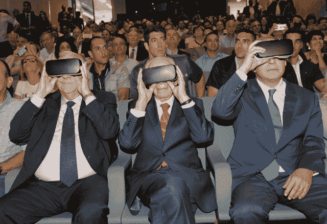

# 以色列将开设一个创新中心，展示以色列的技术并激励年轻企业家 

> 原文：<https://web.archive.org/web/https://techcrunch.com/2016/07/22/israel-is-opening-an-innovation-center-to-showcase-israeli-technology-and-inspire-young-entrepreneurs/>

# 以色列正在开设一个创新中心，展示以色列的技术并激励年轻企业家

众所周知，以色列是技术创新的温床。就在过去几年里，这个国家已经诞生了受欢迎的消费者创业公司，如 [Waze](https://web.archive.org/web/20230130230843/https://www.waze.com/) 、 [Viber](https://web.archive.org/web/20230130230843/http://www.viber.com/en/) 和 [Fiverr](https://web.archive.org/web/20230130230843/https://www.fiverr.com/) 。此外，以色列也是许多硬科学发明的发源地，比如 u 盘和冠状动脉支架。

但是以色列正处于十字路口。虽然这个国家想要自豪地炫耀这些技术“胜利”，但他们也意识到这样一个事实，如果他们不能继续推动创新向前发展，那么记住过去就没有意义。

解决办法？用过去的故事来激励下一代的发明家和企业家。

以色列实现这一目标的一种方式是通过以色列前总统西蒙·佩雷斯在雅法的佩雷斯和平之家新建的以色列创新中心。

今天宣布，该中心将重点介绍以色列已经创造的发明和公司，以及以色列未来尚未开发的技术。

但是这个中心的意义不仅仅是吹嘘以色列。事实上，佩雷斯总统指出，最重要的一点是确保以色列永远不会停止创新:

> 主要焦点将放在通往未来的道路上。我们将证明创新没有极限，没有障碍。创新使国家之间和人民之间的对话成为可能。它将使所有年轻人——犹太人、穆斯林和基督徒——平等地参与科学和技术。在这里我们将强调，我们可以从童年开始促进和平，我们将激发每个男孩和女孩的想象力，丰富他们的梦想。“——前总统西蒙·佩雷斯

那么它将如何实现这一目标呢？首先，该中心的一部分将致力于“展示领先的以色列公司”，以及跨越不同行业的以色列发明。

但更重要的是，中心的其余部分将作为社区空间。它将成为创业者见面、工作、学习甚至参加黑客马拉松的地方。佩雷斯强调，这将是一个获得传统学校或大学所没有的实践学习经验的地方。

这位前总统认为技术是改善社会和创造世界和平的最佳途径，并希望确保下一代制造商和企业家受到激励和培训，能够做到这一点。

从开幕式上的嘉宾来看，可以肯定地说，这将是整个国家的旗舰技术中心——该国三位最重要的人物——前总统佩雷斯、现任以色列总统鲁文·里夫林和现任以色列总理内塔尼亚胡出席了这次活动。

事实上，三个人都在仪式上戴上了虚拟现实耳机。佩雷斯总统告诉我们，尝试虚拟现实是“全新的事情”，可以帮助创造梦想，创造新的现实”。

