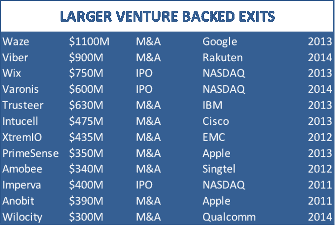

# 以色列高科技变得咄咄逼人 

> 原文：<https://web.archive.org/web/https://techcrunch.com/2014/07/05/israeli-high-tech-gets-aggressive/>

[Adam Fisher](https://web.archive.org/web/20221208071419/https://www.linkedin.com/in/adamrfisher/)

是 Bessemer Venture Partners 以色列办事处的合伙人，他专注于以色列和欧洲多个技术领域的投资，从早期创业公司到成长型公司。

More posts by this contributor

**编者按:** *[亚当·费舍尔](https://web.archive.org/web/20221208071419/http://www.bvp.com/team/adam-fisher)是 [Bessemer Venture Partners](https://web.archive.org/web/20221208071419/http://www.crunchbase.com/organization/bessemer-venture-partners) 的合伙人，在那里他管理着该公司专注于以色列和欧洲投资的赫兹利亚办事处。*

以色列总是获得全球媒体不成比例的关注。这一点在国际政治中一直适用，在国际政治中，以色列更喜欢少一点关注，但在高科技领域，媒体对创业成功的关注往往被夸大或成为轶事。

在过去十年的大部分时间里，以色列风险投资的回报一直令人失望，这让许多曾经相信自己发现了下一个大商机的人感到沮丧。但在上次泡沫破裂十多年后，以色列风险资本行业已经稳步成熟，在过去一年达到了一个转折点。

随着企业家建立更强大、更雄心勃勃的创业公司，着眼于更大的回报和更高的成功概率，以色列高科技投资的回报状况正在显著改善。以色列的科技产业可能没有按照心急的投资者和记者要求的速度前进，但过去十年也证明了以色列的高科技绝不是昙花一现的趋势。

作为一只自 1992 年以来一直在以色列投资的基金，自 2007 年以来一直在那里设有专门的办公室，我们在 Bessemer 看到了与 10 年前我们在以色列创业环境中发现的明显不同。

## **雄心勃勃**

以色列企业家一直雄心勃勃，但以色列创业生态系统的成熟现在给了新兴公司更好的机会来实现伟大的梦想，因此也更有机会筹集资金来实现这些梦想。今天的这一批企业家是在创业生态系统中成长起来的，他们看到同行们因为过早出售或在赚到钱后几年就倒闭而感到失望。这不仅意味着更多的连续创业者，也意味着这些创业公司在招聘前 50 名员工时更加成熟和有经验。

透视显示。自 2011 年以来，风险投资支持的 M&A 和 IPO 退出数量每年都在增长；Waze (谷歌)是 13 年来最大的风险投资支持的并购交易，但 2013 年初收购的 [Intucell](https://web.archive.org/web/20221208071419/http://www.crunchbase.com/organization/intucell) (思科)和 2012 年出售的 [XtremIO](https://web.archive.org/web/20221208071419/http://www.crunchbase.com/organization/xtremio) 也是如此。

Wix 于去年年底在纳斯达克上市，这是风险投资支持的以色列初创企业*有史以来最大的首次公开募股*…自那以后，Varonis 紧随其后。但是像 [Mobileye](https://web.archive.org/web/20221208071419/http://www.crunchbase.com/organization/mobileye-vision-technologies) 、 [CyberArk](https://web.archive.org/web/20221208071419/http://www.crunchbase.com/organization/cyberark) 、 [Outbrain](https://web.archive.org/web/20221208071419/http://www.crunchbase.com/organization/outbrain) 等公司如果还没有提交保密文件的话，可能会在今年提交。我越来越有信心，在不久的将来，谷歌搜索“以色列 IPO”的第一个结果将是与公开发行相关的链接，而不是广受赞誉的以色列爱乐乐团。

在大多数情况下，这些成功是在拒绝其他有利可图的提议多年后取得的，尽管风险较高，管理层还是选择了独立的道路。相对于美国同行，以色列初创公司保持独立通常要困难得多。

首先，对尖端技术和战略合作伙伴关系的重视在很早的阶段就引发了人们的兴趣，远在一个合适的企业建立起来之前。因为对这位以色列创始人来说，在距离客户群 6000 英里之外拓展一家独立企业总是令人望而生畏，所以接受早期收购要约通常是一个非常理性的决定。

## **直接获取客户**

当创业公司“掌握自己的命运”时，它们就会成为大型、独立的成功故事，这需要拥有分销渠道，最重要的是，拥有*客户关系。*从历史上看，以色列公司及其风险投资者认为拥有独特的专有知识产权就足够了。出于这个原因，以色列初创企业的成功通常取决于建立战略合作伙伴关系和原始设备制造商，以相对较低的成本和较低的风险将强大的技术带到遥远的市场。这一点经常被人遗忘，但这就是 Checkpoint(孙)、Amdocs (AT & T)和 [Gilat](https://web.archive.org/web/20221208071419/http://www.crunchbase.com/organization/gilat-satellite-networks) (GE)成为成功故事的原因。

20 年后，以色列初创公司现在知道，这种合作捷径会让公司长期保持独立的能力付出巨大代价。不幸的是，以色列初创公司仍然倾向于在销售之前雇佣商业开发人员，但成功的公司会尽一切努力拥有客户获取手段以及由此产生的关系。

互联网、SaaS 和移动公司的崛起就是这种全行业转型的例证——这在以色列曾被认为是不可想象的。Wix、Waze 和 Outbrain 各自设计了一种可扩展的直接获取客户的方法，无论是通过广告渠道、移动平台还是销售代表。许多专注于企业的公司也是如此，它们越来越多地避开“白衣骑士”OEM，建立独立的走向市场战略。

## **风险投资领域的重组**

美国风险投资在 90 年代末首次进入以色列市场，主要关注最初由以色列当地基金资助的初创企业的后续融资。在过去五年中，早期以色列基金和后期美国基金的传统角色变得模糊不清。包括 BVP 在内的六家交易撮合者居住在以色列的美国风险投资公司是以色列最活跃的早期投资者，至少有四家新成立的以色列风险投资公司专门关注后期机会。

由此产生的早期美国印记是巨大的，进一步点燃了以色列企业家的雄心和独立性。美国投资者不仅带来了更大的支票簿，还带来了对美国市场和竞争格局的更好理解。美国风险投资公司还引入了一套更为激进的风险工具，旨在帮助以色列初创企业更快地增长，包括增长型股权融资、收购策略以及此前被回避的创始人流动性。直接获取客户战略和摒弃战略伙伴关系的背后是美国风险投资的影响。

## **未来是美好的**

最近的高调退出让投资者再次聚焦以色列。在耐心等待之后，活跃的风投正在收获回报，机构投资者——他们正走向众所周知的大门——已经停下来，开始重新审视。

一些人认为这些初创公司还不够完善，不足以引起关注，但它们给自己造成了伤害。以色列的高科技已经成熟到一定程度，在未来的几年里，我们将继续看到大量的大型 M&A 公司上市和首次公开募股。以色列是硅谷唯一真正的技术对手，硅谷对此心知肚明。正如政治观察家不再将以色列视为失败者一样，很少有科技巨头和投资者愿意低估以色列初创公司的潜力。