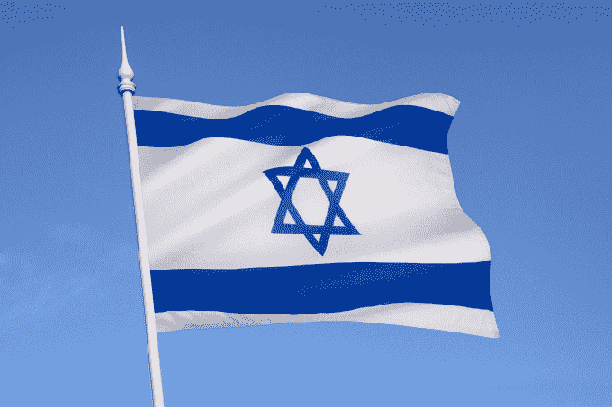

# 以色列前总理埃胡德·巴拉克在紧急应用程序上押下重注

> 原文：<https://web.archive.org/web/https://techcrunch.com/2016/09/27/israels-former-prime-minister-ehud-barak-bets-big-on-emergency-app-reporty/>

丹尼斯·米茨纳撰稿人

[Dennis Mitzner](https://web.archive.org/web/20230309010659/https://www.dennismitzner.com/)

是一名记者和作家，关注科技、文化和政治。你可以找到他的评论

[here](https://web.archive.org/web/20230309010659/https://mitznersblitz.com/)

。他还写了关于电子商务和零售的文章

[Forbes](https://web.archive.org/web/20230309010659/https://www.forbes.com/sites/dennismitzner/?sh=7d1ab33c1dda)

.

More posts by this contributor

以色列最富传奇色彩的政治家之一，以色列前总理埃胡德·巴拉克已经将他巨大的个人和政治资本投入到早期紧急服务应用 [Reporty](https://web.archive.org/web/20230309010659/http://www.reporty.com/) 的背后。

在巴拉克的帮助下，该应用公司筹集了 515 万美元，试图利用他的投资组合和他的政治敏锐性推进拥挤的市场。

在大规模枪击和全球恐怖主义的时代，几个紧急应用程序已经推出，但这位前将军依靠他的安全证书，既是主要投资者又是董事长，以确保 Reporty 不只是另一个独特的算法-吹嘘以色列应用程序的快速退出计划。

像几乎所有成功的以色列初创公司一样，Reporty 似乎起源于以色列国防军的一个情报单位，即情报团的中央收集单位(相当于以色列的 NSA)。巴拉克被认为是以色列政坛的鸽派人物，但他仍然是一名退役将军，他的专长和兴趣都在国家安全领域。

“我看到了创造一种突破性方法的机会，通过使用智能手机的力量直接联系急救人员和紧急服务来解决安全问题，”巴拉克说。

该公司现在已经筹集了 700 万美元，巴拉克(150 万美元)和首席科学家办公室(30 万美元)——经济部的研发部门——参与了 2015 年 9 月筹集的 180 万美元的第一轮种子资金。最近一轮 515 万美元的投资来自亚洲、欧洲和美国的投资者，包括私营和上市公司以及个人。虽然 Reporty 没有透露任何名字，巴拉克参加了第二轮。

拒绝披露投资者的姓名正成为以色列初创公司的一种规则，而不是例外，尤其是在网络安全领域。这再加上以色列国家安全局开发了这款应用，可能会让已经在享受紧急应用大杂烩的智能手机用户感到惊讶。仅在过去几年中，用户已经看到了 [Parachute，一个直播紧急应用](https://web.archive.org/web/20230309010659/https://techcrunch.com/2016/05/03/parachute-lets-organizations-receive-live-streamed-emergency-incidents-recorded-with-your-iphone/)，911bot，[一个在 Disrupt 黑客马拉松](https://web.archive.org/web/20230309010659/https://techcrunch.com/2016/05/08/911bot-is-a-chat-bot-that-could-save-your-life/)上开发的应用， [Witness，一个去年在 Disrupt 上推出的紧急按钮应用](https://web.archive.org/web/20230309010659/https://techcrunch.com/2015/07/14/witness-officially-launches-a-live-streaming-app-thats-a-panic-button-for-the-mobile-age/)，以及 [Wearsafe](https://web.archive.org/web/20230309010659/https://techcrunch.com/2015/08/11/wearsafe-is-a-connected-panic-button-for-the-app-generation/) 。

该应用程序，虽然更多的是在通信，而不是在安全垂直领域，目前只能在以色列下载。在 2016 年初开始的试点项目中，该应用程序的下载量超过了 10 万次。该公司的合作伙伴之一是当地紧急救护服务机构 Magen David Adom。在新的投资报告中，由 Elichai 领导的 20 人团队将随着美国办事处的成立而扩大，但大部分技术团队和 R&D 将留在以色列。

**在亚洲试航**

巴拉克表示，试点项目将很快启动，并设想该应用程序将作为智能城市项目的一部分取得良好效果。虽然巴拉克更喜欢“像以色列这样的开放社会”，但不那么开放的社会似乎是他梦寐以求的目标受众。

“该应用非常容易集成到一个巨大的智能城市项目中。自治市、实体或大城市纪律严明，集权政体可以推荐这款应用供市民下载。”

虽然巴拉克没有提到任何国家的名字，[考虑到中国最近利用以色列技术建设智能城市的目的](https://web.archive.org/web/20230309010659/https://techcrunch.com/2016/05/09/chinese-tech-giant-kuang-chi-harnesses-israeli-tech-to-build-smart-cities-in-china/)，Reporty 可能很快就会出现在许多中国城市。

“我们在一个亚洲国家启动试点项目的工作已进入后期阶段，我们还与该国的几个主要城市以及亚洲和非洲的政府进行了接触。”

至于创收，Barak 说 Reporty 的延展性提供了许多选择，从基于社区规模的订阅模式到整合到更大的系统中。

该应用程序承诺可以在任何网络中工作，并且不受大规模国家紧急情况的影响。

“在以色列的重大活动期间，电话系统往往会崩溃。我们有一个智能路由器，可以优先考虑和检查所有的替代方案，并能够从一个 WiFi 系统跳到另一个系统，直到消息到达调度员。接收消息的命令还可以优先考虑紧急情况现场的最佳智能手机连接。”

以色列以外的 Reporty 应用程序允许定期自动呼叫当地急救人员，即使没有互联网连接，系统将采用相关的号码。然而，在以色列以外，视频和定位功能尚不可用。

**公私之间**

Reporty 是巴拉克的第三笔以色列创业投资，巴拉克也是 GMF 资本的成员，这是一家总部位于苏黎世的投资集团，由 Gary Fegel 领导，他是一位时髦的商品百万富翁，投资了 [FST Biometrics](https://web.archive.org/web/20230309010659/http://fstbm.com/) ，巴拉克是董事会成员，这是一家生物识别动态识别技术创业公司。巴拉克还投资了 [GuardiCore](https://web.archive.org/web/20230309010659/https://www.guardicore.com/) ，这是一款面向软件定义的数据中心的网络安全解决方案。到目前为止，该公司已经筹集了 3100 万美元。

考虑到巴拉克投资组合中的另外两家安全技术公司，如果这两家初创公司最终都将在 Reporty 的发展中发挥不可或缺的作用，这应该不会令人感到震惊。最新的投资似乎与巴拉克的安全重专业过去和投资组合很好地融合在一起。

Barak 拥有耶路撒冷希伯来大学的物理和数学学士学位以及斯坦福大学的工程-经济系统硕士学位，他对技术并不陌生。早在 1995 年，在担任了 5 年的军队总参谋长后，巴拉克就进入了政治舞台，并在几个月后加入了时任总理伊扎克·拉宾(同年遇刺身亡)的政府。

1999 年，巴拉克以较大优势击败了现任本杰明·内塔尼亚胡的利库德集团，并担任以色列总理，直到 2001 年他被利库德集团的阿里尔·沙龙取代。战败后，巴拉克离开以色列前往美国，成为电子数据系统公司的高级顾问，该公司由得克萨斯百万富翁罗斯·佩罗于 1962 年创立。

2001 年，他加入了总部设在宾夕法尼亚州的 SCP Partners，并于 2005 年重返政坛，但未能获得该党的领导权。但在 2007 年，他成功赢得了该党主席职位，随后成为内塔尼亚胡政府下的国防部长，迫使他从 SCP 辞职。

**以色列国**

对于这位前总理来说，过去 20 年是一个平衡的过程，他似乎在以色列混乱且经常——说得委婉一点——激烈的政治生活以及全球科技圈中同样得心应手。结束政治生涯后，巴拉克在多家对冲基金担任了几个战略咨询职位。

当被问及以色列科技的未来时，巴拉克提出了两个话题:人才流失和大型跨国公司的缺乏。

“我们在创办成功的公司方面经验丰富，但在建立和保持大公司方面的成功要少得多。我们有三四家大型跨国公司，如 Teva 和 CheckPoint，但如果看看瑞士，它在高科技知识方面可能不太成熟，但他们已经产生了大约 20 家大型跨国公司。”

巴拉克将大公司的缺乏归因于许多以色列初创企业创始人的卑微出身。

“年轻的以色列人通常来自普通家庭，当有人出价 7000 万英镑收购他们的公司时，他们只会说‘见鬼去吧’，然后拿着钱继续创业。”

**重返政坛？**

尽管在以色列流传的谣言表明巴拉克正着眼于重返政治生活，但他的投资活动——尤其是如果成功的话——很可能会压倒任何重返政治生活的愿望。巴拉克仍然对以色列政治发表评论，正如他最近对内塔尼亚胡总理管理与美国关系的严厉批评所证明的那样。巴拉克认为，这导致了对以色列的最新军事援助大幅减少。

至于再次回归以色列政坛，巴拉克的回答是响亮的“不”，尽管这个答案隐晦得足以让谣言不胫而走。

“我不需要重返政坛，但作为一名忧心忡忡的公民，我当然会表达我的观点，即使这些观点是对政府的批评，以确保以色列回到正确的轨道上，朝着正确的方向前进。”