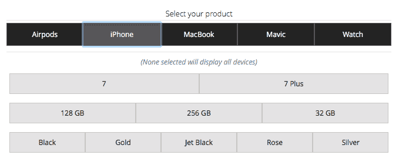

# iStockNow 会告诉你哪些苹果商店现在有 AirPods 库存 

> 原文：<https://web.archive.org/web/https://techcrunch.com/2016/12/20/istocknow-tells-you-which-apple-stores-have-airpods-in-stock-right-now/>

# iStockNow 会告诉你现在哪些苹果商店有 AirPods 库存

苹果零售战略的一个优点是，当涉及到库存时，他们不会像其他零售商那样忽视他们的实体店。因此，虽然像 AirPods 这样的产品的初始库存可能会在苹果网站上发布几分钟后就销售一空，但你通常可以指望苹果零售店在发布日备货。

AirPods 就是这种情况——昨天美国大多数苹果商店都有——但是很快就销售一空。所以问题是弄清楚哪些商店有库存，尤其是你不能再直接打电话给苹果商店了。

输入[iStockNow.com](https://web.archive.org/web/20230129100718/http://www.istocknow.com/)。该网站为你提供全球各苹果商店所有主要苹果产品的实时库存更新。虽然这些信息可以在苹果的网站上找到，但无法在地图视图上看到，也无法一次查看多个商店——因此 iStockNow 非常有用。

该网站已经存在了一段时间，但由于很难找到 AirPods，它又变得有用了。该网站还展示了 iPhones、MacBooks、苹果手表的库存，以及 DJI Mavic，它与 AirPods 一起成为这个假期最难找到的小玩意。

对于像 iPhones 和 MacBooks 这样的东西，你可以根据存储大小、颜色等进行过滤——这在试图在当地商店找到你想要的确切设备时也很有帮助。

每当苹果网站上的库存更新时，网站就会刷新，这似乎是每天晚上午夜后的某个时间。

虽然该网站目前显示美国没有商店有 AirPods，但请经常查看，你可能会看到当地商店变绿。如果有，你可以在苹果网站上订购，然后在店内取货。

该网站还说他们正在开发免费通知功能，用户可以在选择当地店铺后，在商品有现货时收到一封电子邮件。