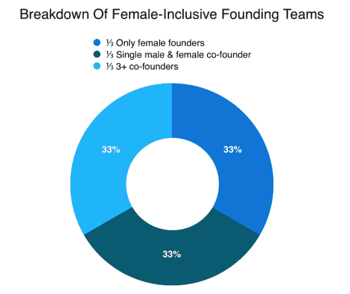
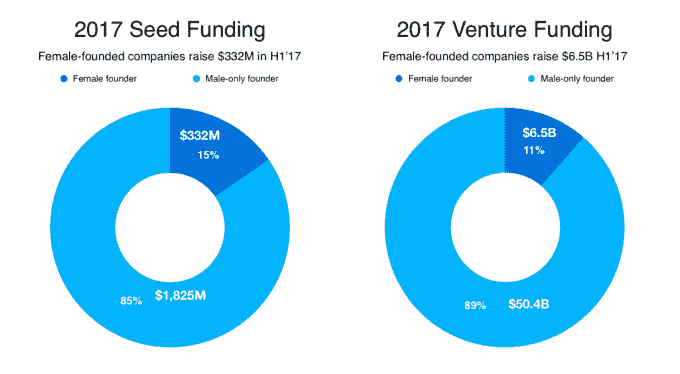
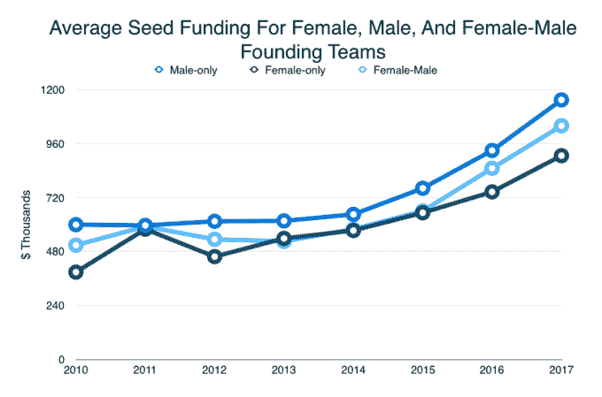
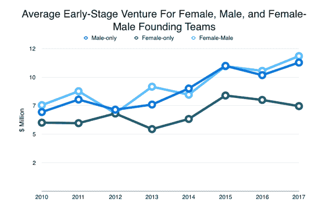

# 现在是 2017 年，女性仍然没有得到平等的资助

> 原文：<https://web.archive.org/web/https://techcrunch.com/2017/07/16/its-2017-and-women-still-arent-being-funded-equally/>

More posts by this contributor

总的来说，风险投资行业正在蓬勃发展。但是，由于隐藏的偏见、性别歧视和普遍的无知，寻求资助的女性经常被排除在繁荣的 T2 之外。正因为如此——以及最近关于高调投资者中令人难以置信的[低俗行为](https://web.archive.org/web/20230326221855/https://www.nytimes.com/2017/06/30/technology/women-entrepreneurs-speak-out-sexual-harassment.html)的报道——理解女性创始人在融资时的立场比以往任何时候都更重要。

自 2015 年以来，Crunchbase 一直在报告风险投资中的性别多样性。而且，再一次，寻求资助的女性的故事仍然是顽固可预测的。这些数字告诉我们。

## 女创始人的分布

至少有一名女性创始人的公司从 2009 年的 9%增长到 2012 年的 17%——这个数据[已经五年没有改变](https://web.archive.org/web/20230326221855/https://about.crunchbase.com/news/2017-17-startups-female-founder/)。

在 17%至少有一名女性创始人的创业公司中，三分之一的团队只有女性创始人。另外三分之一是由两位联合创始人组成的团队，其中包括一男一女。最后三分之一代表有 3 名以上联合创始人且至少有一名女性创始人的团队。因此，这些初创企业中有三分之二的女性和男性创始人占多数或比例相等。

## 资助女性创办的创业公司

在 2017 年的前两个季度，女性创始人的创业公司筹集了 3.32 亿美元的种子投资，约占所有种子资金的 15%。约有 65 亿美元投资于女性创办的公司，占 2017 年前两个季度投资总额的 11%以上。

## 风险投资缺乏女性投资者，这可能会影响融资能力

在投资方面，排名前 100 的风险投资公司中，只有 7%的高级投资合伙人是女性。在筹集资金时，女性创始人比男性创始人面临更大的挑战，因为她们需要进入男性网络，这在大多数投资公司占主导地位。

在我们关于资金缺口的报告中，我们首次查看了自 2010 年以来的种子期和早期阶段资金，以了解女性团队和男性团队在筹资方面是否存在差异。这个阶段的融资是有风险的，投资者关注的是创始团队和想法。

#### 种子平均值

如图所示，男性团队和女性团队之间的收入差距一直存在。创始人既有男性也有女性的团队处于中间位置，这是一种新趋势，自 2015 年以来变得更加明显。

在种子阶段，我们审核了 2400 轮女性专用创始团队和 37000 轮男性专用创始团队。自 2010 年以来，在种子期融资方面，男性创立的团队平均每筹集 100 美元，女性团队就能筹集 82 美元。

#### 早期风险平均水平

对于早期创业，我们审查了 1000 多轮女性创始团队和 22000 轮男性创始团队。对于早期阶段的风险投资，女性创始人的表现比种子阶段更差，因为女性创办的团队平均每筹集 100 美元，男性创办的团队就筹集 77 美元。

值得注意的是，女性和男性之间的资金差距并不总是那么大。2014 年，男性每筹集 100 美元，女性就筹集 89 美元。但在过去三年里，这一比例持续下降，目前还不清楚这一模式是否会持续下去。

## 支持创始人

因为如此多的投资者和创始人都是男性，所以女性在融资过程中往往没有关系。这种不熟悉通常意味着对女性的资助减少以及一系列其他后果。

正如最近的一项研究指出的那样，甚至投资者向女性提问的方式也会影响融资。据《哈佛商业评论》报道，女性创始人经常被问及“预防为主”的问题，这些问题集中在安全、责任、安保和警惕性上。另一方面，男性创始人经常被问及“以晋升为导向”的问题，这些问题集中在希望、成就、晋升和理想上。

两性之间问这些问题的结果？女性最终获得的资助更少。

这种现象不仅仅局限于美国的投资者。 [HBR](https://web.archive.org/web/20230326221855/https://hbr.org/2017/05/we-recorded-vcs-conversations-and-analyzed-how-differently-they-talk-about-female-entrepreneurs) 也审查了 125 个瑞典制造的球场，其中 26 个是由女性创立的公司制造的。在分析中，HBR 发现对女性和男性创始人的评价非常不同:

“金融家们夸张地塑造了女性的刻板形象，认为她们的品质与企业家的重要品质相反，风投们质疑她们的可信度、可信度、经验和知识。”

由于这一系列的问题，妇女只获得了其资金申请的 25%。与此同时，男性带走了超过 50%的资金请求。

有了这些研究和数据，是时候重新审视“穿连帽衫的家伙”的刻板印象，并认识到创业有多种形式。

*感谢[马特·考夫曼](https://web.archive.org/web/20230326221855/https://www.linkedin.com/in/mkaufman/)将筹款差距图概念化。*

## 词汇表

*   没有创始人的公司被排除在这个分析之外。

*   种子/天使包括被归类为种子或天使的融资，包括加速器融资和低于 500 万美元的股权众筹。

*   早期风险投资包括 A 轮或 B 轮融资、低于 1500 万美元但没有指定系列的风险投资，以及高于 500 万美元的股权众筹。