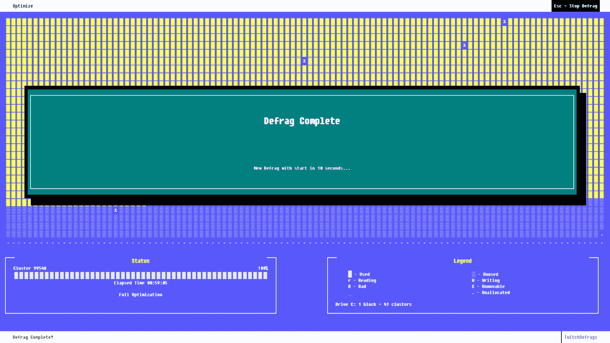

# 今天是周五，放松一下，在 Twitch TechCrunch 上观看硬盘碎片整理

> 原文：<https://web.archive.org/web/https://techcrunch.com/2018/08/17/its-friday-so-relax-and-watch-a-hard-drive-defrag-forever-on-twitch/>

# 今天是周五，所以放松一下，在 Twitch 上永远看硬盘碎片整理

我整理碎片已经有一段时间了——可能有几年了，因为现在由于一些原因，计算机并不需要整理碎片。但是也许是我们需要重组。在漫长的一周之后，还有什么比观看模拟 DOS 机器上发生的令人奇怪的令人满意的碎片整理过程更好的方式来整理你的大脑呢，伴随着风扇和硬盘驱动器的噪音。

这就是你可以用这个 Twitch stream 做的事情，它让 defrag.exe 24/7 运行供你享受。

我没有意识到我是多么想念这个特殊过程的景象和声音。我总是发现 ASCII 视觉效果令人宽慰，看着所有这些小块被移动以形成一个统一的整体是一种满足感。他们在硬盘右下角做什么呢？这就是*我想*知道的。

之后，我会推出一款像*雷神之锤 2* 这样的游戏，只是为了让自己相信它加载得更快。

还有硬盘会发出的那种好听的咕噜声(这里重现了)。至少，我认为那是咕噜声。对于开车来说，这可能就像被水刑。但我确实总是喜欢让程序运行，同时让其他一切保持安静，也许是在我上床睡觉的时候，这样我就可以听听它的轻微咔哒声和呼呼声。有时它会撞上一个特别混乱的部门，真的去镇上，磨得像疯了一样。所以你知道它在工作。

毫无疑问，这个错别字是故意的。

当然，整件事都是模拟的。真的没有一大堆硬盘等着我们在几十年前的硬件上整理碎片(除了在我的旧电脑盒子里)。但是这个模拟非常完美，尽管如果你仔细想想，你可能从来没有在 16:9 的显示器上使用过 DOS，也可能没有在 1080p 的显示器上使用过。没事的。我们可以牺牲真实性，这样我们就不必把它封闭起来。

碎片整理永远不会停止在 TwitchDefrags，这让我感到欣慰。这意味着我不必构建一个 98SE 平台，也不必花时间到处复制东西，这样我就有了一个很好的碎片卷。老实说，他们应该把这种声音放在那些小白噪音机器上。对我来说，这绝对比鲸鱼的声音好。